# Pipeline activity diagrams — mermaid sources

Mermaid versions of the UML activity diagrams in
[`../pipeline-activity-diagrams.html`](../pipeline-activity-diagrams.html), which
remains the fuller companion: it carries the per-stage goal statements, the
worked-example tables in full, and the `entity_class` design discussion that has
no diagram.

These show the *process* — what happens to a document as it moves through the
pipeline. For the *data model* — what tables exist and how they relate — see
[`erd/`](erd/README.md).

Each `.mermaid` file here is standalone and is the source of truth. The blocks
below are generated copies so they render on GitHub — regenerate with
`python3 build_readme.py` after editing any diagram.

## Reading these

| shape | meaning |
|---|---|
| stadium, dark fill | initial / final node |
| rectangle, grey fill | activity — something happens |
| rectangle, blue fill | object node — data at rest |
| diamond | decision |
| dark bar | fork / join |
| rectangle, red fill | data discarded here |
| rectangle, amber fill | a path worth noticing |
| dashed box, dotted edge | worked data example, or a design caveat |
| **green, thick dashed** | **PROPOSED — designed, not built.** Shown at the point in the flow where it would land, so it can be reviewed in place. |
| purple, dashed | `src/research/` — corpus-fitted, unimported by the pipeline, entered only by naming it |
| teal fill | the vector layer — embeddings and the stores that hold them |

## Proposed changes currently on the board

Both are drawn into the diagram at their insertion point rather than described
separately, so the review question is "does this belong here?" and not "where
would this go?".

| # | change | where | status |
|---|---|---|---|
| 1 | Split `entity_class` into a closed `entity_type` (person / organization) and an **open** `role` defaulting to `NULL` | [diagram 06](06-filter-classify-persist.mermaid), replacing the *Classify entity_class* node | designed, not built |
| 2 | Normalize the mention surface (strip leading role/title tokens) before deriving ER blocking keys | [diagram 07](07-entity-resolution.mermaid), inserted between *build_mention_frame* and *derive blocking keys* | designed, not built |

A third proposal — the embedding recall net as a second ER blocking lane — has
since been **built**, and diagrams 07 and 09 now show it as live flow rather
than as a green proposal box. Its design constraint is worth restating because
it is what makes the lane acceptable in a regulated setting: embeddings
**propose** candidate pairs and never **decide** merges. Splink scores an
embedding-found pair with the same EM-trained model it applies to a
deterministic one, and `same_as_edges.blocked_by` records per edge which lane
surfaced it, so the lane's contribution is measured rather than asserted.

Proposal 1 fixes a live defect: `_classify` falls back to
`LABEL_TO_CLASS.get(label, "claimant")`, so an unmatched person is silently
stored as a claimant and an unmatched organization as a medical provider — a
guess written into a field readers treat as a fact.

Proposal 2 is backed by measurement rather than intuition: on this machine
GLiNER's recall was identical across casing regimes (9/9 mixed, ALL CAPS and
lowercase), but exact span-boundary agreement was only 24/31 = 77%, and the
disagreements were leading role words (`adjuster Karen Wu` vs `Karen Wu`).
Role-word absorption happens in mixed case too, so it is not a casing bug.

Two notational compromises, since Mermaid's flowchart grammar is not UML:

- **Fork and join bars** are drawn as labelled dark nodes rather than the thin
  UML synchronisation bar, which the grammar has no shape for. `stateDiagram-v2`
  does provide a real `<<fork>>`, but gives up the decision diamond, the object
  node, and multi-line labels — a bad trade for diagrams whose whole point is the
  per-node data examples.
- **Data examples** hang off their activity as dashed notes on a dotted edge,
  rather than sitting in a table beside the figure as they do in the HTML.

Every diagram in this folder is checked to parse and render with mermaid 11.

## Diagrams


### A — Freeze and fingerprint the note

Source: [`01-freeze-fingerprint.mermaid`](01-freeze-fingerprint.mermaid)

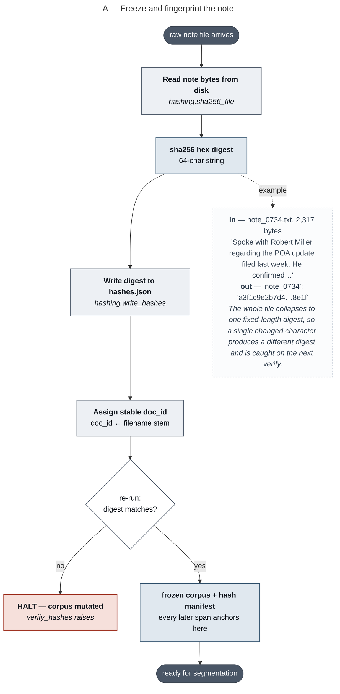

### B — Source claim identity, then segment and score the note

Source: [`02-claim-identity-and-segmentation.mermaid`](02-claim-identity-and-segmentation.mermaid)

```mermaid
---
title: "B — Source claim identity, then segment and score the note"
---
flowchart TD
  classDef act  fill:#EDF0F4,stroke:#4A5666,stroke-width:1.2px,color:#10151C
  classDef obj  fill:#E0E8EF,stroke:#3E5C76,stroke-width:1.3px,color:#10151C
  classDef dec  fill:#FFFFFF,stroke:#4A5666,stroke-width:1.2px,color:#10151C
  classDef bar  fill:#4A5666,stroke:#39424E,stroke-width:1px,color:#FFFFFF
  classDef bad  fill:#F6E0DB,stroke:#A33A2A,stroke-width:1.4px,color:#10151C
  classDef key  fill:#F6E7CE,stroke:#B4650A,stroke-width:1.6px,color:#10151C
  classDef muted fill:#FFFFFF,stroke:#B9C2CE,stroke-width:1px,stroke-dasharray:4 3,color:#4A5666
  classDef ex   fill:#FBFCFD,stroke:#B9C2CE,stroke-width:1px,stroke-dasharray:3 3,color:#33404F
  classDef warn fill:#FFF6E8,stroke:#B4650A,stroke-width:1.3px,stroke-dasharray:5 3,color:#3A2C16
  classDef term fill:#4A5666,stroke:#39424E,stroke-width:1px,color:#FFFFFF
  classDef research fill:#EEE9F5,stroke:#6B5B95,stroke-width:1.2px,stroke-dasharray:5 3,color:#2E2640
  classDef proposed fill:#E4F2EA,stroke:#2F6B4F,stroke-width:2px,stroke-dasharray:7 3,color:#12301F

  B0(["frozen note file"]):::term
  B1["<b>Parse claim_number + note_id from filename</b><br/>filename pattern: ClaimNumber_NoteID.txt"]:::act
  B2["<b>Join against the client's occurrence table</b><br/>Occurrence Number · Claim Number · Note ID<br/>client-provided, never extracted from text"]:::key
  B3["<b>doc_id → claim_id + occurrence_id</b><br/>structural metadata, known before any text is read"]:::obj
  B4["<b>Split note into physical lines</b><br/><i>profiling._line_spans</i>"]:::act
  B5{"line begins a quoted chain?"}:::dec
  B6["<b>kind = quoted</b><br/>a re-sent chain; a mention inside it is not a new sighting"]:::act
  B7["<b>kind = body</b><br/>everything else"]:::act
  B8["<b>Group runs of like lines into segments</b><br/><i>profiling.segment_document</i> — stateless, no latch"]:::act
  B9["<b>Score each segment; never gate on it</b><br/><i>boilerplate_score</i> over a disclaimer cue bundle<br/><i>casing.profile</i> → regime + case_informative"]:::key
  B10["<b>Fingerprint form-like segments</b><br/><i>profiling.template_fingerprint</i> — hash of the label sequence"]:::act
  B11["<b>MinHash shingles → near-dup groups</b><br/><i>profiling._minhash + assign_dup_groups</i><br/>content-based; the part of Layer 0 that generalizes cleanly"]:::act
  B12["<b>segments rows</b><br/>kind, char_start, char_end, dup_group_id,<br/>boilerplate_score, casing_regime, case_informative"]:::obj
  B13(["ready for chunking"]):::term

  B0 --> B1 --> B2 --> B3 --> B4 --> B5
  B5 -->|"yes"| B6
  B5 -->|"no"| B7
  B6 --> B8
  B7 --> B8
  B8 --> B9 --> B10 --> B11 --> B12 --> B13

  BX1["<b>in</b> — CLM00182_0734.txt, the filename as delivered<br/><b>out</b> — claim_number='CLM00182', note_id='0734'<br/><i>Parsed directly from the name; no text has been read yet.</i>"]:::ex
  B1 -.->|"example"| BX1

  BX2["<b>in</b> — join row: OCC0091 · CLM00182 · 0734<br/><b>out</b> — doc_id='note_0734' → claim_id='CLM00182', occurrence_id='OCC0091'<br/><i>Structural metadata established before extraction runs — not a claim about what the text says. The old CLM-plus-4-digits text fallback is gone: it only ever matched our own synthetic corpus, and on real data would mint an identity from any four digits following those letters.</i>"]:::ex
  B2 -.->|"example"| BX2

  BX3["<b>in</b> — 'This e-mail and any attachments are confidential and may be legally privileged. If you are not the intended recipient, any dissemination is unauthorized.'<br/><b>out</b> — boilerplate_score = 1.00<br/><i>Wording our generator never produced. The previous rule was three literal phrases and would have scored this 0, leaving every name inside a real disclaimer exposed to the name filter.</i>"]:::ex
  B9 -.->|"example"| BX3

  BX4["<b>in</b> — 'Counsel asserted attorney-client privilege over the file notes.'<br/><b>out</b> — boilerplate_score = 0.48, below the 0.5 flag<br/><i>Narrative that merely mentions privilege is not a disclaimer. And because the score is advisory, being wrong here costs a flag, never a deleted name.</i>"]:::ex
  B9 -.->|"example"| BX4

  BX5["<b>in</b> — an ALL CAPS header block above a normally-cased body<br/><b>out</b> — header: regime='upper', case_informative=0 · body: regime='mixed', case_informative=1<br/><i>Profiled per segment, because the common legacy shape is a case-degenerate header sitting on a clean narrative. Recorded for measurement — it no longer routes anything, see diagram 04.</i>"]:::ex
  B9 -.->|"example"| BX5

  BW["<b>What was removed here, and why</b><br/>Seven segment kinds became two. template_block, narrative, email_header, email_body and email_signature had <b>no consumer</b> in the production path, and were produced by the module's most fragile rules.<br/>· The signature rule matched only a bare double-hyphen line — the Usenet convention, which Outlook does not emit — and drove a latch that was <b>never cleared</b>, so one stray divider retyped the whole rest of a note as signature.<br/>· Boilerplate was a <b>hard kind</b>: a misclassification silently deleted every real name inside the segment, and a differently-worded disclaimer excluded nothing at all.<br/>Retired rules live in <i>src/research/corpus_heuristics.py</i>, unimported by the pipeline."]:::warn
  B8 -.->|"design note"| BW
```

### C — Cut the note into overlapping chunks

Source: [`03-chunking.mermaid`](03-chunking.mermaid)

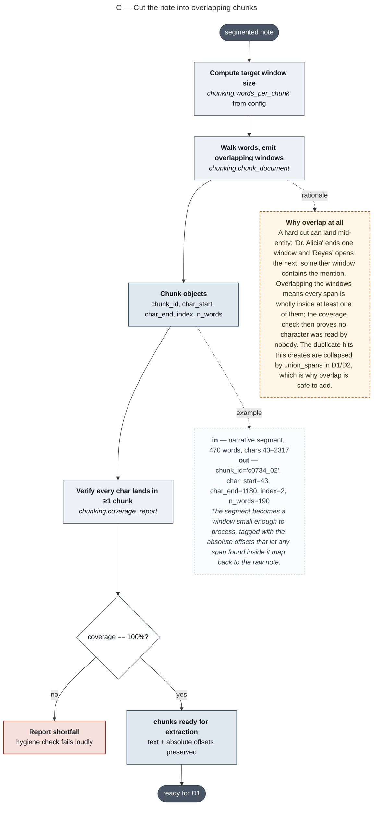

### D1 — Generate candidates: fork, extract, join, sweep

Source: [`04-generate-candidates.mermaid`](04-generate-candidates.mermaid)

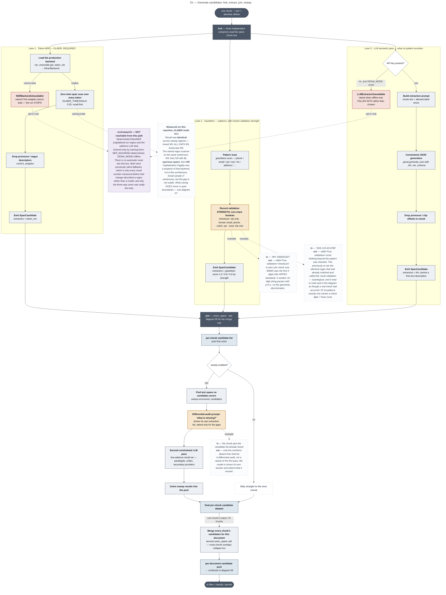

### D2 — How union_spans merges overlapping candidates

Source: [`05-union-overlapping-candidates.mermaid`](05-union-overlapping-candidates.mermaid)

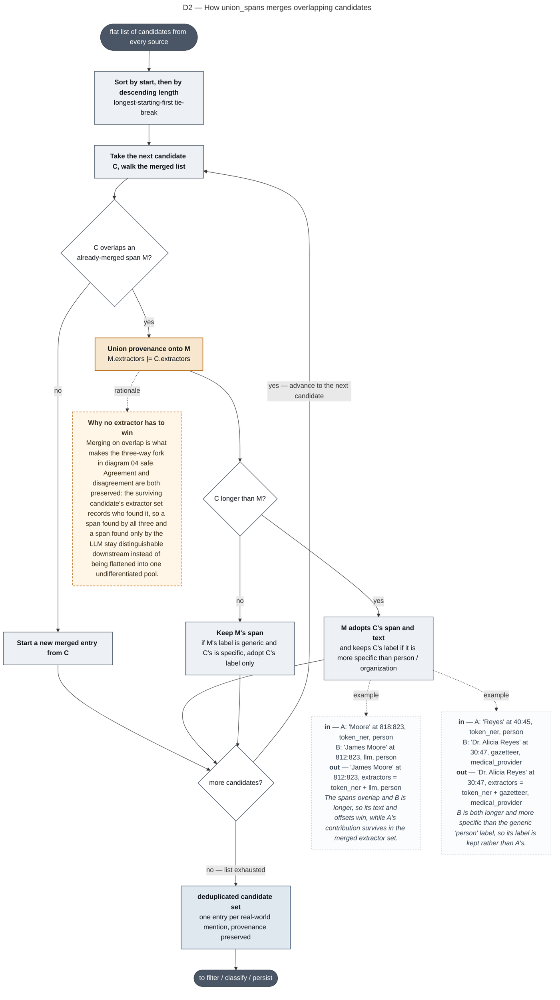

### D3 — Filter, classify, bind, and persist

Source: [`06-filter-classify-persist.mermaid`](06-filter-classify-persist.mermaid)

```mermaid
---
title: "D3 — Filter, classify, bind, and persist"
---
flowchart TD
  classDef act  fill:#EDF0F4,stroke:#4A5666,stroke-width:1.2px,color:#10151C
  classDef obj  fill:#E0E8EF,stroke:#3E5C76,stroke-width:1.3px,color:#10151C
  classDef dec  fill:#FFFFFF,stroke:#4A5666,stroke-width:1.2px,color:#10151C
  classDef bar  fill:#4A5666,stroke:#39424E,stroke-width:1px,color:#FFFFFF
  classDef bad  fill:#F6E0DB,stroke:#A33A2A,stroke-width:1.4px,color:#10151C
  classDef key  fill:#F6E7CE,stroke:#B4650A,stroke-width:1.6px,color:#10151C
  classDef muted fill:#FFFFFF,stroke:#B9C2CE,stroke-width:1px,stroke-dasharray:4 3,color:#4A5666
  classDef ex   fill:#FBFCFD,stroke:#B9C2CE,stroke-width:1px,stroke-dasharray:3 3,color:#33404F
  classDef warn fill:#FFF6E8,stroke:#B4650A,stroke-width:1.3px,stroke-dasharray:5 3,color:#3A2C16
  classDef term fill:#4A5666,stroke:#39424E,stroke-width:1px,color:#FFFFFF
  classDef research fill:#EEE9F5,stroke:#6B5B95,stroke-width:1.2px,stroke-dasharray:5 3,color:#2E2640
  classDef proposed fill:#E4F2EA,stroke:#2F6B4F,stroke-width:2px,stroke-dasharray:7 3,color:#12301F

  F0(["per-document candidate pool — from diagram 04"]):::term
  FORK["<b>fork</b> — every candidate is routed by its label"]:::bar
  F0 --> FORK

  subgraph NAMES["Name lane — a name has to look like a name"]
    direction TB
    N1["<b>label ∈ NAME_LABELS</b><br/>person / organization / attorney / repair_shop / …"]:::act
    N2["<b>Read boilerplate_score for this span</b><br/>ADVISORY — scored, counted, carried onto the row"]:::key
    N3{"passes<br/>_is_plausible_name?"}:::dec
    N3B{"single capitalised token?"}:::dec
    N3C["<b>Admitted on DOCUMENT evidence</b><br/>its token anchors an accepted multi-token name<br/>in this note, OR ≥ 2 extractors agreed"]:::key
    N3D["<b>Dropped</b><br/>n_dropped_shape += 1"]:::bad
    N4["<b>Classify entity_class</b><br/><i>_classify</i> over surface, label, left context, right context"]:::act
    N5["<b>Persist mentions row</b><br/>mention_id, surface, char_start, char_end,<br/>entity_class, inside_quoted, boilerplate_score"]:::act
    N6["<b>Persist has_name assertion</b><br/>source_span = the mention's OWN span"]:::act
    N1 --> N2 --> N3
    N3 -->|"no"| N3B
    N3B -->|"no"| N3D
    N3B -->|"yes"| N3C --> N4
    N3 -->|"yes"| N4 --> N5 --> N6
  end

  subgraph IDS["Identifier lane — an identifier has to be found near a name, or not"]
    direction TB
    I1["<b>label ∈ IDENTIFIER_LABEL_TO_PREDICATE</b><br/>phone / email / npi / tin / ssn / address"]:::act
    I2["<b>subject_for on char_start</b><br/>same line, or ≤120 chars on the immediately preceding line"]:::act
    I3["<b>Persist identifier_observations row — always</b><br/>subject_mention_id = the binding result, NULL if none"]:::key
    I4{"a subject<br/>was found?"}:::dec
    I5["<b>Persist binding assertion</b> e.g. has_phone<br/>source_span = the IDENTIFIER's own location, not the name's"]:::key
    I6["<b>Orphan — no assertion</b><br/>the observation row still stands on its own"]:::key
    I1 --> I2 --> I3 --> I4
    I4 -->|"yes"| I5
    I4 -->|"no"| I6
  end

  FORK --> N1
  FORK --> I1

  JOIN["<b>join</b>"]:::bar
  N6 --> JOIN
  I5 --> JOIN
  I6 --> JOIN

  G1["<b>Scan raw text for allegation language</b><br/>regex over the SOURCE TEXT directly — not over the candidate pool"]:::act
  G2["<b>Bind to nearest mention, persist allegation assertion</b><br/>polarity 'alleged' — kept separate from asserted fact"]:::act
  G3["<b>Resolve coreference over every mention found above</b><br/><i>coref.RuleBasedCorefResolver.resolve</i> over raw_text + mentions"]:::act
  G4["<b>Persist coref_links row</b><br/>anaphor span + antecedent span + antecedent_mention_id"]:::act
  G5["<b>Record scan_ledger coverage for this document</b>"]:::obj
  G6["<b>Persist mentions, assertions, identifier_observations, coref_links</b><br/>one transaction per corpus run"]:::act
  G7(["to entity resolution — diagram 07"]):::term

  JOIN --> G1 -->|"match"| G2 --> G3 -->|"anaphor found"| G4 --> G5 --> G6 --> G7

  NB["<b>in</b> — a name inside a segment scoring boilerplate_score = 1.00<br/><b>out</b> — mention PERSISTED, boilerplate_score = 1.0 stored on the row<br/><i>Previously this was a hard gate and the mention was deleted with no trace. A miss cost precision; a false positive silently erased real names. Now the evidence survives and a consumer discounts it.</i>"]:::ex
  N2 -.->|"example"| NB

  IX1["<b>in</b> — SpanCandidate text='(312) 555-0148', label='phone', no name on this line or the previous one<br/><b>out</b> — identifier_observations kind='phone', value_norm='3125550148', subject_mention_id=NULL<br/><i>Recorded anyway. An identifier with no name nearby is exactly the case this system exists to catch, not a reason to drop it.</i>"]:::ex
  I6 -.->|"example"| IX1

  IX2["<b>in</b> — subject: mention m0000153, 'Robert Miller', chars 40–52<br/>identifier '(312) 555-0148', chars 918–932, bound via subject_for<br/><b>out</b> — Assertion predicate='has_phone', object_value_norm='3125550148', source_span_start=918, source_span_end=932<br/><i><b>This is what an evidence span is.</b> The subject points at the name's location; the evidence span points at the phone number's location — a different place. The fact is ABOUT the subject but PROVEN at the evidence span.</i>"]:::ex
  I5 -.->|"example"| IX2

  CX1["<b>Resolving anaphora to antecedent mentions</b> means finding the specific earlier word or phrase that a pronoun or later reference points back to.<br/><br/>'John gave Mary a present. She loved it.'<br/><b>Antecedents</b> — 'Mary' and 'a present'<br/><b>Anaphors</b> — 'She', referring to Mary, and 'it', referring to the present.<br/><i>Without this step 'She' is either dropped or becomes its own bogus entity.</i>"]:::warn
  G3 -.->|"what this means"| CX1

  CX2["<b>in</b> — '…Spoke with Robert Miller regarding the POA update. He confirmed the demand was served…'<br/>mention m0000153 = 'Robert Miller' at 40:52<br/><b>out</b> — CorefLink surface='He', start=95, end=97, antecedent_surface='Robert Miller', antecedent_start=40, antecedent_end=52, kind='pronoun'<br/><i>The anaphor keeps its own span, so the sentence it appears in stays traceable.</i>"]:::ex
  G4 -.->|"example"| CX2

  %% ---------------- PROPOSED CHANGE 1 -------------------------------
  PROP1["<b>PROPOSED — split entity_class into two fields</b><br/>Not yet built. This node replaces N4.<br/><br/><b>entity_type</b>: person | organization — stays CLOSED. It is a genuine binary and <i>entity_resolution.cannot_link_reason</i> uses it structurally to block person↔org merges.<br/><b>role</b>: OPEN vocabulary, normalized toward canonical forms, defaulting to <b>NULL</b> when unmatched.<br/><br/><i>Why: today ENTITY_CLASSES is a closed 5-tuple (claimant, attorney, medical_provider, repair_shop, adjuster) set PER MENTION, and role-in-claim is not a closed set in reality — witnesses, landlords, employers, public adjusters, SIU investigators and opposing counsel all exist. It is the same restrictive-box problem the predicate vocabulary had before it was opened.</i>"]:::proposed
  N4 -.->|"proposed replacement"| PROP1

  PROP1B["<b>The concrete defect this fixes</b><br/><i>_classify</i> ends in <b>LABEL_TO_CLASS.get(label, 'claimant')</b>.<br/>An unmatched 'person' is silently written as <b>claimant</b>; an unmatched 'organization' as <b>medical_provider</b>.<br/><br/>· 'Marisol Vega', actually a witness → stored claimant<br/>· 'Sunrise Property Mgmt', actually the landlord → stored medical_provider<br/><br/><i>That is a guess written into a field every downstream reader — and the client — treats as a fact. Under the proposal both become role=NULL, which is honest and is queryable as 'needs a role'.</i>"]:::warn
  PROP1 -.-> PROP1B

  SHORTNAME["<b>A precision gate inside the recall path</b><br/>_is_plausible_name required TWO capitalised tokens, so it discarded spans GLiNER, the LLM and the gazetteer had already agreed on. Measured against ground truth once span grounding was fixed (D25), recall by variant kind:<br/><br/>&nbsp;&nbsp;canonical · flip · initials · nickname &nbsp;<b>1.000</b><br/>&nbsp;&nbsp;typo &nbsp;0.878<br/>&nbsp;&nbsp;<b>last_only</b> ("Wilson" for Marge Wilson) &nbsp;<b>0.091</b> — 3 of 33<br/>&nbsp;&nbsp;<b>short</b> ("Ibarra" for Ibarra Neurology Associates) &nbsp;<b>0.000</b> — 0 of 41<br/><br/>Those two were <b>74 of the 77 missed placements in the corpus</b>. Nothing else about extraction was materially wrong.<br/><br/><i>The escapes are narrow on purpose. A bare token is admitted only where the DOCUMENT already introduced it, or where two independent extractors agreed — which is what the union's provenance is for, and it was being thrown away here. Legalese headers, template labels and sub-three-character tokens are still rejected; those were never the problem.</i>"]:::warn
  N3B -.->|"why"| SHORTNAME
```

### E — Resolve mentions into entities

Source: [`07-entity-resolution.mermaid`](07-entity-resolution.mermaid)

```mermaid
---
title: "E — Resolve mentions into entities"
---
flowchart TD
  classDef act  fill:#EDF0F4,stroke:#4A5666,stroke-width:1.2px,color:#10151C
  classDef obj  fill:#E0E8EF,stroke:#3E5C76,stroke-width:1.3px,color:#10151C
  classDef dec  fill:#FFFFFF,stroke:#4A5666,stroke-width:1.2px,color:#10151C
  classDef bar  fill:#4A5666,stroke:#39424E,stroke-width:1px,color:#FFFFFF
  classDef bad  fill:#F6E0DB,stroke:#A33A2A,stroke-width:1.4px,color:#10151C
  classDef key  fill:#F6E7CE,stroke:#B4650A,stroke-width:1.6px,color:#10151C
  classDef muted fill:#FFFFFF,stroke:#B9C2CE,stroke-width:1px,stroke-dasharray:4 3,color:#4A5666
  classDef ex   fill:#FBFCFD,stroke:#B9C2CE,stroke-width:1px,stroke-dasharray:3 3,color:#33404F
  classDef warn fill:#FFF6E8,stroke:#B4650A,stroke-width:1.3px,stroke-dasharray:5 3,color:#3A2C16
  classDef term fill:#4A5666,stroke:#39424E,stroke-width:1px,color:#FFFFFF
  classDef research fill:#EEE9F5,stroke:#6B5B95,stroke-width:1.2px,stroke-dasharray:5 3,color:#2E2640
  classDef proposed fill:#E4F2EA,stroke:#2F6B4F,stroke-width:2px,stroke-dasharray:7 3,color:#12301F
  classDef vec  fill:#DDEEF6,stroke:#1F6F8B,stroke-width:1.6px,color:#0C2430

  E0(["all mentions for the corpus"]):::term
  E1["<b>Build one feature row per mention</b><br/><i>entity_resolution.build_mention_frame</i>"]:::act
  E2["<b>Derive the blocking keys from the surface</b><br/>full_name · name_sorted = sorted tokens<br/>first_name = toks[0] · last_name = toks[-1] · soundex(last)"]:::key
  E3["<b>Null out missing identifiers</b><br/>empty string would block-explode; NULL is excluded by Splink"]:::act
  E4["<b>mention frame</b><br/>name keys + email, phone7, npi, tin, ssn, vin, dob<br/>address_key (blocking) + street · city · state · zip (scoring)"]:::obj

  %% ---------------- LANE 2: the embedding recall net ----------------
  V0[/"<b>mentions.faiss</b><br/>one vector per mention: norm_surface + class<br/><i>embed_index.run — diagram 09</i>"/]:::vec
  V1["<b>Class-filtered k-NN over the mention index</b><br/>top-25 neighbours per mention, filter applied INSIDE the index<br/><i>blocking.knn_edges</i>"]:::vec
  V2{"cosine ≥ EMB_BLOCK_SIM = 0.29 ?"}:::dec
  V3["<b>Neighbour edge kept</b>"]:::vec
  V4["<b>Dropped — not a neighbour</b>"]:::muted
  V5["<b>Connected components over the k-NN graph</b><br/><i>blocking.connected_components</i>"]:::vec
  V6{"component size"}:::dec
  V7["<b>emb_bucket = EB&lt;root&gt;</b><br/>2 … EMB_BLOCK_MAX_BUCKET members"]:::vec
  V8["<b>emb_bucket = NULL</b><br/>singleton — would propose no pairs anyway"]:::muted
  V9["<b>emb_bucket = NULL</b><br/>oversize — transitive chaining, dropped on purpose"]:::warn

  E5["<b>Declare blocking rules — ORDER IS LOAD-BEARING</b><br/>0 email · 1 npi · 2 tin · 3 phone7 · 4 address_key<br/>5 full_name · 6 name_sorted · 7 soundex+first_name · 8 last_name<br/><b>9 emb_bucket</b> ← the recall net<br/><i>entity_resolution.BLOCKING_RULES</i>"]:::key
  E6["<b>Estimate the match prior λ from deterministic rules</b><br/>rules chosen for what FIRES on the data, not what is trustworthy<br/><i>entity_resolution.lambda_rules — raises if it fails</i>"]:::key
  E7["<b>Estimate u by random sampling</b>"]:::act
  E8["<b>Train m by expectation-maximisation</b><br/>one pass per blocking rule; sparse blocks skipped<br/>u stays FIXED — see NOU"]:::act
  E8B["<b>Report the calibration</b><br/>λ · bits per agreeing field · every m/u EM could not estimate<br/><i>entity_resolution.calibration_report / training_completeness</i>"]:::key
  E8C{"fully trained?"}:::dec
  E8D["<b>Raise ModelNotFullyTrained</b><br/>only when CFG.ER_REQUIRE_FULLY_TRAINED"]:::bad
  E9["<b>Score every blocked candidate pair</b><br/>ONE model scores both lanes<br/><i>linker.inference.predict</i>"]:::act
  E10["<b>same_as_edges rows</b><br/>mention_a, mention_b, probability, match_weight,<br/><b>blocked_by</b> = the rule that proposed it<br/><b>uncalibrated</b> = substituted comparisons this edge used"]:::obj
  E11{"structural conflict?"}:::dec
  E12["<b>Edge suppressed before clustering</b><br/><i>cannot_link_reason</i> — Jr/Sr at one address,<br/>conflicting <b>npi / tin / ssn</b> — see VETO"]:::bad
  E13["<b>Union-find over edges ≥ threshold</b><br/><i>entity_resolution.cluster_at</i>"]:::act
  E14["<b>entity_snapshot / entities / entity_members</b><br/>identity is a VIEW at T, never a destructive merge"]:::key
  E15["<b>Sweep T to plot the operating curve</b><br/>B³ precision / recall per threshold"]:::act
  E16(["to graph assembly — diagram 08"]):::term

  E0 --> E1 --> E2 --> E3 --> E4 --> E5
  E4 --> V0
  V0 --> V1 --> V2
  V2 -->|"no"| V4
  V2 -->|"yes"| V3 --> V5 --> V6
  V6 -->|"= 1"| V8
  V6 -->|"2 … 60"| V7
  V6 -->|"&gt; 60"| V9
  V7 --> E5
  V8 -.-> E5
  V9 -.-> E5
  E5 --> E6 --> E7 --> E8 --> E8B --> E8C
  E8C -->|"no, and required"| E8D
  E8C -->|"otherwise, flagged"| E9
  E9 --> E10 --> E11
  E11 -->|"yes"| E12
  E11 -->|"no"| E13 --> E14 --> E15 --> E16

  %% ---------------- why the second lane exists ----------------------
  WHY["<b>Why a second candidate generator at all</b><br/>Blocking recall is a <b>hard ceiling</b> on ER recall. A pair no rule proposes is never scored, so it can never be merged — no matter how good the comparison model is.<br/><br/>The nine deterministic rules only fire when two mentions <b>share a key</b>. The pairs that costs are the realistic ones:<br/>· 'Bob Miller' vs 'Robert Miller Jr' — no shared key<br/>· 'Valley Auto Body' vs 'Valley Auto Body &amp; Paint'<br/>· an entity written differently in every note it appears in<br/><br/><i>Deterministic blocking is not wrong, it is incomplete. The fix is another way to propose, not a looser way to decide.</i>"]:::warn
  E5 -.->|"why rule 9"| WHY

  SPLIT["<b>The division of labour — this is the whole design</b><br/>The embedding lane only ever <b>PROPOSES</b>. Splink scores its pairs with the same EM-trained Fellegi-Sunter model it applies to deterministic candidates, so an embedding-found link carries the same calibrated probability and the same per-comparison breakdown.<br/><br/><i>Embeddings buy recall, which is what they are good at. They are kept out of the scoring decision, where 'the vectors were close' is not an explanation anyone can audit. That boundary is what keeps a production ER system defensible to a regulator.</i>"]:::key
  E9 -.->|"one model, two lanes"| SPLIT

  PROV["<b>How the lane is measured, not asserted</b><br/>Splink stamps every predicted pair with <b>match_key</b> — the index of the rule that generated it — and credits the FIRST rule that fires. So a pair credited to rule 9 is one that <b>no deterministic rule proposed at all</b>.<br/><br/>Stored per-edge as <b>same_as_edges.blocked_by</b>, so a reviewer can ask of any specific merge 'would deterministic blocking have caught this?' instead of only seeing an aggregate.<br/><br/><i>entity_resolution.lane_provenance aggregates it; the audit joins it against ground truth to say whether the lane cut under-merges without raising over-merges.</i>"]:::key
  E10 -.->|"provenance"| PROV

  CAP["<b>Why oversize components are dropped rather than split</b><br/>A loose threshold lets components chain transitively — A~B, B~C, C~D with A nothing like D. One runaway component of n mentions costs n²/2 pairs: the same blow-up the empty-string address_key guard at E3 exists to prevent.<br/><br/>Those mentions keep all nine deterministic rules, so dropping costs only what the lane would have added.<br/><br/><i>A giant component means the embedding signal was not discriminative there. The honest response is to contribute nothing rather than contribute noise.</i>"]:::warn
  V9 -.->|"why"| CAP

  EX1["<b>in</b> — mention pair m0000153 'Robert Miller' and m0000891 'R. Miller', same phone last-7<br/><b>out</b> — same_as_edges probability=0.94, match_weight=+6.2, blocked_by='phone7'<br/><i>The pair is scored, not merged. A number survives into storage where a yes/no decision would have destroyed the evidence.</i>"]:::ex
  E10 -.->|"example"| EX1

  MEAS["<b>Measured yield, live against gemini-embedding-001</b><br/>Twelve-mention labelled probe (notebook 04, final cell):<br/><br/>· <b>recall 7/7, precision 7/7</b> — three clean buckets, zero false pairs<br/>· the deterministic name rules propose <b>1 of those 7</b><br/>· the lane adds <b>6</b> true pairs no name rule proposes<br/><br/>&nbsp;&nbsp;Bob Miller ↔ Robert Miller Jr ↔ R. Miller<br/>&nbsp;&nbsp;Valley Auto Body ↔ … &amp; Paint ↔ Valley Autobody<br/>&nbsp;&nbsp;Dr. Alicia Reyes ↔ Alicia Reyes, MD<br/><br/><i>A mechanism check on a small labelled set, not a corpus result. The corpus-level question — does the lane cut under-merges without raising over-merges — is answerable from same_as_edges.blocked_by joined to ground truth, and is NOT yet measured.</i>"]:::key
  V7 -.->|"measured"| MEAS

  CALIB["<b>The threshold is model-specific, and getting it wrong is silent</b><br/>0.29 looks alarmingly low next to the 0.7–0.9 one expects from a sentence-transformer. It is correct for THIS model: gemini-embedding-001 compresses everything into a narrow band — co-referring pairs 0.30–0.34, unrelated pairs 0.25–0.29.<br/><br/>EMB_BLOCK_SIM was first set to <b>0.86</b>, carried over from sentence-transformer intuition. The lane produced <b>zero edges</b>. Resolution still ran, still clustered, still passed every assertion — it merged less, and nothing said why.<br/><br/><i>Now an exception: EmbeddingThresholdMiscalibrated fires when the floor exceeds every similarity in the index. Re-run the calibration cell in notebook 04 after changing EMBED_MODEL. The margin is ~0.01, which is a property of the model, not a tuning failure.</i>"]:::warn
  V2 -.->|"why 0.29"| CALIB

  OFFL["<b>The offline stub cannot serve this lane at all</b><br/>genai._offline_embedding hashes character shingles — it measures LEXICAL overlap, which is exactly what rules 5–8 already do, better and explainably.<br/><br/>Measured offline on the same probe: true pairs 0.7708–0.9040, false pairs 0.5180–<b>0.8354</b>. The distributions <b>OVERLAP</b> — the hardest false pair outscores six of the eight true pairs — so no threshold separates them and no recalibration can.<br/><br/><i>EmbeddingBackendUnsuitable is raised rather than emitting buckets that look like output and mean nothing. Set EMB_BLOCK_ENABLED=False to resolve deterministically on purpose.</i>"]:::bad
  CALIB -.-> OFFL

  EX4["<b>in</b> — 'Bob Miller' and 'Robert Miller Jr', no shared identifier, different first token, different soundex bucket<br/><b>out</b> — proposed ONLY by emb_bucket, then scored by Splink like any other pair; blocked_by='emb_bucket'<br/><i>Under deterministic blocking alone this pair is never scored, so it is never merged and never appears in any report — the failure is invisible, which is what makes it worth a whole lane.</i>"]:::ex
  V7 -.->|"example"| EX4

  EX2["<b>in</b> — all edges, threshold T=0.90<br/><b>out</b> — entity_snapshot rows grouping both mentions under one entity_id at that T<br/><i>Identity is recomputed per threshold, so raising or lowering T re-partitions the corpus without re-running resolution.</i>"]:::ex
  E14 -.->|"example"| EX2

  VETO["<b>Which identifiers may VETO a merge, and why the others may not</b><br/>The test is not how strong an identifier is. It is: <b>can one entity legitimately hold two of these at once?</b><br/><br/>&nbsp;&nbsp;<b>ssn</b> — no. One per person, by construction. Vetoes.<br/>&nbsp;&nbsp;<b>npi / tin</b> — mostly not, though a provider can hold both a Type 1 and a Type 2 NPI. Vetoes, narrowly.<br/>&nbsp;&nbsp;<b>vin</b> — YES, a claimant owns two cars and a shop touches hundreds. <b>Scores but never vetoes.</b><br/>&nbsp;&nbsp;<b>address · phone · email</b> — yes: people move, hold a desk and a mobile, have work and personal mail.<br/><br/><b>dob is the interesting omission.</b> A person has exactly one, so it looks like it belongs. It is deliberately absent: dob binding accuracy has never been measured, real DOBs carry transcription errors, and T0.3 measured what happens when a consistency rule meets a mis-bound identifier — it splits a CORRECT cluster.<br/><br/><i>A client whose TINs are shared across a franchise group is changing a POLICY here, not fixing a bug. That is what making this list explicit is for.</i>"]:::key
  E12 -.->|"veto policy"| VETO

  VETOX["<b>DELETED: the person-vs-organisation veto</b><br/>It suppressed any pair where one side was classed as a person-role and the other as repair_shop. Measured against ground truth on a 60-document run:<br/><br/>&nbsp;&nbsp;<b>1,335 edges suppressed</b>; of the 1,291 with both sides labelled, <b>898 (69.6%) joined two mentions of the SAME entity</b> — including pairs at p=1.000 and p=0.997, identical surfaces.<br/><br/>It was not preventing over-merge. It was the largest single source of <b>under</b>-merge in the system.<br/><br/>The cause: it vetoed on <b>entity_class</b>, and comparison_specs already says why that is wrong — <i>a noisy derived label from our own classifier, not identity evidence</i>. The codebase had concluded the label was too unreliable to SCORE with, then used it as an absolute veto no probability could outweigh.<br/><br/>Removing it: best F1 <b>0.889 -&gt; 0.920</b>, recall at 0.45 <b>0.885 -&gt; 0.937</b>, precision cost 0.008, entities 59 -&gt; 54 against 42 gold.<br/><br/><i>The identifier vetoes stay: conflicting_tin fired 36 times in the same run with ZERO false vetoes. A TIN is observed evidence; entity_class is our own guess.</i>"]:::bad
  VETO -.->|"and one that was removed"| VETOX

  EX3["<b>in</b> — 'Miller Auto Body' (organization) and 'Robert Miller' (person), high name similarity<br/><b>out</b> — edge suppressed, never reaches clustering<br/><i>A hard structural constraint applied as edge suppression rather than a permanent veto. Note this is the ONE place entity_class is load-bearing — see the proposal in diagram 06, which keeps person/organization closed precisely so this keeps working.</i>"]:::ex
  E12 -.->|"example"| EX3

  CLASSF["<b>The class filter is not decoration</b><br/>EMB_BLOCK_SAME_CLASS keeps a person from ever bucketing with a repair shop. Without it the lane spends its k-NN budget proposing pairs that cannot_link_reason (E12) will suppress anyway — work done twice to reach the same answer.<br/><br/><i>Applied inside the index via IDSelector, BEFORE nearest-neighbour selection, so the top-k is exact over the filtered set rather than a post-filtered guess that can silently drop true neighbours.</i>"]:::ex
  V1 -.->|"note"| CLASSF

  %% ---------------- PROPOSED CHANGE 2 -------------------------------
  PROP2["<b>PROPOSED — normalize the mention surface before deriving keys</b><br/>Not yet built. This node inserts between E1 and E2.<br/><br/>Strip leading role and title tokens from the surface used for BLOCKING, while the stored mention surface and its char offsets stay exactly as extracted.<br/><br/><i>Model-agnostic, and it belongs here rather than in an extractor: the retired regex scanner had a version of this (_LEADING_NOISE), but as a corpus-fitted denylist inside extraction. The need was real; the location and the shape were wrong.</i>"]:::proposed
  E1 -.->|"proposed insertion point"| PROP2
  PROP2 -.-> E2

  PROP2B["<b>Measured evidence for it, this machine, GLiNER multi-v2.1</b><br/>Exact span-boundary agreement across casing regimes: <b>24/31 = 77%</b>. Recall was 100% in every regime — casing does not cost detections, it moves <b>boundaries</b>.<br/><br/>Observed disagreements:<br/>· 'adjuster Karen Wu' vs 'Karen Wu'<br/>· 'Claimant Deborah Fitzgerald' vs 'Deborah Fitzgerald'<br/>· 'SIU' found in mixed case, lost in BOTH ALL CAPS and lowercase<br/><br/><i>Role-word absorption also happens in MIXED case — 'Claimant Deborah Fitzgerald' was the normally-cased output — so this is not a casing bug. Casing only changes which words get absorbed.</i>"]:::ex
  PROP2 -.->|"why"| PROP2B

  PROP2C["<b>What it actually costs today</b><br/>Not invisibility. last_name = toks[-1], and role words are LEADING, so 'adjuster Karen Wu' and 'Karen Wu' both key to 'wu' and still meet under block_on(last_name).<br/><br/>But <b>three of nine deterministic rules miss</b>:<br/>· full_name — 'adjuster karen wu' ≠ 'karen wu'<br/>· name_sorted — 'adjuster karen wu' ≠ 'karen wu'<br/>· soundex+first_name — first_name 'adjuster' vs 'karen'<br/><br/>and when the pair does meet, <b>ForenameSurnameComparison(first_name, last_name) scores it DOWN</b> because first_name disagrees.<br/><br/><i>So the real cost is a depressed match probability on true pairs, not a missing pair. That is a subtler failure than it first looked, and it degrades the calibration the whole threshold story rests on.</i>"]:::warn
  PROP2B -.-> PROP2C

  PROP2D["<b>Rule 9 partly compensates — but does not replace this</b><br/>'adjuster Karen Wu' and 'Karen Wu' embed close together, so the lane proposes the pair even when three deterministic rules miss it. That recovers the CANDIDATE.<br/><br/>It does not recover the SCORE: ForenameSurnameComparison still sees first_name 'adjuster' vs 'karen' and scores the pair down whichever lane proposed it.<br/><br/><i>Blocking and comparison are separate failures. The recall net fixes the first and cannot touch the second, which is exactly why PROP2 is still open.</i>"]:::warn
  PROP2C -.-> PROP2D

  %% ---------------- calibration: measured 2026-09-02 -----------------
  LAM["<b>The prior multiplies every posterior, and it was 16× too low</b><br/>λ = probability_two_random_records_match: the chance two randomly drawn mentions co-refer. Splink's 1e-4 default assumes a corpus where entities barely recur; a claim file is the opposite.<br/><br/>The first rule set was <b>[email, npi, full_name AND dob]</b> — the textbook choice, and on this corpus the fields that are almost always ABSENT: email is non-null on 55 of 922 mentions, npi on <b>7</b>. The rules barely fired.<br/><br/>&nbsp;&nbsp;λ estimated <b>0.000764</b> · λ in truth <b>0.012097</b><br/><br/><i>Nothing compensates for a wrong prior. EM re-fits m against whatever u it is handed, so u errors partly wash out — λ is applied at the end and simply shifts the whole distribution down ~4 bits.</i>"]:::bad
  E6 -.->|"why these rules"| LAM

  LAMFIX["<b>What it cost, and what fixing it bought</b><br/>Measured end-to-end through the shipped path, B-cubed vs ground truth at the operating threshold <b>0.45</b>:<br/><br/>&nbsp;&nbsp;before — F1 <b>0.604</b> · P 0.973 · R 0.438 · <b>515 entities</b><br/>&nbsp;&nbsp;after &nbsp;— F1 <b>0.800</b> · P 0.888 · R 0.728 · <b>81 entities</b><br/>&nbsp;&nbsp;<i>(42 is the truth for this subset: ~12x over-split becomes ~1.9x)</i><br/><br/>The curve also stops being a cliff: worst F1 anywhere in 0.20–0.95 rises from <b>0.185</b> to <b>0.783</b>.<br/><br/><i>ER_LINK_THRESHOLD = 0.45 needed no change — it was never the bug, it was downstream of it. The system was splitting one entity into twelve while reporting 0.97 precision, and no run output named the prior, so nothing caught it.</i>"]:::key
  LAM -.-> LAMFIX

  ORDER["<b>The sanity check with no statistics in it</b><br/>What one agreeing field is worth, in bits. A globally unique identifier MUST outrank a name.<br/><br/>Before the fix, on this corpus:<br/>&nbsp;&nbsp;exact name <b>+4.96</b> · exact phone +3.07 · exact address +2.95<br/>&nbsp;&nbsp;<b>exact NPI +2.73</b> · exact email +2.57<br/><br/>A nationally unique provider identifier counted for barely half a name match.<br/><br/><i>Printed every run by calibration_report. If npi or email ever sits below name_sorted again, the model is reporting that something is wrong with its inputs — no ground truth needed to see it.</i>"]:::key
  E8B -.->|"evidence ordering"| ORDER

  UNTR["<b>Untrained parameters are named, not swallowed</b><br/>Splink logs 'your model is not yet fully trained … will use default values' and carries on. The substitute is not neutral: for a two-level comparison the invented m for agreement is <b>0.95 whatever the field is</b>.<br/><br/>Currently 7 parameters: three email levels (username / Jaro-Winkler variants) and <b>npi's exact-match m</b>. Training harder cannot fix npi — only 7 of 922 mentions carry one, so there is genuinely nothing to learn from.<br/><br/><i>same_as_edges.uncalibrated names the substituted comparisons an edge ACTUALLY used — 2 of 14,895 edges, both npi. An edge whose npi values were both null used no npi parameter and is perfectly calibrated, so a blanket flag would be alarmist and useless for triage.</i>"]:::warn
  E8B -.->|"completeness"| UNTR

  NOU["<b>Rejected: letting EM train u as well</b><br/>fix_u_probabilities=False is the obvious lever and it is <b>wrong here</b>. Measured: B-cubed F1 <b>0.80 → 0.64</b>, with name_sorted m=0.0 and −44-bit weights.<br/><br/>EM sees only the <b>blocked</b> population, which is not remotely representative of random pairs.<br/><br/><i>Also rejected: Splink's populate_…_from_trained_values, which returns λ = 0.619 — it claims 62% of random mention pairs co-refer. It scores acceptably at 0.45 by accident and peaks at 0.99, destroying the threshold's meaning. A prior nobody can defend out loud is not a calibration.</i>"]:::bad
  E8 -.->|"why u stays fixed"| NOU

  UOPEN["<b>OPEN (T0.5) — u is inflated 3–37× and the fix is not obvious</b><br/>estimate_u_using_random_sampling estimates P(agree GIVEN non-match) by sampling random pairs and treating them ALL as non-matches. Valid when λ≈1e-4; here λ≈1.2e-2, so ~1.2% of the sample are true matches and they inflate u.<br/><br/>Measured against ground truth: phone <b>36.9×</b> · address 18.3× · name 13.8× · dob 4.2× · email 2.6×.<br/><br/>Ceiling, with u oracle-corrected: <b>+0.026 F1</b>, and the 0.99 cliff disappears (F1 0.80 instead of 0.29).<br/><br/><i>The textbook remedy — estimate u on a DEDUPLICATED frame — fails here: that frame is 42 rows and contains no identifier pairs at all, so Splink cannot observe the columns that need it most. Candidate: two-pass, computing u analytically over cross-cluster pairs. Unsolved: choosing the pass-1 threshold without labels.</i>"]:::proposed
  E7 -.->|"known bias"| UOPEN

  %% ---------------- T0.7: what counted as evidence at all -----------
  EVID["<b>What the model was allowed to count as evidence</b><br/>Found by reading the bits-per-field report and asking why NPI was there and TIN, SSN and VIN were not.<br/><br/>&nbsp;&nbsp;<b>VIN</b> — no detector anywhere; a declared identifier kind that nothing produced<br/>&nbsp;&nbsp;<b>SSN</b> — in the frame, never blocked, never compared: it could only VETO a merge, never support one<br/>&nbsp;&nbsp;<b>TIN</b> — blocked, so it proposed candidates, then contributed ZERO to their score<br/>&nbsp;&nbsp;<b>NPI</b> — compared, and the RAREST identifier kind in the corpus<br/><br/><i>None of it was a decision. comparison_specs documents why entity_class is excluded and is silent on TIN and SSN — the gap was invisible until a run printed what each field was worth.</i>"]:::bad
  E8B -.->|"T0.7"| EVID

  EVIDFIX["<b>Fixed, and the benefit reported honestly</b><br/>Added tin/ssn/vin comparisons, a VIN detector with a real ISO 3779 check digit, and a graded address comparison over decomposed street·city·state·zip.<br/><br/><b>Measured: B-cubed F1 0.810 -&gt; 0.812. That is noise.</b> TIN was the only genuinely new trained signal (+2.21 bits over 25 mentions); the address regrade moved its top level ~+3.1 -&gt; +4.56 bits.<br/><br/><b>The first attempt made things worse in a way only the report could see:</b> ssn and vin landed at the TOP of the ordering at +10.00 bits each, entirely fabricated — neither column holds a single value in this corpus, so EM trained nothing and Splink substituted m=0.95 / u=0.0009.<br/><br/><i>_prune_absent now drops an all-NULL comparison rather than training on nothing. That is also the tunable behaviour: a client whose notes carry SSNs gets it trained on their data; one whose notes do not is never shown an invented weight.</i>"]:::key
  EVID -.-> EVIDFIX

  ADDR["<b>Why address is ONE comparison and not four</b><br/>Street, city, state and zip are heavily correlated — agreeing on a street almost guarantees agreeing on the city. Fellegi-Sunter assumes comparisons are conditionally independent given match status, so four separate comparisons would count one piece of evidence four times, inflating the weight on exactly the pairs that need care.<br/><br/>Ordered, mutually exclusive levels price the combination once:<br/>&nbsp;&nbsp;same street + (zip or city) &gt; same street &gt; same locality &gt; else<br/><br/>The old model compared one opaque number|street|zip composite by ExactMatch, so dropping a zip earned <b>no</b> evidence rather than less — while a city-only address exact-matched every address in its zip.<br/><br/><i>Four levels, not eight: any level EM cannot reach becomes a Splink-invented default, and address components are sparse enough that a finer ladder would buy resolution nobody trained.</i>"]:::key
  EVIDFIX -.-> ADDR

  D21["<b>BLOCKED (D21) — two of the three lanes cannot be tested</b><br/>The ground-truth manifest declares <b>125 SSNs and 140 VINs</b>, and <b>zero appear in any of the 2,000 notes</b>. corpus_gen mints them as entity attributes and never places them into note text; its VIN values also fail their own ISO check digit.<br/><br/><i>So the SSN and VIN comparisons are correct-by-construction and unexercised. They are pruned automatically here, and must not be counted as coverage until the generator plants them.</i>"]:::proposed
  ADDR -.-> D21
```

### F — Assemble the global entity graph

Source: [`08-graph-assembly.mermaid`](08-graph-assembly.mermaid)

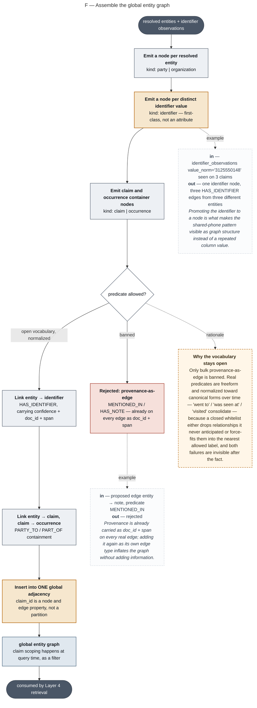

### F — The vector layer: two indices, two jobs

Source: [`09-vector-layer.mermaid`](09-vector-layer.mermaid)

```mermaid
---
title: "F — The vector layer: two indices, two jobs"
---
flowchart TD
  classDef act  fill:#EDF0F4,stroke:#4A5666,stroke-width:1.2px,color:#10151C
  classDef obj  fill:#E0E8EF,stroke:#3E5C76,stroke-width:1.3px,color:#10151C
  classDef dec  fill:#FFFFFF,stroke:#4A5666,stroke-width:1.2px,color:#10151C
  classDef bad  fill:#F6E0DB,stroke:#A33A2A,stroke-width:1.4px,color:#10151C
  classDef key  fill:#F6E7CE,stroke:#B4650A,stroke-width:1.6px,color:#10151C
  classDef muted fill:#FFFFFF,stroke:#B9C2CE,stroke-width:1px,stroke-dasharray:4 3,color:#4A5666
  classDef ex   fill:#FBFCFD,stroke:#B9C2CE,stroke-width:1px,stroke-dasharray:3 3,color:#33404F
  classDef warn fill:#FFF6E8,stroke:#B4650A,stroke-width:1.3px,stroke-dasharray:5 3,color:#3A2C16
  classDef term fill:#4A5666,stroke:#39424E,stroke-width:1px,color:#FFFFFF
  classDef vec  fill:#DDEEF6,stroke:#1F6F8B,stroke-width:1.6px,color:#0C2430
  classDef fixed fill:#E4F2EA,stroke:#2F6B4F,stroke-width:1.6px,color:#12301F

  subgraph ABSTRACTION["every vector op goes through one interface"]
    VS["<b>VectorStore (ABC)</b><br/>upsert · search(filter_fn | allowed_ids) · persist · load<br/><b>get_vector</b> · <b>knn_within(ids, k)</b><br/><i>src/vectorstore.py — the only file permitted to import faiss</i>"]:::key
    FS["<b>FaissVectorStore</b><br/>IndexFlatIP + IDMap2, sidecar parquet for metadata<br/>exact search — no ANN-recall confound in the evaluation"]:::act
    MS["<b>a managed store</b><br/>implement the same five methods, change nothing else"]:::muted
  end
  VS --> FS
  VS -.-> MS

  %% ------------------------------------------------------------------
  subgraph LANE_A["mentions.faiss — identity"]
    A0(["mentions table, after Layer 1"]):::term
    A1["<b>Build node text per mention</b><br/>norm_surface | class=… | ctx: ±EMB_BLOCK_CONTEXT_CHARS<br/>default <b>0</b> — name and class only<br/><i>embed_index.build_node_text</i>"]:::act
    A2["<b>Embed via genai.embed</b><br/>thread pool, cached by (model, text) hash"]:::act
    A3[/"<b>mentions.faiss</b> + mentions_faiss_meta.parquet<br/>id = mention_id · meta = entity_class, doc_id, claim_id"/]:::vec
    A4["<b>Consumer: blocking.attach_buckets</b><br/>class-filtered k-NN → components → emb_bucket<br/><i>rule 9 of the Splink blocking list — diagram 07</i>"]:::vec
    A0 --> A1 --> A2 --> A3 --> A4
  end

  %% ------------------------------------------------------------------
  subgraph LANE_B["chunks.faiss — retrieval"]
    B0(["raw notes"]):::term
    B1["<b>Overlapping chunking</b><br/><i>chunking.chunk_corpus — diagram 03</i>"]:::act
    B2["<b>Embed chunk text</b>"]:::act
    B3[/"<b>chunks.faiss</b> + chunks_meta.parquet<br/>id = chunk_id · meta = claim_id, occurrence_id, doc_id, span, text"/]:::vec
    B4["<b>Consumer: ClaimScopedAgent.retrieve_chunks</b><br/>Layer 4 step 2 — semantic entry into one claim<br/><i>claim filter applied INSIDE the index</i>"]:::vec
    B0 --> B1 --> B2 --> B3 --> B4
  end

  A4 --> OUT1(["entity resolution — diagram 07"]):::term
  B4 --> OUT2(["graph expansion + synthesis — Layer 4"]):::term

  %% ------------------------------------------------------------------
  WHYTWO["<b>Why two indices and not one</b><br/>They answer different questions and are keyed differently.<br/><br/>· <b>mentions.faiss</b> — 'which other mentions might be this same party?' Keyed by mention, name-dominant, class-filtered. Read once per resolution run.<br/>· <b>chunks.faiss</b> — 'which passages bear on this question?' Keyed by chunk, prose-dominant, claim-filtered. Read once per user question.<br/><br/><i>Collapsing them would mean one text representation serving two opposed objectives: name-dominant for identity, context-dominant for retrieval.</i>"]:::key
  VS -.-> WHYTWO

  CTX["<b>Context in the vector: the assumption, and what measurement said</b><br/><b>Assumed</b> — folding surrounding prose in would encode what the mention was DOING, pulling two different people who share a name apart. That was the argument for a non-zero window.<br/><br/><b>Measured</b> (notebook 04, live, 14 labelled mentions):<br/>&nbsp;&nbsp;window&nbsp;&nbsp;&nbsp;true-min&nbsp;&nbsp;false-max&nbsp;&nbsp;margin<br/>&nbsp;&nbsp;&nbsp;&nbsp;&nbsp;0&nbsp;&nbsp;&nbsp;&nbsp;&nbsp;0.3000&nbsp;&nbsp;&nbsp;&nbsp;0.2899&nbsp;&nbsp;&nbsp;0.0101<br/>&nbsp;&nbsp;&nbsp;&nbsp;40&nbsp;&nbsp;&nbsp;&nbsp;&nbsp;0.2718&nbsp;&nbsp;&nbsp;&nbsp;0.2622&nbsp;&nbsp;&nbsp;0.0096<br/>&nbsp;&nbsp;&nbsp;120&nbsp;&nbsp;&nbsp;&nbsp;&nbsp;0.2697&nbsp;&nbsp;&nbsp;&nbsp;0.2596&nbsp;&nbsp;&nbsp;0.0101<br/><br/>The margin barely moves, and context did <b>not</b> help on the pair the argument rested on — Dr. Alicia Reyes vs Dr. Alan Reyes. It only shifted the whole distribution down.<br/><br/><i>So the default is 0. Not because context is worthless, but because it bought nothing measurable here and it COUPLES two knobs: with context in the vector, EMB_BLOCK_SIM must be re-calibrated whenever the window moves. Caveat: 14 mentions is a small sample.</i>"]:::warn
  A1 -.->|"tradeoff"| CTX

  %% ---------------- what this diagram exists to record --------------
  HIST["<b>What this layer looked like before, and why it is worth recording</b><br/>Both indices were mis-wired in opposite directions and neither failure was visible from any output:<br/><br/>· <b>entities.faiss</b> was WRITE-ONLY. embed_index built it every run for a v1 resolution pass ('C1: embedding top-k class-filtered') that was deleted when v2 moved to Splink. The builder was never removed. Nothing in src/ read it.<br/>· <b>chunks.faiss</b> had a real consumer but was never built on the tested path — smoke_test called build_graph.build_graph() directly, not build_graph.run() — and agent.py caught the resulting FileNotFoundError with a bare `pass`.<br/><br/><i>So the index with no consumer was always written, and the index with a consumer was usually absent. The agent answered from graph expansion alone, returned zero citations, and reported no error: one of four retrieval layers silently missing behind output still shaped like a real answer.</i>"]:::bad
  A3 -.->|"history"| HIST
  B3 -.-> HIST

  FIX["<b>What changed</b><br/>· entities.faiss → <b>mentions.faiss</b>, named for what it holds — entities do not exist yet when it is built; resolving them is what it is for.<br/>· It now has a live consumer: the embedding blocking lane (rule 9).<br/>· agent.py raises <b>AgentStoreUnavailable</b> instead of `pass`.<br/>· smoke_test now builds both indices and asserts scoped retrieval returns hits, so a regression to either failure mode breaks the test rather than the numbers.<br/>· genai.embed runs on a thread pool — it was a serial loop, tolerable for chunks, not for one call per mention.<br/><br/><i>The rule this restores: an artifact with no consumer is deleted or given one. It is never left being written.</i>"]:::fixed
  HIST --> FIX

  EXA["<b>in</b> — mention m0000153 'Bob Miller', class claimant<br/><b>out</b> — node text 'bob miller | class=claimant' → 768-dim unit vector<br/><i>Its nearest same-class neighbour is 'Robert Miller Jr' at cosine <b>0.3000</b> (measured, gemini-embedding-001) — above the 0.29 floor, and a pair no deterministic rule proposes. Note how close that is to the floor: this model compresses the whole range, which is the point the calibration note makes.</i>"]:::ex
  A2 -.->|"example"| EXA

  EXB["<b>in</b> — question 'who treated the claimant?' scoped to CLM0005<br/><b>out</b> — top-5 chunks, every one with claim_id=CLM0005, filter applied by IDSelector before nearest-neighbour selection<br/><i>Scope isolation is structural: there is no code path that returns another claim's chunk and then filters it out.</i>"]:::ex
  B4 -.->|"example"| EXB

  CALIB["<b>EMB_BLOCK_SIM is model-specific, and getting it wrong is silent</b><br/>Embedding models differ enormously in how they use the cosine range:<br/><br/>· sentence-transformers — co-referring 0.75–0.95, unrelated 0.1–0.4<br/>· <b>gemini-embedding-001 — co-referring 0.30–0.34, unrelated 0.25–0.29</b><br/><br/>The threshold was first set to <b>0.86</b>, a sensible number from the first row. Against gemini-embedding-001 it produced <b>zero edges</b>: resolution still ran, still produced clusters, still passed every assertion, and simply merged less. Nothing said why.<br/><br/><i>Measured, live, on 14 hand-labelled mentions — true pairs min 0.3000, false pairs max 0.2899. The operating value is 0.29, and the margin is ~0.01.</i>"]:::warn
  A2 -.->|"calibration"| CALIB

  CALIBG["<b>So the miscalibration is now an exception, not a shrug</b><br/><b>EmbeddingThresholdMiscalibrated</b> — raised when EMB_BLOCK_SIM exceeds the highest similarity anywhere in the index. No pair can clear the floor, so the lane is structurally dead, and that is distinguishable from 'found nothing worth proposing'.<br/><br/><b>EmbeddingBackendUnsuitable</b> — raised when the lane is enabled in offline mode. The offline stub hashes character shingles, which measures LEXICAL overlap: exactly what the deterministic name rules already do, better and explainably. Measured offline on the same probe, true pairs 0.7708–0.9040 and false pairs 0.5180–<b>0.8354</b> — the distributions <b>overlap</b>, so no threshold separates them and no recalibration can fix it.<br/><br/><i>Both refuse rather than degrade. The lane's whole value is the pairs nothing else proposes; a lane that silently proposes nothing is worse than no lane, because the numbers still look fine.</i>"]:::fixed
  CALIB --> CALIBG

  RESULT["<b>Measured yield, live against gemini-embedding-001</b><br/>On a 12-mention labelled probe (notebook 04, final cell):<br/><br/>· <b>recall 7/7, precision 7/7</b> — three clean buckets, zero false pairs<br/>· deterministic name rules propose <b>1 of those 7</b><br/>· the lane adds <b>6</b> true pairs no name rule proposes:<br/>&nbsp;&nbsp;Bob Miller ↔ Robert Miller Jr ↔ R. Miller<br/>&nbsp;&nbsp;Valley Auto Body ↔ &amp; Paint ↔ Autobody<br/>&nbsp;&nbsp;Dr. Alicia Reyes ↔ Alicia Reyes, MD<br/><br/><i>Small labelled set, so read it as a mechanism check rather than a corpus-level result. The corpus-level number is the audit's under-merge count, which is not yet re-measured.</i>"]:::key
  A4 -.->|"measured"| RESULT

  KNN["<b>knn_within is on the interface for a reason</b><br/>'which of these mentions look like each other' is one operation, so it is named once rather than open-coded by the caller. The ABC carries a correct default (one query per id); FaissVectorStore overrides it with a batched form.<br/><br/>That override is not a micro-optimisation. The default builds a fresh <b>IDSelectorBatch per query</b>, which is O(n) to construct — so O(n²) selector building across a class group before a single distance is computed. Batched, the selector is built once and the group is searched as a matrix.<br/><br/><b>Measured</b> (random unit vectors, dim 768, verified to return identical results):<br/>&nbsp;&nbsp;n=2000&nbsp;&nbsp;batched <b>0.15s</b> vs 3.35s<br/>&nbsp;&nbsp;n=8000&nbsp;&nbsp;batched <b>1.80s</b> vs 13.6s<br/><br/><i>The corpus runs 23k mentions. A managed store should translate knn_within into one filtered batch query rather than inheriting the default.</i>"]:::fixed
  VS -.->|"contract"| KNN

  GAP["<b>Still open</b><br/>Neither index is bitemporal. Re-running Layer 1 after a corpus correction rebuilds both from scratch; there is no incremental upsert path keyed on changed documents, and no record of which model version produced a given vector.<br/><br/><i>At POC scale a rebuild is cheap and exactness is worth more. At production volume both become required, and the EMBED_MODEL string would have to be stored alongside the vectors — comparing cosines across two model versions is meaningless.</i>"]:::warn
  FIX -.-> GAP
```

### G — The operational path: notes arrive, the dataset updates

Source: [`10-operational-ingest.mermaid`](10-operational-ingest.mermaid)

```mermaid
---
title: "G — The operational path: notes arrive, the dataset updates"
---
flowchart TD
  classDef act  fill:#EDF0F4,stroke:#4A5666,stroke-width:1.2px,color:#10151C
  classDef obj  fill:#E0E8EF,stroke:#3E5C76,stroke-width:1.3px,color:#10151C
  classDef dec  fill:#FFFFFF,stroke:#4A5666,stroke-width:1.2px,color:#10151C
  classDef bad  fill:#F6E0DB,stroke:#A33A2A,stroke-width:1.4px,color:#10151C
  classDef key  fill:#F6E7CE,stroke:#B4650A,stroke-width:1.6px,color:#10151C
  classDef muted fill:#FFFFFF,stroke:#B9C2CE,stroke-width:1px,stroke-dasharray:4 3,color:#4A5666
  classDef ex   fill:#FBFCFD,stroke:#B9C2CE,stroke-width:1px,stroke-dasharray:3 3,color:#33404F
  classDef warn fill:#FFF6E8,stroke:#B4650A,stroke-width:1.3px,stroke-dasharray:5 3,color:#3A2C16
  classDef term fill:#4A5666,stroke:#39424E,stroke-width:1px,color:#FFFFFF
  classDef vec  fill:#DDEEF6,stroke:#1F6F8B,stroke-width:1.6px,color:#0C2430
  classDef fixed fill:#E4F2EA,stroke:#2F6B4F,stroke-width:1.6px,color:#12301F

  %% ================= PHASE 1 =================
  subgraph BACKFILL["PHASE 1 — BACKFILL (onboarding, once)"]
    B0(["the client's note history"]):::term
    B1["<b>Profile every note</b><br/>segment · boilerplate score · casing regime · near-dup"]:::act
    B2["<b>Extract, Layer 1</b><br/>chunk -> coref -> union(token-NER u gazetteer u LLM) -> sweep"]:::act
    B3["<b>Embed every mention</b><br/><i>-> mentions.faiss</i>"]:::vec
    B4["<b>Resolve: TRAIN by EM, score the corpus</b><br/>10 blocking rules -> Fellegi-Sunter<br/><i>entity_resolution.run</i>"]:::key
    B5[/"<b>splink_model.json</b><br/>the trained m/u parameters"/]:::key
    B6[/"<b>mention_blocks</b><br/>emb_bucket per mention"/]:::vec
    B7["<b>Dossiers, graph, chunk index</b>"]:::act
    B0 --> B1 --> B2 --> B3 --> B4
    B4 --> B5
    B4 --> B6
    B4 --> B7
  end

  %% ================= PHASE 2 =================
  subgraph INGEST["PHASE 2 — INGEST (steady state, per arriving note)"]
    I0(["a note arrives"]):::term
    IG{"backfilled?"}:::dec
    IX["<b>NotBackfilled</b><br/>refuses rather than training a model on one note"]:::bad
    I1["<b>Profile THIS note</b><br/>dup-checked against stored segments, not just the batch"]:::act
    I2["<b>Extract THIS note</b><br/>replaces only its own rows -- idempotent re-ingest"]:::act
    I3["<b>Embed its mentions</b><br/>UPSERT into the existing index"]:::vec
    I4["<b>Attach to existing blocks</b><br/>k-NN -> adopt a stored emb_bucket<br/><i>blocking.buckets_for_new</i>"]:::vec
    I5["<b>Score ONLY the new pairs</b><br/>against the ALREADY-TRAINED model<br/><i>find_matches_to_new_records</i>"]:::key
    I6["<b>Append to same_as_edges</b><br/>nothing rewritten"]:::obj
    I7["<b>Re-cluster the whole corpus</b><br/>union-find over stored edges<br/><i>cluster_at</i>"]:::act
    I8["<b>The dataset</b><br/>entities · dossiers · graph"]:::obj
    I0 --> IG
    IG -->|"no"| IX
    IG -->|"yes"| I1 --> I2 --> I3 --> I4 --> I5 --> I6 --> I7 --> I8
  end

  B5 -.->|"scored against"| I5
  B6 -.->|"attached to"| I4

  %% ================= NOTES =================
  WHY["<b>Why the split, and why it is not an optimisation</b><br/>A full resolve is 23k mentions and 2.9M scored pairs, about two minutes. Running that per arriving note is absurd -- and it is also WRONG.<br/><br/>Retraining on every note re-estimates the m/u parameters, so every probability already written down was scored by a different model than the next one will be. Two edges reading 0.62 would not mean the same thing, and a human who reviewed one of them reviewed a number that has since moved.<br/><br/><i>So the model is frozen at backfill by design, not by laziness. Picking up drift is a periodic RE-backfill, which is a deliberate, dated, auditable event.</i>"]:::key
  I5 -.->|"why"| WHY

  RECLUST["<b>Why re-clustering the whole corpus is still fine</b><br/>Clustering is union-find over stored edges: linear, cheap, and already the design -- identity is a THRESHOLD-DERIVED VIEW, never a stored merge.<br/><br/>That is what lets one arriving note legitimately merge two entities that were previously separate, without anything being un-written. The edges do not change; the partition over them does.<br/><br/><i>The expensive half of resolution is SCORING, and that is the half this path makes incremental.</i>"]:::fixed
  I7 -.->|"note"| RECLUST

  UNDER["<b>The trade this makes, stated plainly</b><br/>An arriving mention that bridges two existing embedding blocks JOINS one rather than merging them. A full re-partition would have merged them.<br/><br/>Bucket labels are referenced by edges already written down with blocked_by provenance, so silently re-partitioning underneath would invalidate a record of how a stored decision was reached.<br/><br/><i>Under-merging on the ingest path, collapsed by a periodic re-backfill. The alternative -- rewriting history on every note -- is worse.</i>"]:::warn
  I4 -.->|"limit"| UNDER

  IDEM["<b>Re-ingesting a note is idempotent</b><br/>The extraction pass deletes only the rows belonging to the notes being processed (assertions by source_doc_id, mentions/ledger/coref/identifiers by doc_id) and leaves every other note's extraction -- and the entities built from it -- untouched.<br/><br/>The whole-corpus pass still wipes everything, because there a rebuild really does invalidate the resolution downstream of it.<br/><br/><i>Same function, two delete scopes, chosen by whether doc_ids was passed.</i>"]:::ex
  I2 -.->|"note"| IDEM

  DUP["<b>Near-duplicate detection has to look backwards</b><br/>A one-note batch contains no duplicates by definition, so batch-local dup detection would never fire on the ingest path -- and a note quoting an email from six weeks ago is exactly the case that matters.<br/><br/>So arriving segments are matched against the MinHash of segments already stored, which join the older dup group and are marked non-canonical (the canonical copy arrived first and is not in this batch).<br/><br/><i>Cost: this is the one part of an ingest that is O(corpus) rather than O(new notes), because segment text is not stored -- only offsets -- so the note files are re-read. Cheap next to NER; a stored minhash column is the fix if the corpus grows.</i>"]:::warn
  I1 -.->|"note"| DUP

  PERF["<b>What actually made this watchable</b><br/>Three lanes were calling a batch-capable API one item at a time, with the batching primitive sitting right there unused:<br/><br/>· <b>LLM lane</b> -- one blocking Gemini call per chunk while GENAI_MAX_WORKERS=8 idled. 160 chunks: unfinished after 15 min serial, <b>115s</b> batched.<br/>· <b>token-NER lane</b> -- GLiNER one chunk at a time instead of GLiNER.inference over a batch.<br/>· <b>embeddings</b> -- a serial request loop; fine for chunks, not for one call per mention.<br/><br/><i>Same defect three times, in three modules written at different times. The batching primitive existing is not the same as it being used.</i>"]:::fixed
  B2 -.->|"performance"| PERF

  LOG["<b>Every stage says what it DECIDED</b><br/>src/runlog.py. Not a progress bar: the thing worth watching is what each stage concluded -- how many mentions each extractor found, how many pairs each blocking lane proposed, which entity an arriving note matched.<br/><br/><i>Long stages used to run silent, and silence is indistinguishable from a hang. That is how a pathological .iterrows() over 2.9M edges passed for normal slowness.</i>"]:::fixed
  I8 -.->|"visibility"| LOG

  SAME["<b>Same engines, different question</b><br/>Both paths call the same profiling, extraction, embedding, resolution and graph code over the same tables. What differs is what is asked:<br/><br/>· research (notebooks 01-11) -- a generated corpus with a sealed manifest, every stage over everything, accuracy measured. <i>How good is this system?</i><br/>· operational (notebook 30) -- notes from a feed, only the new ones processed, no manifest anywhere. <i>What does it do with a note?</i><br/><br/><i>The leakage guard makes 'same engines' checkable rather than asserted: no pipeline module may reference ground truth, so the manifest is genuinely unreachable from this path.</i>"]:::key
  I0 -.->|"context"| SAME
```

### H — Proposed evidence-first target: a real claim note becomes a traceable fact

Source: [`11-evidence-first-target.mermaid`](11-evidence-first-target.mermaid)

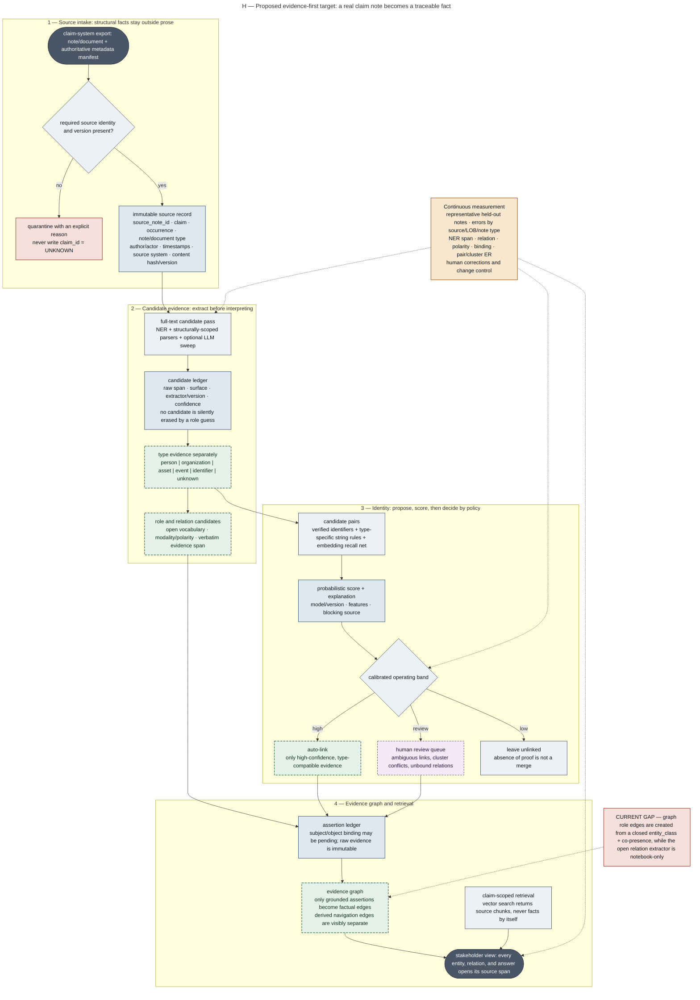

### Target — Client-tunable claim-note intelligence architecture

Source: [`12-client-tunable-reference-architecture.mermaid`](12-client-tunable-reference-architecture.mermaid)

```mermaid
---
title: "Target — Client-tunable claim-note intelligence architecture"
---
flowchart TB
  classDef source fill:#E8EEF8,stroke:#315A8A,stroke-width:1.6px,color:#102A43
  classDef control fill:#F3E8FF,stroke:#7048A8,stroke-width:1.6px,color:#32195A
  classDef activity fill:#F7F7F4,stroke:#535B61,stroke-width:1.4px,color:#20252A
  classDef evidence fill:#E4F2EA,stroke:#2F6B4F,stroke-width:1.8px,color:#12301F
  classDef decision fill:#FFF2D9,stroke:#A06416,stroke-width:1.6px,color:#5A3300
  classDef review fill:#FFF0F0,stroke:#A33A3A,stroke-width:1.6px,stroke-dasharray:6 3,color:#5C1616
  classDef projection fill:#E7F5F7,stroke:#27717A,stroke-width:1.6px,color:#123A40
  classDef invariant fill:#FFF8C9,stroke:#8A6A00,stroke-width:2px,color:#493800
  classDef terminal fill:#263238,stroke:#263238,color:#FFFFFF

  subgraph CONTROL["CONTROL PLANE — changes client policy without changing core code"]
    direction LR
    CP1["<b>ClientProfile vN</b><br/>client · effective window · locale · jurisdiction · LOB"]:::control
    CP2["<b>Source contracts</b><br/>adapters · field mappings · required metadata · source ids"]:::control
    CP3["<b>Extraction policy</b><br/>models · prompts · labels · detector packs · context/chunk rules"]:::control
    CP4["<b>Identity policy</b><br/>per-type features · blockers · constraints · decision bands"]:::control
    CP5["<b>Search policy</b><br/>lane routing · filters · fusion · reranker · context budget"]:::control
    CP6["<b>Governance + evaluation</b><br/>authorization · model boundary · retention · release gates"]:::control
    RS["<b>Immutable RunSpec</b><br/>resolved profile + code commit + model/prompt/schema hashes<br/>reference-data versions + source watermark"]:::evidence
    CP1 --> RS
    CP2 --> RS
    CP3 --> RS
    CP4 --> RS
    CP5 --> RS
    CP6 --> RS
  end

  subgraph INTAKE["1 — INTAKE: authoritative source facts, immutable document versions"]
    direction TB
    S0(["claim-system export / API / file feed"]):::source
    S1["<b>SourceAdapter</b><br/>emit source_document_id · claim_id · occurrence_id<br/>note timestamp · author/source · bytes · metadata"]:::activity
    S2{"contract valid?<br/>required ids · encoding · supported type · authorized client"}:::decision
    Q0["<b>quarantine record</b><br/>reason · raw receipt id · retry/disposition"]:::review
    D0[/"<b>source_document_version</b><br/>opaque document_version_id · SHA-256 · source metadata<br/>bytes are immutable; duplicate delivery is idempotent"/]:::evidence
    S0 --> S1 --> S2
    S2 -->|no| Q0
    S2 -->|yes| D0
  end

  RS -.->|"parameterizes every stage"| S1

  subgraph CONTEXT["2 — CONTEXT PREPARATION: create views, never rewrite evidence"]
    direction LR
    X1["layout / line / quoted-block signals<br/>confidence + detector-pack version"]:::activity
    X2["task-specific text units<br/>sentence/layout-aware boundaries + overlap"]:::activity
    X3["<b>ContextAssembler</b><br/>document metadata · chronology · neighboring notes<br/>authorized party roster · reference hits"]:::activity
    XM[/"<b>context_manifest</b><br/>every item supplied to a model call, with id + as-of version"/]:::evidence
    D0 --> X1 --> X2 --> X3 --> XM
  end

  subgraph CANDIDATES["3 — CANDIDATE GENERATION: maximize recall, preserve disagreements"]
    direction TB
    F0{{"fork by extraction capability"}}:::decision
    NER["<b>entity span lane</b><br/>GLiNER / approved NER provider<br/>open unknown route; no casing gate"]:::activity
    IDS["<b>structured-token lane</b><br/>email · phone · NPI · client identifier packs<br/>detection separate from validation"]:::activity
    REL["<b>relation lane</b><br/>subject · raw predicate · object · evidence<br/>open predicate vocabulary"]:::activity
    EVT["<b>claim-activity lane</b><br/>actor · action · participants · amount/date/status<br/>CONTACTED / RECEIVED / SENT are retained"]:::activity
    REF["<b>reference-data lane</b><br/>carrier roster · client entity list · registries<br/>match is a proposal with source/version"]:::activity
    CL[/"<b>extraction_candidate ledger</b><br/>raw span · raw label/value · lane · score · model/prompt/run<br/>alternatives and overlaps remain separate"/]:::evidence
    XM --> F0
    F0 --> NER --> CL
    F0 --> IDS --> CL
    F0 --> REL --> CL
    F0 --> EVT --> CL
    F0 --> REF --> CL
  end

  subgraph RECONCILE["4 — EVIDENCE RECONCILIATION: validate before interpreting"]
    direction TB
    G1["exact span check<br/>raw[start:end] must equal candidate surface<br/>relocate exactly or reject with reason"]:::activity
    G2["compatible interval reconciliation<br/>preserve nested entities · multi-label alternatives · lane provenance"]:::activity
    G3{"enough evidence to normalize?<br/>unknown and ambiguous remain valid states"}:::decision
    RV["review / unresolved queue<br/>candidate is retained; no guessed fallback"]:::review
    E1[/"<b>mentions</b><br/>structural entity_type · source span · extraction lineage"/]:::evidence
    E2[/"<b>identifier observations + validations</b><br/>format · checksum · registry are separate facts"/]:::evidence
    E3[/"<b>relation / role / event assertions</b><br/>raw + normalized form · orthogonal status axes · evidence"/]:::evidence
    CL --> G1 --> G2 --> G3
    G3 -->|ambiguous / unsupported| RV
    G3 -->|entity observation| E1
    G3 -->|structured observation| E2
    G3 -->|semantic assertion| E3
  end

  subgraph BIND["5 — ARGUMENT + IDENTIFIER BINDING: proposals, not one-time guesses"]
    direction LR
    B1["candidate bindings<br/>explicit span · within-note coref · claim roster<br/>proximity · reference-data owner"]:::activity
    B2["score + compatibility checks<br/>retain competing candidates and method provenance"]:::activity
    B3{"binding decision band"}:::decision
    B4[/"bound assertion / identifier<br/>selected mention/entity + probability + method"/]:::evidence
    B5["binding review queue<br/>unbound observation remains searchable"]:::review
    E1 --> B1
    E2 --> B1
    E3 --> B1
    B1 --> B2 --> B3
    B3 -->|auto| B4
    B3 -->|review| B5
    B3 -->|no-link| B5
  end

  subgraph IDENTITY["6 — ENTITY RESOLUTION: propose, score, validate clusters, version identity"]
    direction TB
    I0{{"candidate-generation union"}}:::decision
    I1["deterministic blocks<br/>exact identifiers · normalized names · source/reference keys"]:::activity
    I2["embedding recall net<br/>task-specific model · per-type compatibility<br/>proposes only; never decides"]:::activity
    I3["per-entity-type pair models<br/>comparison explanations + calibration artifact"]:::activity
    I4["cannot-link + cluster consistency<br/>bridge diagnostics · hub/shared-identifier handling"]:::activity
    I5{"auto-link / review / no-link"}:::decision
    I6["identity review<br/>decision and rationale are immutable"]:::review
    I7[/"<b>stable entity_id</b> + versioned entity_snapshot<br/>membership · predecessor lineage · cluster fingerprint"/]:::evidence
    E1 --> I0
    B4 --> I0
    I0 --> I1 --> I3
    I0 --> I2 --> I3
    I3 --> I4 --> I5
    I5 -->|auto-link| I7
    I5 -->|review| I6 --> I7
    I5 -->|no-link| I7
  end

  subgraph PUBLISH["7 — ATOMIC PROJECTION PUBLICATION: one watermark, many read models"]
    direction LR
    P0["projection builder<br/>requires one client_id + source_run_id"]:::activity
    P1[/"evidence graph<br/>factual assertions separate from derived navigation signals"/]:::projection
    P2[/"entity profiles / dossiers<br/>deterministic summaries with evidence ids"/]:::projection
    P3[/"exact + lexical indexes<br/>ids · names · codes · raw wording"/]:::projection
    P4[/"evidence vector indexes<br/>task/model/version declared"/]:::projection
    P5[/"analytics / timeline views<br/>claim activities ordered by event and record time"/]:::projection
    AM{"all required projections validated<br/>at the same watermark?"}:::decision
    BAD["do not publish<br/>retain last complete manifest; emit failed stage run"]:::review
    GOOD[/"<b>ArtifactManifest</b><br/>checksums · counts · versions · watermarks<br/>atomic pointer to the complete searchable snapshot"/]:::evidence
    I7 --> P0
    E1 --> P0
    E2 --> P0
    E3 --> P0
    B4 --> P0
    P0 --> P1 --> AM
    P0 --> P2 --> AM
    P0 --> P3 --> AM
    P0 --> P4 --> AM
    P0 --> P5 --> AM
    AM -->|no| BAD
    AM -->|yes| GOOD
  end

  subgraph QUERY["8 — QUERY + ANSWER: retrieve evidence, then verify every claim"]
    direction LR
    U0(["authorized stakeholder question"]):::source
    U1["shared QueryService<br/>authorization scope != relevance scope"]:::activity
    U2["typed query router<br/>exact · lexical · vector · temporal · graph"]:::activity
    U3["fusion + reranking<br/>lane attribution and filters preserved"]:::activity
    U4[/"bounded evidence pack<br/>raw spans · assertions · entities · paths · chronology"/]:::evidence
    U5["structured synthesis<br/>answer claims select evidence IDs only"]:::activity
    U6{"citation exists, span matches,<br/>and evidence supports claim?"}:::decision
    U7(["answer + citations + retrieval trace"]):::terminal
    U8["abstain / qualify / request review"]:::review
    GOOD --> U1
    U0 --> U1 --> U2 --> U3 --> U4 --> U5 --> U6
    U6 -->|yes| U7
    U6 -->|no| U8
  end

  subgraph QUALITY["9 — QUALITY LOOP: tune profiles and learned artifacts, never silently mutate history"]
    direction LR
    M1["stage metrics<br/>span · type · binding · polarity axes · pair/cluster ER"]:::activity
    M2["search metrics<br/>Recall@K · nDCG · citation support · abstention · latency/cost"]:::activity
    M3["human review + representative labels<br/>stratified by source · LOB · locale · note form"]:::review
    M4{"release gates passed?"}:::decision
    M5[/"new calibration / model / ClientProfile version<br/>old RunSpecs remain reproducible"/]:::evidence
    U7 --> M2
    RV --> M3
    B5 --> M3
    I6 --> M3
    E1 --> M1
    E2 --> M1
    E3 --> M1
    M1 --> M4
    M2 --> M4
    M3 --> M4
    M4 -->|no| CP6
    M4 -->|yes| M5 --> CP1
  end

  INV["<b>Non-tunable invariants</b><br/>no cross-client identity · immutable source versions · exact evidence provenance<br/>no required silent fallback · unknown survives · factual vs inferred stays visible<br/>readers see only a complete published snapshot"]:::invariant
  INV -.->|"constrains"| RS
  INV -.->|"constrains"| G1
  INV -.->|"constrains"| AM
  INV -.->|"constrains"| U6

  EX["<b>Small data example</b><br/><b>source:</b> '9/2 — claimant says Dr Reyes did not refer her to Apex Imaging.'<br/><b>candidates:</b> person='Dr Reyes'; organization='Apex Imaging'; action='refer'; negation='did not'<br/><b>assertion:</b> Dr Reyes —REFERRED_TO→ Apex Imaging; proposition_status=negated;<br/>evidentiality=reported; source=claimant; evidence=document_version_17[21:68]<br/><b>result:</b> the graph may store the negated assertion, but factual-positive traversal excludes it by policy."]:::invariant
  E3 -.->|"example"| EX
```

### Target — Search, context assembly, and answer verification

Source: [`13-search-and-context-routing.mermaid`](13-search-and-context-routing.mermaid)

```mermaid
---
title: "Target — Search, context assembly, and answer verification"
---
flowchart TD
  classDef input fill:#E8EEF8,stroke:#315A8A,stroke-width:1.6px,color:#102A43
  classDef act fill:#F7F7F4,stroke:#535B61,stroke-width:1.4px,color:#20252A
  classDef decide fill:#FFF2D9,stroke:#A06416,stroke-width:1.6px,color:#5A3300
  classDef lane fill:#E7F5F7,stroke:#27717A,stroke-width:1.6px,color:#123A40
  classDef data fill:#E4F2EA,stroke:#2F6B4F,stroke-width:1.7px,color:#12301F
  classDef warn fill:#FFF0F0,stroke:#A33A3A,stroke-width:1.6px,stroke-dasharray:6 3,color:#5C1616
  classDef note fill:#FFF8C9,stroke:#8A6A00,stroke-width:1.6px,color:#493800
  classDef terminal fill:#263238,stroke:#263238,color:#FFFFFF

  Q0(["question + authenticated user + client context"]):::input
  Q1["<b>authorize first</b><br/>permitted clients · claims · occurrences · fields · cross-claim purpose"]:::act
  Q2{"authorized?"}:::decide
  DENY(["deny + audit event"]):::warn
  Q3["<b>parse a typed query plan</b><br/>intent · entities · exact values · time constraints<br/>relation/path need · requested output · confidence"]:::act
  Q4["mechanically validate plan<br/>allowed operators · bounded graph hops · safe filters · context budget"]:::act
  Q5{"plan valid and sufficiently specific?"}:::decide
  CLARIFY["ask for clarification or use a declared conservative default"]:::warn
  Q0 --> Q1 --> Q2
  Q2 -->|no| DENY
  Q2 -->|yes| Q3 --> Q4 --> Q5
  Q5 -->|no| CLARIFY

  subgraph ANCHORS["A — Extract anchors and separate hard filters from ranking signals"]
    direction LR
    A1[/"authorization filters<br/>client_id · allowed claim set · sensitive-field policy"/]:::data
    A2[/"relevance filters<br/>claim · occurrence · source · note type · author · date range"/]:::data
    A3[/"exact anchors<br/>claim/policy id · NPI · phone · email · date · quoted phrase · code"/]:::data
    A4[/"semantic concepts<br/>'delayed treatment' · 'coverage concern' · 'prior similar activity'"/]:::data
    A5[/"relationship needs<br/>who represented whom · shared identifier · path · neighborhood"/]:::data
    Q5 -->|yes| A1
    Q5 -->|yes| A2
    Q5 -->|yes| A3
    Q5 -->|yes| A4
    Q5 -->|yes| A5
  end

  ROUTE{{"route to every lane that can add independent recall"}}:::decide
  A1 --> ROUTE
  A2 --> ROUTE
  A3 --> ROUTE
  A4 --> ROUTE
  A5 --> ROUTE

  subgraph L1["LANE 1 — Structured / exact"]
    direction TB
    E1["SQL / key-value lookup<br/>document metadata · claim ids · entity ids · validated identifiers"]:::lane
    E2["exact normalized matching<br/>names · phones · emails · registry ids · source-native ids"]:::lane
    E3[/"ranked exact hits<br/>match field · normalization · source row · certainty"/]:::data
    E1 --> E2 --> E3
  end

  subgraph L2["LANE 2 — Lexical"]
    direction TB
    L21["full-text / BM25 query<br/>names · codes · jargon · quoted language · rare tokens"]:::lane
    L22["field boosts<br/>title/name > body; exact phrase > token match"]:::lane
    L23[/"ranked lexical passages<br/>score · matched terms · source span"/]:::data
    L21 --> L22 --> L23
  end

  subgraph L3["LANE 3 — Semantic vector"]
    direction TB
    V1["embed query with retrieval-specific model/task<br/>model version must match index manifest"]:::lane
    V2["pre-filtered k-NN<br/>authorization and required scope applied before ranking"]:::lane
    V3[/"ranked semantic passages / entities<br/>cosine score · model version · source span"/]:::data
    V1 --> V2 --> V3
  end

  subgraph L4["LANE 4 — Temporal"]
    direction TB
    T1["normalize event time vs record time<br/>before/after/as-of/range/sequence"]:::lane
    T2["query claim activities and assertion lifecycle<br/>include corrections/retractions by policy"]:::lane
    T3[/"ordered event/assertion hits<br/>time basis · uncertainty · source span"/]:::data
    T1 --> T2 --> T3
  end

  subgraph L5["LANE 5 — Graph"]
    direction TB
    G1["resolve seed IDs from exact/ER evidence<br/>never start traversal from an unverified surface alone"]:::lane
    G2["bounded typed traversal<br/>factual assertions · identity · containment · optional derived signals"]:::lane
    G3["apply edge policy<br/>polarity/status · confidence · as-of snapshot · hub penalty"]:::lane
    G4[/"ranked paths / neighborhoods<br/>every edge has assertion or derivation provenance"/]:::data
    G1 --> G2 --> G3 --> G4
  end

  ROUTE -->|id / metadata / count| E1
  ROUTE -->|name / code / exact language| L21
  ROUTE -->|concept / paraphrase| V1
  ROUTE -->|chronology / as-of| T1
  ROUTE -->|relationship / network| G1

  F0["<b>normalize lane scores without erasing origin</b><br/>retain rank · raw score · lane · filters · index/artifact version"]:::act
  E3 --> F0
  L23 --> F0
  V3 --> F0
  T3 --> F0
  G4 --> F0
  F1["candidate deduplication<br/>same evidence ID merges lane provenance; raw spans remain distinct"]:::act
  F2["rank fusion<br/>RRF or client-evaluated fusion policy"]:::act
  F3["cross-encoder / rule reranking where justified<br/>question-to-evidence relevance; no factual invention"]:::act
  F4{"minimum evidence and confidence met?"}:::decide
  F0 --> F1 --> F2 --> F3 --> F4

  NONE["return no-supported-answer<br/>show searched scopes and lanes; do not fill from model memory"]:::warn
  F4 -->|no| NONE

  subgraph PACK["B — Context assembler: construct the smallest complete evidence packet"]
    direction TB
    C1[/"selected raw passages<br/>document_version_id · exact span · note/source metadata"/]:::data
    C2[/"selected assertions/events<br/>orthogonal status axes · argument-resolution method"/]:::data
    C3[/"selected entity snapshots / paths<br/>stable IDs · membership version · edge provenance"/]:::data
    C4[/"chronology + authoritative context<br/>claim/occurrence metadata · roster/reference versions"/]:::data
    C5["budget + coverage check<br/>remove redundant overlap; preserve counterevidence and corrections"]:::act
    C6[/"<b>EvidencePack</b><br/>immutable ids only · explicit as-of watermark · complete manifest"/]:::data
    F4 -->|yes| C1
    F4 -->|yes| C2
    F4 -->|yes| C3
    F4 -->|yes| C4
    C1 --> C5
    C2 --> C5
    C3 --> C5
    C4 --> C5
    C5 --> C6
  end

  S1["structured synthesis<br/>each answer_claim = text + selected evidence_ids + uncertainty"]:::act
  S2{"mechanical citation validation<br/>known evidence id? allowed scope? exact span still matches?"}:::decide
  BAD1["reject claim<br/>unknown or unauthorized citation"]:::warn
  S3{"semantic support check<br/>does cited evidence entail or explicitly qualify this claim?"}:::decide
  BAD2["drop / qualify claim or abstain<br/>persist verification failure for evaluation"]:::warn
  S4(["answer + clickable evidence + query/retrieval/verification trace"]):::terminal
  C6 --> S1 --> S2
  S2 -->|no| BAD1
  S2 -->|yes| S3
  S3 -->|no| BAD2
  S3 -->|yes| S4

  TRACE[/"<b>search_run</b><br/>plan · authorization result · filters · lane candidates · ranks<br/>fusion/reranker versions · selected evidence · answer claims · verification"/]:::data
  Q3 -.-> TRACE
  F0 -.-> TRACE
  C6 -.-> TRACE
  S4 -.-> TRACE
  NONE -.-> TRACE
  BAD1 -.-> TRACE
  BAD2 -.-> TRACE

  EX1["<b>Example 1 — 'Find NPI 1234567893'</b><br/>exact identifier lane is authoritative for retrieval;<br/>lexical can recover raw formatting; vector adds little and need not run."]:::note
  EX2["<b>Example 2 — 'What delayed treatment?'</b><br/>semantic + lexical + temporal lanes retrieve passages/events;<br/>graph connects providers only after seed identity is grounded."]:::note
  EX3["<b>Example 3 — 'Who else used this phone across claims?'</b><br/>exact phone normalization seeds graph traversal;<br/>authorization controls cross-claim scope; hub/ownership signals qualify results."]:::note
  E3 -.-> EX1
  V3 -.-> EX2
  G4 -.-> EX3

  WHY["<b>Why vector-only is wrong</b><br/>semantic similarity finds paraphrases, but exact identifiers, names, dates, codes,<br/>and quoted wording often need lexical or structured retrieval. Graph traversal answers<br/>connectivity, not passage relevance. The router composes mechanisms instead of forcing<br/>every question through one representation."]:::note
  ROUTE -.-> WHY
```

### Current — Executable flow and architectural breakpoints

Source: [`14-current-system-breakpoints.mermaid`](14-current-system-breakpoints.mermaid)

```mermaid
---
title: "Current — Executable flow and architectural breakpoints"
---
flowchart TB
  classDef current fill:#F7F7F4,stroke:#535B61,stroke-width:1.4px,color:#20252A
  classDef data fill:#E8EEF8,stroke:#315A8A,stroke-width:1.6px,color:#102A43
  classDef good fill:#E4F2EA,stroke:#2F6B4F,stroke-width:1.7px,color:#12301F
  classDef bad fill:#FFF0F0,stroke:#A33A3A,stroke-width:2px,color:#5C1616
  classDef stale fill:#FFF2D9,stroke:#A06416,stroke-width:1.8px,stroke-dasharray:6 3,color:#5A3300
  classDef disconnected fill:#F3E8FF,stroke:#7048A8,stroke-width:2px,stroke-dasharray:7 3,color:#32195A
  classDef term fill:#263238,stroke:#263238,color:#FFFFFF

  GLOBAL["<b>ONE GLOBAL RUNTIME</b><br/>CFG · SQLite DB · Splink model · graph pickle<br/>Gemini cache · mentions.faiss · chunks.faiss<br/><i>no client_id, RunSpec, artifact manifest, or watermark</i>"]:::bad

  subgraph INPUT["1 — Input"]
    I0([".txt files + mutable doc_index.json"]):::data
    I1["deliver()<br/>copyfile may overwrite same name<br/>claim mapping is optional"]:::current
    I2[/"documents<br/>doc_id · claim_id · occurrence_id · n_chars"/]:::data
    I0 --> I1 --> I2
  end
  GLOBAL -.-> I1

  subgraph PREP["2 — Profiling and chunks"]
    P1["body / quoted segmentation<br/>boilerplate and casing scores"]:::current
    P2["fixed word-based chunks<br/>300-token approximation · 50% overlap"]:::current
    P3[/"segments + Chunk objects"/]:::data
    I2 --> P1 --> P2 --> P3
  end

  subgraph EXTRACT["3 — Candidate extraction and persistence"]
    E0{{"three lanes"}}:::current
    E1["required GLiNER<br/>fixed label set"]:::current
    E2["regex / checksum gazetteer<br/>fixed identifier families"]:::current
    E3["Gemini entity spans<br/>model text + clamped offsets accepted"]:::stale
    E4["union every overlap<br/>longest span wins"]:::stale
    E5["capitalized two-token name gate<br/>failed candidate is deleted"]:::bad
    E6["entity_class guess<br/>person→claimant; organization→medical_provider<br/>ourinsco.com and role cues in code"]:::bad
    E7[/"mentions + has_name assertions"/]:::data
    E8["identifier subject_for()<br/>same line or previous line"]:::stale
    E9[/"identifier_observations<br/>+ bound attribute assertions"/]:::data
    E10["coref.py resolver"]:::current
    E11[/"coref_links<br/>stored but not used by factual pipeline"/]:::disconnected
    P3 --> E0
    E0 --> E1 --> E4
    E0 --> E2 --> E4
    E0 --> E3 --> E4
    E4 --> E5 --> E6 --> E7
    E4 --> E8 --> E9
    E7 --> E10 --> E11
  end

  subgraph REL["DISCONNECTED RESEARCH PATH"]
    R1["relations.extract_relations()<br/>open S-P-O candidates"]:::disconnected
    R2["drops CONTACTED / SENT / RECEIVED / FILED...<br/>drops identifier ownership relations<br/>invalid polarity becomes asserted"]:::bad
    R3["bind_to_mentions()<br/>surface / substring matching"]:::stale
    R4(["not persisted; never reaches operational graph"]):::bad
    P3 -.->|"notebook 20 only"| R1 --> R2 --> R3 --> R4
  end

  subgraph ER["4 — Entity resolution"]
    D1["mention vectors<br/>name + guessed class"]:::current
    D2[/"mentions.faiss"/]:::data
    D3["deterministic blocks + embedding buckets<br/>embedding lane proposes candidates"]:::good
    D4["one global Splink person-name model<br/>training blocks may fail silently"]:::bad
    D5[/"same_as_edges<br/>probability + blocked_by"/]:::good
    D6["connected components<br/>one bad bridge can join a cluster"]:::stale
    D7["entity_id = hash(all member mention_ids)<br/>ID changes whenever membership changes"]:::bad
    D8[/"entities + current snapshot<br/>entity_versions is cleared / unused"/]:::data
    E7 --> D1 --> D2 --> D3 --> D4 --> D5 --> D6 --> D7 --> D8
    E9 --> D3
  end

  subgraph PROFILE["5 — Profiles and graph"]
    F1["profiles.run()<br/>role derived from entity_class<br/>normalized identifiers labeled validated"]:::bad
    F2[/"entity_attributes appended<br/>dossiers upserted by unstable entity_id"/]:::stale
    F3["build_graph()<br/>does not read semantic assertions"]:::bad
    F4["fabricate role edge from class + co-presence<br/>first claimant becomes arbitrary anchor"]:::bad
    F5[/"igraph pickle<br/>party / claim / occurrence / raw identifier nodes"/]:::data
    D8 --> F1 --> F2 --> F3 --> F4 --> F5
    E9 --> F3
    R4 -.->|"no route"| F3
  end

  subgraph INDEX["6 — Search projections"]
    S1["backfill: chunk every note + embed"]:::current
    S2[/"chunks.faiss + raw-text Parquet metadata"/]:::data
    S3["incremental ingest refreshes graph<br/><b>but does not refresh chunks.faiss</b>"]:::bad
    P3 --> S1 --> S2
    I1 -.->|"later note"| S3
    S3 -.->|"stale after ingest"| S2
  end

  subgraph QUERY["7 — Two divergent query products"]
    Q1["app.py<br/>closed dossier-filter query plan<br/>in-memory exact/fuzzy lookups"]:::stale
    Q2["agent.py<br/>every question starts vector-only<br/>then claim-filtered graph expansion"]:::stale
    Q3["LLM synthesis accepts citation strings<br/>without support validation"]:::bad
    Q4["cross_claim_network passes an argument<br/>the graph method no longer accepts"]:::bad
    OUT(["answers can differ by entry point<br/>and can read different data watermarks"]):::term
    F2 --> Q1 --> OUT
    S2 --> Q2
    F5 --> Q2 --> Q3 --> OUT
    Q2 --> Q4
  end

  GLOBAL -.-> D4
  GLOBAL -.-> F5
  GLOBAL -.-> S2
  GLOBAL -.-> Q1
  GLOBAL -.-> Q2

  INC["<b>Incremental consistency failure</b><br/>new SQL evidence + rebuilt graph + stale chunk index<br/>old attributes/dossiers can survive entity-ID churn<br/><i>there is no atomic published snapshot</i>"]:::bad
  S3 --> INC
  F2 --> INC
  D7 --> INC

  LEGEND["<b>Reading this diagram</b><br/><span style='color:#2F6B4F'>green</span> = principle worth retaining · <span style='color:#A06416'>amber</span> = weak/partial mechanism<br/><span style='color:#A33A3A'>red</span> = correctness or semantic break · purple dashed = disconnected path"]:::good
```

### 15-resolution-and-hybrid-search-architecture

Source: [`15-resolution-and-hybrid-search-architecture.mermaid`](15-resolution-and-hybrid-search-architecture.mermaid)

```mermaid
%% Lucid-ready Mermaid: paste the full file into Lucid's Mermaid import.
%% Solid nodes are committed and exercised. Purple dashed nodes are agreed target work.
flowchart LR
  classDef source fill:#E8EEF8,stroke:#315A8A,stroke-width:1.6px,color:#102A43
  classDef live fill:#E4F2EA,stroke:#2F6B4F,stroke-width:1.7px,color:#12301F
  classDef target fill:#F3E8FF,stroke:#7048A8,stroke-width:1.7px,stroke-dasharray:7 4,color:#32195A
  classDef evidence fill:#E7F5F7,stroke:#27717A,stroke-width:1.6px,color:#123A40
  classDef decision fill:#FFF2D9,stroke:#A06416,stroke-width:1.6px,color:#5A3300
  classDef risk fill:#FFF0F0,stroke:#A33A3A,stroke-width:1.5px,stroke-dasharray:5 3,color:#5C1616
  classDef note fill:#FFF8C9,stroke:#8A6A00,stroke-width:1.4px,color:#493800
  classDef terminal fill:#263238,stroke:#263238,color:#FFFFFF

  TITLE["<b>Target — Evidence-first entity resolution and hybrid search</b><br/>Solid = committed and exercised · Purple dashed = agreed target, not yet built"]:::note

  subgraph RESOLVE["A. Entity resolution — decide whether evidence mentions describe the same real-world party"]
    direction TB
    N0(["new note + source metadata<br/>claim ID required; note type / author / timestamp optional"]):::source
    N1["capture span-grounded evidence<br/>mentions + identifier observations are live;<br/>relations + activities are target work"]:::live
    N2["candidate identifier / relation binding<br/>explicit span · coreference · roster · proximity"]:::target
    N3{"binding evidence sufficient?"}:::decision
    N4["retain as unbound evidence<br/>searchable; no guessed owner"]:::risk
    N5[("validated observations<br/>mention IDs · identifier observations · assertions")]:::evidence
    N0 --> N1 --> N2 --> N3
    N3 -->|no / ambiguous| N4
    N3 -->|yes| N5

    R0{{"union candidate-pair generators"}}:::decision
    R1["deterministic blocks<br/>exact identifiers · normalized name keys · source/reference keys"]:::live
    R2["embedding top-K recall net<br/>find semantically similar aliases / variants<br/><i>proposes pairs only; never merges</i>"]:::live
    R3["Fellegi-Sunter / Splink pair score<br/>per-type comparison evidence + calibration artifact"]:::live
    R4{"auto-link · review · no-link<br/>with calibrated decision bands"}:::target
    R5[("versioned entity snapshot<br/>stable ID + membership + lineage + evidence")]:::target
    N5 --> R0
    R0 --> R1 --> R3
    R0 --> R2 --> R3 --> R4 --> R5
  end

  subgraph PUBLISH["B. Publish the searchable evidence view"]
    direction TB
    P0[("claim-scoped evidence graph<br/>only grounded relations / activities / identifiers")]:::target
    P1[("exact identifier index<br/>normalized validated identifiers<br/><i>working now</i>")]:::live
    P2[("lexical index<br/>BM25 / phrase / rare-token retrieval")]:::target
    P3[("vector index<br/>semantic passage retrieval")]:::live
    P4[("temporal event index<br/>event time, record time, corrections")]:::target
    P5[("snapshot manifest<br/>one coherent watermark + versions")]:::target
    R5 --> P0
    N5 --> P0
    N5 --> P1
    N5 --> P2
    N5 --> P3
    N5 --> P4
    P0 --> P5
    P1 --> P5
    P2 --> P5
    P3 --> P5
    P4 --> P5
  end

  subgraph SEARCH["C. Search resolution — use the mechanism that matches the question"]
    direction TB
    Q0(["authorized stakeholder question<br/>+ claim / time / access scope"]):::source
    Q1["extract query anchors and needs<br/>exact values · terms · concepts · time · entity/path"]:::live
    Q2{{"run every applicable retrieval lane<br/>scope filters apply before ranking"}}:::target
    Q0 --> Q1 --> Q2

    E1["EXACT lane<br/>normalized phone / email / NPI and other validated tokens<br/><i>working now</i>"]:::live
    L1["LEXICAL lane<br/>names · codes · jargon · quoted language<br/><i>target</i>"]:::target
    V1["SEMANTIC lane<br/>paraphrases / concepts over note chunks<br/><i>working now</i>"]:::live
    T1["TEMPORAL lane<br/>before / after / as-of / sequence<br/><i>target</i>"]:::target
    G1["GRAPH lane<br/>bounded paths over grounded factual edges<br/><i>target until evidence path is connected</i>"]:::target
    Q2 --> E1
    Q2 --> L1
    Q2 --> V1
    Q2 --> T1
    Q2 --> G1

    F1["preserve lane provenance<br/>rank · raw score · matched evidence · filters"]:::target
    F2["deduplicate evidence, then fuse ranks<br/>RRF + optional relevance reranker"]:::target
    F3[("EvidencePack<br/>raw spans + assertions + entity snapshots + chronology")]:::evidence
    E1 --> F1
    L1 --> F1
    V1 --> F1
    T1 --> F1
    G1 --> F1
    F1 --> F2 --> F3
  end

  subgraph ANSWER["D. Answer only from retrieved evidence"]
    direction TB
    A1["structured synthesis<br/>each answer claim selects evidence IDs<br/><i>target</i>"]:::target
    A2{"citation parses, is in scope,<br/>and lies inside supplied evidence?"}:::decision
    A3(["answer + clickable spans<br/>lane / rank / entity-resolution trace"]):::terminal
    A4["reject / qualify / abstain<br/>show no-supported-answer rather than invent"]:::risk
    F3 --> A1 --> A2
    A2 -->|yes| A3
    A2 -->|no| A4
  end

  TITLE -.-> N0
  TITLE -.-> Q0
  P5 -.-> Q2

  subgraph WHY["Which problem each mechanism solves"]
    direction TB
    W1["<b>Missed aliases / variants</b><br/>Embedding finds candidates deterministic keys miss;<br/>Splink still makes the decision."]:::note
    W2["<b>Wrong identifier ownership</b><br/>Binding is scored before ER. Do not split a correct cluster<br/>to compensate for a mis-bound phone or NPI."]:::note
    W3["<b>Rare literal tokens</b><br/>Exact and lexical lanes retrieve IDs, names, codes, and quotes;<br/>dense vectors are structurally weak for these."]:::note
    W4["<b>Paraphrased narrative</b><br/>Vector retrieval finds conceptually similar passages<br/>such as ‘delayed care’ vs ‘treatment was postponed.’"]:::note
    W5["<b>Chronology and relationships</b><br/>Temporal events answer sequence/as-of questions; a grounded graph<br/>answers bounded relationship paths—not passage relevance."]:::note
    W6["<b>Fabricated provenance</b><br/>Mechanical citation checks reject spans not actually provided<br/>to synthesis. This is working now."]:::note
  end

  R2 -.-> W1
  N2 -.-> W2
  E1 -.-> W3
  L1 -.-> W3
  V1 -.-> W4
  T1 -.-> W5
  G1 -.-> W5
  A2 -.-> W6
```

### 16-platform-runtime-and-data-boundaries

Source: [`16-platform-runtime-and-data-boundaries.mermaid`](16-platform-runtime-and-data-boundaries.mermaid)

```mermaid
%% Lucid-ready Mermaid: paste the full file into Lucid's Mermaid import.
%% Solid green = committed current capability. Purple dashed = agreed target capability.
flowchart TB
  classDef source fill:#E8EEF8,stroke:#315A8A,stroke-width:1.6px,color:#102A43
  classDef store fill:#E7F5F7,stroke:#27717A,stroke-width:1.7px,color:#123A40
  classDef model fill:#FFF2D9,stroke:#A06416,stroke-width:1.7px,color:#5A3300
  classDef service fill:#F7F7F4,stroke:#535B61,stroke-width:1.4px,color:#20252A
  classDef live fill:#E4F2EA,stroke:#2F6B4F,stroke-width:1.7px,color:#12301F
  classDef target fill:#F3E8FF,stroke:#7048A8,stroke-width:1.7px,stroke-dasharray:7 4,color:#32195A
  classDef guard fill:#FFF0F0,stroke:#A33A3A,stroke-width:1.5px,stroke-dasharray:5 3,color:#5C1616
  classDef note fill:#FFF8C9,stroke:#8A6A00,stroke-width:1.4px,color:#493800
  classDef terminal fill:#263238,stroke:#263238,color:#FFFFFF

  LEGEND["<b>Runtime map — which technology is used where, and why</b><br/>Green = current; purple dashed = target. ‘Text’ means original characters/tokens. ‘Vector’ means a numeric embedding; it is never treated as a fact."]:::note

  subgraph INTAKE["1. Intake and authoritative evidence"]
    direction LR
    S0(["client note export<br/>text file/API payload + claim ID<br/>optional: note type, author, timestamp"]):::source
    S1["immutable source store<br/>object/file storage: original note bytes + SHA-256"]:::store
    S2["RELATIONAL evidence store<br/>SQLite today → PostgreSQL-class RDBMS target<br/>documents, spans, identifiers, assertions, runs, entity snapshots"]:::store
    S0 -->|raw note text + source metadata| S1
    S1 -->|document version + source metadata| S2
  end

  subgraph EXTRACT["2. Extraction — locate evidence before interpreting it"]
    direction LR
    X0["read raw text chunks<br/>from immutable source store"]:::service
    X1["GLiNER NER<br/><b>input:</b> raw text tokens<br/><b>output:</b> named-entity spans + labels<br/><b>why:</b> broad recall across casing / phrasing"]:::live
    X2["identifier detectors + validators<br/><b>input:</b> raw text characters<br/><b>output:</b> phone/email/NPI candidates + validation<br/><b>why:</b> exact structured values need deterministic checks"]:::live
    X3["LLM relation + activity extraction<br/><b>input:</b> raw chunk text + allowed context, never vectors<br/><b>output:</b> constrained JSON: arguments, raw predicate/action, evidence offsets<br/><b>why:</b> recover open-ended semantics patterns cannot enumerate"]:::target
    X4["span and schema verifier<br/>raw[start:end] must equal cited surface;<br/>reject unsupported model output"]:::target
    X5["RELATIONAL write<br/>candidate ledger + mentions + identifier observations + grounded assertions<br/><b>why:</b> transactionality, joins, versioning, auditability"]:::store
    X0 --> X1 --> X5
    X0 --> X2 --> X5
    X0 --> X3 --> X4 --> X5
  end

  S1 --> X0
  S2 -.->|document metadata / claim scope| X0

  subgraph RESOLUTION["3. Entity resolution — embeddings propose; probabilistic linkage decides"]
    direction LR
    R0["RELATIONAL read<br/>mention surfaces + validated IDs + source/reference facts"]:::service
    R1["deterministic candidate blocks<br/>exact IDs, normalized name keys, client reference keys<br/><b>why:</b> cheap, explainable high-precision candidates"]:::live
    R2["embedding model<br/><b>input:</b> normalized mention text, not the full note<br/><b>output:</b> numeric vector"]:::live
    R3["ER vector candidate index<br/>FAISS today; vector-store abstraction later<br/><b>operation:</b> top-K nearest mention candidates<br/><b>why:</b> catch alias/variant pairs blocking misses"]:::live
    R4["Splink / Fellegi-Sunter scorer<br/><b>input:</b> candidate pair features from relational store<br/><b>output:</b> pair probability + feature explanation<br/><b>why:</b> the decision is measured, not semantic similarity"]:::live
    R5["binding + cluster policy<br/>auto-link / review / no-link; temporal identifier conflicts<br/><b>why:</b> do not repair a wrong binding by splitting a correct entity"]:::target
    R6["RELATIONAL entity view<br/>versioned membership, stable identity/lineage, decision provenance"]:::target
    X5 --> R0
    R0 --> R1 --> R4
    R0 --> R2 --> R3 -->|candidate mention IDs only| R4
    R4 --> R5 --> R6
  end

  subgraph PUBLISH["4. Build purpose-specific read models from evidence"]
    direction LR
    P0["RELATIONAL / exact index<br/><b>operation:</b> key lookup and metadata filters<br/><b>used for:</b> validated identifiers, claim scope, dates, entity IDs<br/><b>why:</b> exact answers and filtering"]:::live
    P1["full-text lexical index<br/><b>operation:</b> BM25 / phrase / rare token match<br/><b>used for:</b> names, codes, jargon, quoted language<br/><b>why:</b> literal wording is not a vector-similarity problem"]:::target
    P2["chunk vector index<br/>FAISS today<br/><b>operation:</b> nearest-neighbor passage search<br/><b>used for:</b> paraphrase / concept recall<br/><b>why:</b> find meaning when wording changes"]:::live
    P3["GRAPH DATABASE / property graph projection<br/>igraph today; graph DB target at scale<br/><b>operation:</b> bounded typed traversal<br/><b>used for:</b> entity-to-entity paths and identifier adjacency<br/><b>why:</b> relationships, not keyword search"]:::target
    P4["temporal event read model<br/><b>operation:</b> ordered / as-of event query<br/><b>used for:</b> claim chronology and corrections"]:::target
    X5 --> P0
    X5 --> P1
    X5 --> P2
    X5 --> P3
    X5 --> P4
    R6 --> P0
    R6 --> P3
  end

  subgraph SEARCH["5. Search — query each representation for the question it can answer"]
    direction TB
    Q0(["authorized analyst question + claim/time scope"]):::source
    Q1["deterministic query analysis<br/>extract exact values, terms, concepts, date/path intent<br/><b>no LLM required to route the POC</b>"]:::service
    Q2{{"run every applicable lane;<br/>apply authorization and claim filters first"}}:::target
    Q0 --> Q1 --> Q2
    Q3["exact lookup<br/>query tokens → normalized identifier / metadata key"]:::live
    Q4["lexical retrieval<br/>query words → BM25 / phrase hits"]:::target
    Q5["query embedding<br/><b>input:</b> question text<br/><b>output:</b> numeric query vector → k-NN chunks"]:::live
    Q6["temporal query<br/>time language → ordered events / assertions"]:::target
    Q7["graph traversal<br/>resolved seed ID → bounded factual paths"]:::target
    Q2 --> Q3 --> P0
    Q2 --> Q4 --> P1
    Q2 --> Q5 --> P2
    Q2 --> Q6 --> P4
    Q2 --> Q7 --> P3
    Q8["retain lane, rank, raw score, evidence ID, filters"]:::target
    Q9["deduplicate then fuse ranked evidence<br/>RRF + optional reranker"]:::target
    Q10["EvidencePack in relational form<br/>only selected raw spans, assertions, entity snapshots, chronology"]:::store
    P0 --> Q8
    P1 --> Q8
    P2 --> Q8
    P3 --> Q8
    P4 --> Q8
    Q8 --> Q9 --> Q10
  end

  subgraph ANSWER["6. Answer and verify"]
    direction LR
    A0["LLM synthesis<br/><b>input:</b> retrieved raw text + structured triples; target input is an EvidencePack<br/>never vectors and never the whole database<br/><b>output:</b> answer claims + requested citations<br/><b>why:</b> readable explanation, not fact discovery"]:::live
    A1["mechanical citation verifier<br/>check document exists, span bounds, and cited span was in EvidencePack"]:::live
    A2(["answer, clickable source spans,<br/>and retrieval / resolution trace"]):::terminal
    A3["reject unsupported claim;<br/>qualify or abstain"]:::guard
    Q10 --> A0 --> A1
    A1 -->|supported| A2
    A1 -->|unsupported| A3
  end

  LEGEND -.-> S0
  LEGEND -.-> Q0

  subgraph BOUNDARIES["Non-negotiable boundaries"]
    direction LR
    B1["<b>Relational database = system of record</b><br/>facts, evidence spans, decisions, versions, and joins"]:::note
    B2["<b>Vector index = recall accelerator</b><br/>returns candidates/passages; it never establishes identity or truth"]:::note
    B3["<b>Graph database = relationship navigation</b><br/>answers bounded paths only after edges are evidence-grounded"]:::note
    B4["<b>LLM = constrained interpretation and presentation</b><br/>raw text in; structured JSON or cited prose out; never an untraceable store"]:::note
  end
  S2 -.-> B1
  R3 -.-> B2
  P3 -.-> B3
  X3 -.-> B4
  A0 -.-> B4
```
