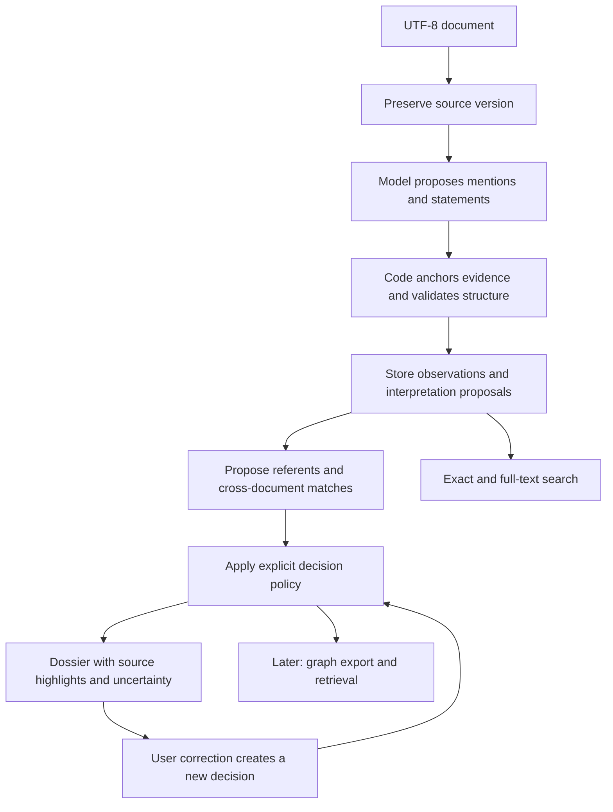

# General-first system design

## The starting decision

Build **one application with one evidence store, one general-purpose model adapter, and one dossier interface**. Start with UTF-8 text. Keep domain concepts in optional configuration/adapters. Add richer retrieval and tuning only after the basic interaction is understandable and reversible.

This document is a proposed design, not an implementation. It follows the [metric-independent assessment](general-first-assessment.md). Architectural choices and stage gates below do not depend on accuracy metrics or benchmark claims.

The minimum usable system automatically interprets a document, creates provisional dossiers, and offers cross-document match proposals. Human review is available where useful; it is not required before every mention can be stored or displayed.

## The whole system



The model can interpret meaning. It cannot invent source IDs, silently change original text, or commit identity changes directly. The store and decision policy enforce those boundaries.

## A small vocabulary you can use to understand the system

| Record | Plain meaning | Example |
|---|---|---|
| Document version | The exact text received at one point | A saved email, including its original line breaks |
| Evidence span | An address into that version | The second occurrence of “Jordan” |
| Mention | An expression referring to something | “Jordan,” “she,” “the pump,” “both teams” |
| Referent / entity | A stable handle for the thing being discussed | The particular pump that a dossier concerns |
| Statement | Something the source expresses | Someone reported that the pump failed |
| Proposal | A possible interpretation with supporting evidence | “It” may refer to the pump |
| Decision | The current selected treatment of a proposal | Keep this link provisional; or accept/reject it |
| Dossier | A view of those records for a referent | Mentions, reported activity, connections, and unresolved alternatives |

“Entity” does not mean “verified real-world person.” It may be an unnamed object, a group, a fictional referent, or an event discussed by a source. It has a stable handle before the system knows everything about it.

## What must be stored from the beginning

Use a relational database initially. SQLite is sufficient for the first local application; a move to a shared database is a later deployment decision. Keep source text in that store initially to simplify consistent backups and citation lookup. No graph database, vector service, message broker, or plugin framework is required for the first build.

These are logical records, not a requirement for one table per row in the list:

- **Document and source version:** stable document ID, version ID, original UTF-8 bytes/text, hash, ingestion time, source metadata. Optional collection/conversation/case membership is metadata, not identity ownership.
- **Evidence:** version ID, exact start/end boundaries, raw quotation. Support multiple spans for an interpretation that depends on several passages. Start with exact raw-text matching; preserve unanchored model proposals as diagnostics, not as grounded observations.
- **Mention:** stable ID, evidence reference, form such as name/pronoun/description/identifier, and separate interpretation proposals for semantic type. Overlapping candidates can coexist.
- **Statement:** source wording/evidence, predicate wording, argument references to mentions or values, and optional qualifiers. Preserve negation, uncertainty, speaker/reporter, hypothetical/quoted context, and stated time. Unknown qualifiers stay unknown; a minimal record does not need a complete semantic parse.
- **Entity:** stable ID and display label, with revisioned membership decisions. A name and a type are revisable interpretations, not immutable identity keys.
- **Proposal and decision:** relation or membership being proposed, supporting evidence/other proposal IDs, status, actor, method/run ID, timestamp, and superseded decision ID. Identity, coreference, type, and attribute ownership are distinct proposal kinds.
- **Run:** model/configuration/prompt versions, input source versions, processing outcome, and failed or incomplete ranges. Preserve the returned proposal payload for inspection and replay analysis.

Use controlled vocabulary for structural states and record kinds. Allow open source-level type/predicate wording, with optional canonical labels added later. This avoids both a giant universal ontology and a claim-specific whitelist.

For propositions with several participants, allow a statement to have multiple named argument roles. Do not force “Alice sent a sample to Bob on Tuesday” into a single lossy triple. Later graph exports can represent the statement/event as a node with participant edges.

## The decision gates

Each gate is a narrow permission boundary. A gate passing means its own conditions hold; it does not certify everything downstream. These are runtime gates, not repeated requests for your approval.

| Gate | Question it decides | Starting policy | If undecided | Your control |
|---|---|---|---|---|
| 1. Source | Can this input be preserved and decoded? | Preserve bytes; decode UTF-8 without silent replacement; version changed content | Record the import issue and retain the original bytes | Accepted input encodings/adapters |
| 2. Evidence | Does this proposed quotation identify an exact occurrence? | Exact matching plus surrounding quoted context; code computes boundaries | Retain an unanchored proposal; do not fabricate a span | Later enable mapped normalization explicitly |
| 3. Interpretation | What mention or statement might this span express? | One general model proposes structure; code validates references and shape | Store unknown types/arguments and incomplete statements | Prompt and schema revision |
| 4. Local reference | Which thing does a mention refer to in this document/context? | Model proposes evidence-backed candidates; uniquely selected proposals may populate provisional dossiers | Keep alternatives and an unresolved mention | Whether machine-selected provisional links appear by default |
| 5. Corpus identity | Might two referents be the same across documents? | Exact-name/value/full-text retrieval proposes candidates; machine suggests links without auto-accepting identity | Show possible matches alongside separate dossiers | Explicitly enable a narrow automatic acceptance rule later |
| 6. Presentation | Which records belong in this dossier view? | Include direct/member evidence, mark provisional attribution, separate possible cross-document matches | Show a visible uncertainty/coverage item | Switch provisional-inclusive vs accepted-only view |

Structural consistency checking occurs before storing a selected decision: no missing referenced records, unsupported source address, or conflict with a current human rejection may be silently accepted. Semantic conflict can remain unresolved; it does not justify deleting observations.

### What each status means

- **Proposed:** an interpretation exists; it has not been selected.
- **Provisional:** a machine-selected interpretation used in the working view, visibly marked as such.
- **Accepted:** an explicit human decision, or later an enabled automatic policy with a recorded rule ID.
- **Rejected:** an explicit decision against that interpretation.
- **Superseded:** historical decision replaced by a newer one, still inspectable.

“Unresolved” describes an item without a selected interpretation. It does not mean rejected or nonexistent. Acceptance is an operational decision, not a claim of infallibility.

Do not introduce arbitrary confidence thresholds at the start. Let the model supply candidates and evidence; keep structural checks deterministic. This makes the operating policy understandable without interpreting opaque scores.

## How the first version behaves out of the box

### Import and interpretation

Process the whole document when it fits the model context. For longer inputs, use stable paragraph/block windows with recorded boundaries and overlap. Windows do not become identity boundaries. Run a document-level reconciliation step over extracted mentions and retrieve original passages when resolving references across windows. If context is insufficient, leave the reference unresolved.

Use one general-purpose structured-output model through a thin adapter. No fine-tuning, claim-role dictionary, learned organization lexicon, multi-model voting, or domain identifier policy is required. Model selection is a separate implementation choice; this design makes no current product recommendation.

The extraction response contains quoted evidence and surrounding anchors, mention proposals, statement proposals, and proposed local references. Code assigns durable IDs and grounds the quotes. Normalization may supply search keys but never replaces source text.

Do not create a separate independent entity for every pronoun. When no antecedent can be selected, retain its mention and statement arguments unresolved. Named or descriptive mentions can seed provisional referents; several mentions can be provisionally grouped only through a recorded local-reference decision.

### Cross-document discovery without hidden merging

Retrieve candidate referents by names, aliases, identifiers, and full-text context. An exact name match proposes a candidate; it does not prove identity. The same applies to an identifier value unless a later enabled policy establishes its assignment semantics.

Present candidate dossiers side by side with supporting and conflicting passages. A user can accept a shared identity, reject it, or leave it open. Working search can surface all candidates without combining their statements into one accepted biography.

This default intentionally provides automated discovery and provisional local organization before unattended corpus-wide deduplication. You can enable more automation later through a single named identity policy, without rewriting the storage model.

### Dossier

Start with four panels:

1. **Identity and scope:** display label, type hypotheses, source/context coverage, provisional/accepted state, and possible matches.
2. **Mentions and statements:** every included occurrence and attributed statement, with exact source highlights, reporting context, and uncertainty. Use pagination; do not substitute top-k retrieval for a complete occurrence list.
3. **Connections:** sourced relationships and separately labeled shared-value/co-occurrence proposals.
4. **Decisions:** why each selected attribution exists, alternative proposals, and correction history.

Avoid a generated biography in the first release. A deterministic presentation of sourced statements is already a useful dossier and is easier to inspect. A stored export pins the source versions and decision revision, so it can reproduce a prior view.

### Correction and dependency handling

A correction appends a decision. It never rewrites the source or deletes the original proposal. Reassigning a mention changes which dossier displays its attributed statement; the statement's original mention argument remains unchanged.

Store dependencies between proposals/decisions. If a later inference depended on a now-rejected interpretation, mark it stale/pending and recompute it explicitly. Rendering a provisional relationship in a dossier must not turn it into evidence for a subsequent identity decision.

Accepting identity consolidation preserves the previous entity handles with revisioned aliases/membership. A later split records the replacement memberships and retains historical views. Rejecting identity must also be respected by any indirect accepted-group path; arbitrary graph traversal is never the identity algorithm.

## Four different meanings of deduplication

| Operation | Starting behavior |
|---|---|
| Re-importing identical source content | Reuse content storage where appropriate, but preserve distinct source-document provenance. |
| Two extraction passes propose the same occurrence | Keep one occurrence with separate proposal provenance; do not lose disagreement about its meaning. |
| Several mentions refer to one entity | Change the identity view through explicit decisions; preserve all occurrences. |
| Several documents repeat one statement | Preserve each appearance; allow a copied-source association. Do not treat repetition as independent confirmation. |

Keeping these operations separate prevents “deduplicate” from becoming permission to discard evidence.

## How to stagger improvements

These are build stages. Each ends with a concrete walkthrough you can inspect. Advancing is a deliberate scope decision; no new hidden gate is added merely because a model or library offers it.

| Stage | Add | Demonstration before moving on |
|---|---|---|
| A. Evidence and first dossier | Source versions, quoted mentions/statements, one model, source viewer, provisional dossier | Import a document, click every shown item to its exact source, and preserve the old view after editing/reimporting the document. |
| B. Reference decisions | Pronoun/descriptor candidates, alternatives, correction history | Inspect an ambiguous pronoun, choose/reject its referent, and see attribution update without losing the original text or decision. |
| C. Corpus identity | Candidate lookup, side-by-side dossiers, accepted/rejected identity decisions, merge/split history | Two same-name entities remain distinct; one entity across documents can be consolidated and split again. |
| D. Targeted improvements | Enable one change at a time: a detector, contextual retrieval, identity rule, or domain vocabulary | Explain the new gate in one decision card and demonstrate both its selected and unresolved outcomes, plus disabling it. |
| E. Graph retrieval and optional synthesis | Versioned graph export, supported path queries, then narrative answers | Trace a returned connection through the exact statements and identity decisions used; uncertainty survives export and synthesis. |

Stages A–C form the baseline usable system. A dossier appears in A; it becomes more capable without being rebuilt around a new ontology at each stage. Stage B is foundational, not a late optional enhancement. Stages D and E should not hold up delivery of that baseline.

Behavioral checks here verify contracts and user actions. They do not use accuracy metrics as design variables. Do not characterize the demonstrations as proof that arbitrary text is fully understood.

## Your control surface

Expose a short policy page rather than a wall of model thresholds:

- Interpretation model and prompt revision.
- Display provisional attributions: on/off.
- Automatic corpus identity acceptance: off initially; named rules only when enabled.
- Enabled domain adapters: none initially.
- Optional retrieval/index features: off until introduced.

Keep evidence integrity, source history, and preservation of human decisions as fixed invariants, not toggles. Numeric infrastructure limits such as request size or concurrency can remain ordinary technical settings; they must not silently decide identity.

For every proposed improvement, require this card:

```text
Decision:
User interaction this enables:
Why the current stage cannot handle it:
New interpretation or automatic action permitted:
Evidence and dependencies it must retain:
What remains unresolved:
What the dossier will display:
How to disable or reverse it:
One concrete example to walk through:
```

This keeps control at the policy level. You should not need to understand an embedding implementation to know whether it can merge two dossiers.

## Domain tuning and GraphRAG later

A domain adapter can provide identifier recognizers, preferred terminology, metadata mappings, candidate hints, and explicit identity-assignment rules. Claims, medical research, equipment maintenance, and other domains plug into the same records. An adapter cannot delete source observations because they fall outside its vocabulary or silently convert association into identity.

Graph export is generated from the current evidence and decision revision. Export entities, mentions, statement/event nodes, evidence references, and typed decision/relationship edges. Preserve negation, reporting context, and provisional status. A consumer-specific format is an adapter; the core remains independent of it.

Structured lookup answers exhaustive questions. Graph queries answer supported connection/path questions. Optional model synthesis explains retrieved evidence. These are distinct operations with distinct completeness claims.

## Explicit limits on the starting scope

Start with text, not OCR or arbitrary binary document parsing. Other input adapters may later produce text with a mapping back to the original document. UTF-8 preserves languages; it does not establish that the selected model supports every language equally. Keep language/script metadata optional and avoid English-only name-shape rules as mandatory gates.

Do not attempt a universal ontology, autonomous investigator, inferred risk score, learned linkage engine, community-summary pipeline, or distributed service mesh in the first build. Preserve enough evidence and provenance that these can be added deliberately, rather than designing an abstract framework for all of them now.

The architecture's enduring rule is simple: **preserve what was received, expose what was inferred, and make every consequential interpretation a visible, reversible decision.**
