# Pipeline activity diagrams — mermaid sources

Mermaid versions of the UML activity diagrams in
[`../pipeline-activity-diagrams.html`](../pipeline-activity-diagrams.html), which
remains the fuller companion: it carries the per-stage goal statements, the
worked-example tables in full, and the `entity_class` design discussion that has
no diagram.

Each `.mermaid` file here is standalone and is the source of truth. The blocks
below are generated copies so they render on GitHub — regenerate with
`python3 build_readme.py` after editing any diagram.

## Reading these

| shape | meaning |
|---|---|
| stadium, dark fill | initial / final node |
| rectangle, grey fill | activity — something happens |
| rectangle, blue fill | object node — data at rest |
| diamond | decision |
| dark bar | fork / join |
| rectangle, red fill | data discarded here |
| rectangle, amber fill | a path worth noticing |
| dashed box, dotted edge | worked data example, or a design caveat |

Two notational compromises, since Mermaid's flowchart grammar is not UML:

- **Fork and join bars** are drawn as labelled dark nodes rather than the thin
  UML synchronisation bar, which the grammar has no shape for. `stateDiagram-v2`
  does provide a real `<<fork>>`, but gives up the decision diamond, the object
  node, and multi-line labels — a bad trade for diagrams whose whole point is the
  per-node data examples.
- **Data examples** hang off their activity as dashed notes on a dotted edge,
  rather than sitting in a table beside the figure as they do in the HTML.

Every diagram in this folder is checked to parse and render with mermaid 11.

## Diagrams

### A — Freeze and fingerprint the note

Source: [`01-freeze-fingerprint.mermaid`](01-freeze-fingerprint.mermaid)

### B — Source claim identity, then segment the note

Source: [`02-claim-identity-and-segmentation.mermaid`](02-claim-identity-and-segmentation.mermaid)

```mermaid
---
title: "B — Source claim identity, then segment the note"
---
flowchart TD
  classDef act  fill:#EDF0F4,stroke:#4A5666,stroke-width:1.2px,color:#10151C
  classDef obj  fill:#E0E8EF,stroke:#3E5C76,stroke-width:1.3px,color:#10151C
  classDef dec  fill:#FFFFFF,stroke:#4A5666,stroke-width:1.2px,color:#10151C
  classDef bar  fill:#4A5666,stroke:#39424E,stroke-width:1px,color:#FFFFFF
  classDef bad  fill:#F6E0DB,stroke:#A33A2A,stroke-width:1.4px,color:#10151C
  classDef key  fill:#F6E7CE,stroke:#B4650A,stroke-width:1.6px,color:#10151C
  classDef muted fill:#FFFFFF,stroke:#B9C2CE,stroke-width:1px,stroke-dasharray:4 3,color:#4A5666
  classDef ex   fill:#FBFCFD,stroke:#B9C2CE,stroke-width:1px,stroke-dasharray:3 3,color:#33404F
  classDef warn fill:#FFF6E8,stroke:#B4650A,stroke-width:1.3px,stroke-dasharray:5 3,color:#3A2C16
  classDef term fill:#4A5666,stroke:#39424E,stroke-width:1px,color:#FFFFFF


  B0(["frozen note file"]):::term
  B1["<b>Parse claim_number + note_id from filename</b><br/>filename pattern: ClaimNumber_NoteID.txt"]:::act
  B2["<b>Join against the client's occurrence table</b><br/>Occurrence Number · Claim Number · Note ID<br/>client-provided, never extracted from text"]:::key
  B3["<b>doc_id → claim_id + occurrence_id</b><br/>structural metadata, known before any text is read"]:::obj
  B4["<b>Split note into physical lines</b><br/><i>profiling._line_spans</i>"]:::act
  B5["<b>Classify each line by shape</b><br/><i>profiling._classify_line</i> — 5 regexes + a signature latch"]:::act
  B6["<b>Group runs of like lines into segments</b><br/><i>profiling.segment_document</i>"]:::act
  B7{"segment kind?"}:::dec
  B8["<b>Marked as excluded range</b><br/>the NAME lane in D3 drops candidates inside it"]:::muted
  B9["<b>Fingerprint template blocks</b><br/><i>profiling.template_fingerprint</i> — hash of the label sequence"]:::act
  B10["<b>MinHash shingles → near-dup groups</b><br/><i>profiling._minhash + assign_dup_groups</i>"]:::act
  B11["<b>segments rows</b><br/>kind, char_start, char_end, dup_group_id"]:::obj
  B12(["ready for chunking"]):::term

  B0 --> B1 --> B2 --> B3 --> B4 --> B5 --> B6 --> B7
  B7 -->|"boilerplate"| B8
  B7 -->|"narrative / template / email"| B9 --> B10 --> B11 --> B12

  BX1["<b>in</b> — CLM00182_0734.txt, the filename as delivered<br/><b>out</b> — claim_number='CLM00182', note_id='0734'<br/><i>Parsed directly from the name; no text has been read yet.</i>"]:::ex
  B1 -.->|"example"| BX1

  BX2["<b>in</b> — join row: OCC0091 · CLM00182 · 0734<br/><b>out</b> — doc_id='note_0734' → claim_id='CLM00182', occurrence_id='OCC0091'<br/><i>A join on claim_number + note_id resolves the occurrence. Structural metadata established before extraction runs — not a claim about what the text says.</i>"]:::ex
  B2 -.->|"example"| BX2

  BX3["<b>in</b> — 'Claimant: Jones' / 'D.O.B 04/11/1979' / blank / 'Spoke with Robert Miller regarding…'<br/><b>out</b> — kind='template_block' chars 0–41; kind='narrative' chars 43–512<br/><i>Runs of similarly-shaped lines become one typed segment each, so the label-value header and the prose below it are handled by different logic downstream.</i>"]:::ex
  B6 -.->|"example"| BX3

  BX4["<b>in</b> — 'CONFIDENTIALITY NOTICE: This message is intended…'<br/><b>out</b> — kind='boilerplate' → excluded character range<br/><i>Legal footer text is typed as boilerplate and its range excluded, so names inside it never reach the name-shape filter.</i>"]:::ex
  B8 -.->|"example"| BX4

  BW["<b>Known limitation of this classifier</b><br/>It is 5 regexes over a single line plus one stateful flag — not a learned model.<br/>· <b>SIG_MARK_RE</b> matches only a bare '--' line, the Usenet signature convention. Outlook rarely emits it, and the in_sig flag is a <b>one-way latch</b>: once set it is never cleared, so one stray '--' turns the whole rest of the note into email_signature.<br/>· <b>BOILER_RE</b> is three hardcoded English phrases; a disclaimer worded differently is not excluded, and its names reach the name filter.<br/>· <b>LABEL_RE</b> fires on any line starting 'Word:', so narrative openers like 'Update: spoke with counsel' are typed template_block.<br/><i>These labels are a hard gate today — D3 drops name candidates inside a boilerplate range — so a miss costs precision and a false positive silently deletes real names. Measure on real client notes before trusting it; prefer making the label advisory over widening the regexes.</i>"]:::warn
  B5 -.->|"caveat"| BW
```

### C — Cut the note into overlapping chunks

Source: [`03-chunking.mermaid`](03-chunking.mermaid)

### D1 — Generate candidates: fork, extract, join, sweep

Source: [`04-generate-candidates.mermaid`](04-generate-candidates.mermaid)

```mermaid
---
title: "D1 — Generate candidates: fork, extract, join, sweep"
---
flowchart TD
  classDef act  fill:#EDF0F4,stroke:#4A5666,stroke-width:1.2px,color:#10151C
  classDef obj  fill:#E0E8EF,stroke:#3E5C76,stroke-width:1.3px,color:#10151C
  classDef dec  fill:#FFFFFF,stroke:#4A5666,stroke-width:1.2px,color:#10151C
  classDef bar  fill:#4A5666,stroke:#39424E,stroke-width:1px,color:#FFFFFF
  classDef bad  fill:#F6E0DB,stroke:#A33A2A,stroke-width:1.4px,color:#10151C
  classDef key  fill:#F6E7CE,stroke:#B4650A,stroke-width:1.6px,color:#10151C
  classDef muted fill:#FFFFFF,stroke:#B9C2CE,stroke-width:1px,stroke-dasharray:4 3,color:#4A5666
  classDef ex   fill:#FBFCFD,stroke:#B9C2CE,stroke-width:1px,stroke-dasharray:3 3,color:#33404F
  classDef warn fill:#FFF6E8,stroke:#B4650A,stroke-width:1.3px,stroke-dasharray:5 3,color:#3A2C16
  classDef term fill:#4A5666,stroke:#39424E,stroke-width:1px,color:#FFFFFF


  D0(["one chunk — text + absolute offsets"]):::term
  FORK["<b>fork</b> — three independent extractors read the same chunk text"]:::bar
  D0 --> FORK

  subgraph LANE1["Lane 1 · Token-NER — deterministic name shapes"]
    direction TB
    L1["<b>Regex name-shape scan</b><br/><i>DeterministicTokenNER._RE_SEQ / _RE_FLIP / _RE_TITLED</i>"]:::act
    L2["<b>Trim sentence-opener words</b><br/>strip _LEADING_NOISE; offsets stay byte-exact"]:::act
    L3["<b>Reject all-stopword spans</b><br/>surface ⊆ _STOP → discarded"]:::act
    L4["<b>Emit SpanCandidate</b><br/>extractors = token_ner"]:::act
    L1 --> L2 --> L3 --> L4
  end

  subgraph LANE2["Lane 2 · Gazetteer — patterns with structural validation"]
    direction TB
    M1["<b>Pattern scan</b><br/><i>gazetteers.scan</i> — phone / email / npi / claim_id / …"]:::act
    M2["<b>Validation — strength varies by label</b><br/>checksum: npi only · format: email, phone, icd10, cpt · none: the rest"]:::act
    M3["<b>Keep only valid hits</b><br/>invalid checksum → discarded here, not downstream"]:::act
    M4["<b>Emit SpanCandidate</b><br/>extractors = gazetteer; score 1.0 valid / 0.5 unvalidated"]:::act
    M1 --> M2 --> M3 --> M4
  end

  subgraph LANE3["Lane 3 · LLM semantic pass — what no pattern encodes"]
    direction TB
    R1["<b>Build extraction prompt</b><br/>chunk text + allowed label enum"]:::act
    R2["<b>Constrained JSON generation</b><br/><i>genai.generate_json with _llm_ner_schema</i>"]:::act
    R3["<b>Drop pronouns / vague descriptors</b><br/><i>coref.is_anaphor</i> filter; clip offsets to chunk"]:::act
    R4["<b>Emit SpanCandidate</b><br/>extractors = llm; carries a free-text description"]:::act
    R1 --> R2 --> R3 --> R4
  end

  FORK --> L1
  FORK --> M1
  FORK --> R1

  JOIN["<b>join</b> — union_spans · see diagram 05 for the merge rule itself"]:::bar
  L4 --> JOIN
  M4 --> JOIN
  R4 --> JOIN

  P1["<b>per-chunk candidate list</b><br/>post first union"]:::obj
  JOIN --> P1
  SW{"sweep enabled?"}:::dec
  P1 --> SW
  SKIP["<b>Skip straight to the next chunk</b>"]:::muted
  SW -->|"no"| SKIP

  S1["<b>Find text spans no candidate covers</b><br/><i>sweep.uncovered_candidates</i>"]:::act
  S2["<b>Differential-audit prompt: 'what is missing?'</b><br/>shown its own extraction list, asked only for the gaps"]:::key
  S3["<b>Second constrained LLM pass</b><br/>low-salience recall net — paralegals, codes, secondary providers"]:::act
  S4["<b>Union sweep results into the pool</b><br/><i>union_spans over spans + extra</i>"]:::act
  SW -->|"yes"| S1 --> S2 --> S3 --> S4

  P2["<b>final per-chunk candidate dataset</b><br/>repeats for every chunk in the note"]:::obj
  S4 --> P2
  SKIP --> P2
  MERGE["<b>Merge every chunk's candidates for this document</b><br/>second union_spans call — cross-chunk overlaps collapse too"]:::act
  P2 -->|"one chunk's output ×N chunks"| MERGE
  P3["<b>per-document candidate pool</b><br/>→ continues in diagram 06"]:::obj
  MERGE --> P3 --> D9(["to filter / classify / persist"]):::term

  LX1["<b>in</b> — '…transfer note. Contacted James Moore per yesterday's…'<br/><b>out</b> — raw regex hit 'Contacted James Moore' at 800:823<br/><i>The capitalized-run pattern matches greedily and swallows the sentence-opening verb.</i>"]:::ex
  L1 -.->|"example"| LX1
  LX2["<b>in</b> — 'Contacted James Moore' at 800:823<br/><b>out</b> — 'James Moore' at 812:823<br/><i>The leading token is a known sentence-opener, so it is stripped; the offset shifts but stays byte-exact.</i>"]:::ex
  L2 -.->|"example"| LX2
  LX3["<b>in</b> — 'Claims Department' at 40:58<br/><b>out</b> — discarded<br/><i>Every token in the span is a structural stopword, so it is rejected before it can become a candidate.</i>"]:::ex
  L3 -.->|"example"| LX3
  LX4["<b>in</b> — 'James Moore' at 812:823<br/><b>out</b> — SpanCandidate start=812, end=823, text='James Moore', label='person', extractors=token_ner, score=0.75<br/><i>A surviving span is packaged into the common candidate type every lane emits.</i>"]:::ex
  L4 -.->|"example"| LX4

  MX1["<b>in</b> — '…callback left at (312) 555-0148, no name given…'<br/><b>out</b> — raw pattern hit '(312) 555-0148' at 918:932, label='phone'<br/><i>The identifier shape matches on its own, independent of any nearby name.</i>"]:::ex
  M1 -.->|"example"| MX1
  MX2["<b>in</b> — 'NPI 1568291037'<br/><b>out</b> — valid=True, validation='checksum'<br/><i>A real Luhn check over '80840' + the first 9 digits, the NPPES standard. A random 10-digit string passes with p≈0.1, so this genuinely discriminates. <b>npi is the only label with a real check digit.</b></i>"]:::ex
  M2 -.->|"example"| MX2
  MX3["<b>in</b> — 'SSN 123-45-6789'<br/><b>out</b> — valid=True, validation='none'<br/><i>Nothing beyond the pattern was checked. This previously re-ran the identical regex that had already matched and called the result validation — tautological, and it read in code and in this diagram as though a real check had occurred. ssn and tin now report validation='none' honestly, and the ensemble scores them lower than a checksum-verified hit.</i>"]:::ex
  M3 -.->|"example"| MX3
  MX4["<b>in</b> — GazetteerHit start=918, end=932, text='(312) 555-0148', label='phone', valid=true<br/><b>out</b> — SpanCandidate with extractors=gazetteer, score=1.0<br/><i>A validated hit converts 1:1 into a candidate at full confidence.</i>"]:::ex
  M4 -.->|"example"| MX4

  RX1["<b>in</b> — chunk text, 190 words<br/><b>out</b> — 'Extract every entity mention… Labels: person, organization, …' followed by the chunk between delimiters, including '…Lakeshore Imaging Center performed the follow-up scan…'<br/><i>The whole chunk is embedded in one instruction asking for every mention, not just the ones a pattern would catch.</i>"]:::ex
  R1 -.->|"example"| RX1
  RX2["<b>in</b> — the prompt above<br/><b>out</b> — entities: text='Lakeshore Imaging Center', label='organization', start=214, end=238, description='secondary imaging provider, mentioned once', confidence=0.8<br/><i>Output is constrained to this exact JSON shape — the model cannot return free prose instead.</i>"]:::ex
  R2 -.->|"example"| RX2
  RX3["<b>in</b> — text='She', label='person', start=260, end=263<br/><b>out</b> — discarded<br/><i>A pronoun slipped past the prompt's instruction; the anaphor filter catches it before it becomes a candidate.</i>"]:::ex
  R3 -.->|"example"| RX3
  RX4["<b>in</b> — text='Lakeshore Imaging Center', start=214, end=238 — chunk-relative<br/><b>out</b> — SpanCandidate start=chunk_offset+214, end=chunk_offset+238, label='organization', extractors=llm, description carried through<br/><i>The chunk-relative offset is shifted to the document-absolute offset the other two lanes already use.</i>"]:::ex
  R4 -.->|"example"| RX4

  SX["<b>in</b> — the chunk plus the candidate list already found<br/><b>out</b> — only the mentions absent from that list<br/><i>This is a differential audit, not a repeat of the first pass: the model is shown its own answer and asked what it missed, which is why it surfaces low-salience mentions the first pass skimmed over.</i>"]:::ex
  S2 -.->|"example"| SX
```

### D2 — How union_spans merges overlapping candidates

Source: [`05-union-overlapping-candidates.mermaid`](05-union-overlapping-candidates.mermaid)

### D3 — Filter, classify, bind, and persist

Source: [`06-filter-classify-persist.mermaid`](06-filter-classify-persist.mermaid)

```mermaid
---
title: "D3 — Filter, classify, bind, and persist"
---
flowchart TD
  classDef act  fill:#EDF0F4,stroke:#4A5666,stroke-width:1.2px,color:#10151C
  classDef obj  fill:#E0E8EF,stroke:#3E5C76,stroke-width:1.3px,color:#10151C
  classDef dec  fill:#FFFFFF,stroke:#4A5666,stroke-width:1.2px,color:#10151C
  classDef bar  fill:#4A5666,stroke:#39424E,stroke-width:1px,color:#FFFFFF
  classDef bad  fill:#F6E0DB,stroke:#A33A2A,stroke-width:1.4px,color:#10151C
  classDef key  fill:#F6E7CE,stroke:#B4650A,stroke-width:1.6px,color:#10151C
  classDef muted fill:#FFFFFF,stroke:#B9C2CE,stroke-width:1px,stroke-dasharray:4 3,color:#4A5666
  classDef ex   fill:#FBFCFD,stroke:#B9C2CE,stroke-width:1px,stroke-dasharray:3 3,color:#33404F
  classDef warn fill:#FFF6E8,stroke:#B4650A,stroke-width:1.3px,stroke-dasharray:5 3,color:#3A2C16
  classDef term fill:#4A5666,stroke:#39424E,stroke-width:1px,color:#FFFFFF


  F0(["per-document candidate pool — from diagram 04"]):::term
  FORK["<b>fork</b> — every candidate is routed by its label"]:::bar
  F0 --> FORK

  subgraph NAMES["Name lane — a name has to look like a name"]
    direction TB
    N1["<b>label ∈ NAME_LABELS</b><br/>person / organization / attorney / repair_shop / …"]:::act
    N2{"inside a<br/>boilerplate range?"}:::dec
    N2D["<b>Dropped</b><br/>n_dropped_boiler += 1"]:::bad
    N3{"passes<br/>_is_plausible_name?"}:::dec
    N3D["<b>Dropped</b><br/>n_dropped_shape += 1"]:::bad
    N4["<b>Classify entity_class</b><br/><i>_classify</i> over surface, label, left context, right context"]:::act
    N5["<b>Persist mentions row</b><br/>mention_id, surface, char_start, char_end, entity_class"]:::act
    N6["<b>Persist has_name assertion</b><br/>source_span = the mention's OWN span"]:::act
    N1 --> N2
    N2 -->|"yes"| N2D
    N2 -->|"no"| N3
    N3 -->|"no"| N3D
    N3 -->|"yes"| N4 --> N5 --> N6
  end

  subgraph IDS["Identifier lane — an identifier has to be found near a name, or not"]
    direction TB
    I1["<b>label ∈ IDENTIFIER_LABEL_TO_PREDICATE</b><br/>phone / email / npi / tin / ssn / address"]:::act
    I2["<b>subject_for on char_start</b><br/>same line, or ≤120 chars on the immediately preceding line"]:::act
    I3["<b>Persist identifier_observations row — always</b><br/>subject_mention_id = the binding result, NULL if none"]:::key
    I4{"a subject<br/>was found?"}:::dec
    I5["<b>Persist binding assertion</b> e.g. has_phone<br/>source_span = the IDENTIFIER's own location, not the name's"]:::key
    I6["<b>Orphan — no assertion</b><br/>the observation row still stands on its own"]:::key
    I1 --> I2 --> I3 --> I4
    I4 -->|"yes"| I5
    I4 -->|"no"| I6
  end

  FORK --> N1
  FORK --> I1

  JOIN["<b>join</b>"]:::bar
  N6 --> JOIN
  I5 --> JOIN
  I6 --> JOIN

  G1["<b>Scan raw text for allegation language</b><br/>regex over the SOURCE TEXT directly — not over the candidate pool at all"]:::act
  G2["<b>Bind to nearest mention, persist allegation assertion</b><br/>polarity 'alleged' — kept separate from asserted fact"]:::act
  G3["<b>Resolve coreference over every mention found above</b><br/><i>coref.RuleBasedCorefResolver.resolve</i> over raw_text + mentions"]:::act
  G4["<b>Persist coref_links row</b><br/>anaphor span + antecedent span + antecedent_mention_id"]:::act
  G5["<b>Record scan_ledger coverage for this document</b>"]:::obj
  G6["<b>Persist mentions, assertions, identifier_observations, coref_links</b><br/>one transaction per corpus run"]:::act
  G7(["to entity resolution"]):::term

  JOIN --> G1 -->|"match"| G2 --> G3 -->|"anaphor found"| G4 --> G5 --> G6 --> G7

  IX1["<b>in</b> — SpanCandidate text='(312) 555-0148', label='phone', with no name on this line or the previous one<br/><b>out</b> — identifier_observations kind='phone', value_norm='3125550148', subject_mention_id=NULL<br/><i>Recorded anyway. An identifier with no name nearby is exactly the case this system exists to catch, not a reason to drop it.</i>"]:::ex
  I6 -.->|"example"| IX1

  IX2["<b>in</b> — subject: mention m0000153, 'Robert Miller', chars 40–52<br/>identifier candidate '(312) 555-0148', chars 918–932, bound via subject_for<br/><b>out</b> — Assertion subject_mention_id='m0000153', predicate='has_phone', object_value_norm='3125550148', source_span_start=918, source_span_end=932<br/><i><b>This is what an evidence span is.</b> The assertion's subject points at the name's location; its evidence span points at the phone number's location — a different place in the text. The fact is ABOUT the subject but PROVEN at the evidence span, and the two are not always the same characters.</i>"]:::ex
  I5 -.->|"example"| IX2

  CX1["<b>Resolving anaphora to antecedent mentions</b> means finding the specific earlier word or phrase that a pronoun or later reference points back to.<br/><br/>'John gave Mary a present. She loved it.'<br/><b>Antecedents</b> — 'Mary' and 'a present'<br/><b>Anaphors</b> — 'She', referring to Mary, and 'it', referring to the present.<br/><i>Without this step 'She' is either dropped or becomes its own bogus entity; with it, the sentence's second half attaches to the entity named in the first half.</i>"]:::warn
  G3 -.->|"what this means"| CX1

  CX2["<b>in</b> — '…Spoke with Robert Miller regarding the POA update. He confirmed the demand was served…'<br/>mention m0000153 = 'Robert Miller' at 40:52<br/><b>out</b> — CorefLink surface='He', start=95, end=97, antecedent_surface='Robert Miller', antecedent_start=40, antecedent_end=52, kind='pronoun'<br/><i>The anaphor keeps its own span, so the sentence it appears in stays traceable, while pointing at the antecedent's span and mention id.</i>"]:::ex
  G4 -.->|"example"| CX2

  NW["<b>Open question on entity_class</b><br/>_classify falls back to LABEL_TO_CLASS.get with default 'claimant', so an unmatched 'person' is silently labelled claimant and an unmatched 'organization' is silently labelled medical_provider. That is a guess written into a field readers treat as a fact. See the entity_class section of the HTML companion for the proposed split into a closed entity_type and an open role."]:::warn
  N4 -.->|"caveat"| NW
```

### E — Resolve mentions into entities

Source: [`07-entity-resolution.mermaid`](07-entity-resolution.mermaid)

```mermaid
---
title: "E — Resolve mentions into entities"
---
flowchart TD
  classDef act  fill:#EDF0F4,stroke:#4A5666,stroke-width:1.2px,color:#10151C
  classDef obj  fill:#E0E8EF,stroke:#3E5C76,stroke-width:1.3px,color:#10151C
  classDef dec  fill:#FFFFFF,stroke:#4A5666,stroke-width:1.2px,color:#10151C
  classDef bar  fill:#4A5666,stroke:#39424E,stroke-width:1px,color:#FFFFFF
  classDef bad  fill:#F6E0DB,stroke:#A33A2A,stroke-width:1.4px,color:#10151C
  classDef key  fill:#F6E7CE,stroke:#B4650A,stroke-width:1.6px,color:#10151C
  classDef muted fill:#FFFFFF,stroke:#B9C2CE,stroke-width:1px,stroke-dasharray:4 3,color:#4A5666
  classDef ex   fill:#FBFCFD,stroke:#B9C2CE,stroke-width:1px,stroke-dasharray:3 3,color:#33404F
  classDef warn fill:#FFF6E8,stroke:#B4650A,stroke-width:1.3px,stroke-dasharray:5 3,color:#3A2C16
  classDef term fill:#4A5666,stroke:#39424E,stroke-width:1px,color:#FFFFFF


  E0(["all mentions for the corpus"]):::term
  E1["<b>Build one feature row per mention</b><br/><i>entity_resolution.build_mention_frame</i>"]:::act
  E2["<b>Null out missing identifiers</b><br/>empty string would block-explode; NULL is excluded by Splink"]:::act
  E3["<b>mention frame</b><br/>name_sorted, first / last, soundex, email, phone7, npi, address_key"]:::obj
  E4["<b>Declare blocking rules</b><br/>block_on email … block_on name_sorted, block_on last_name"]:::act
  E5["<b>Estimate match prior from deterministic rules</b><br/><i>estimate_probability_two_random_records_match</i>"]:::act
  E6["<b>Estimate u by random sampling</b><br/><i>estimate_u_using_random_sampling</i>"]:::act
  E7["<b>Train m by expectation-maximisation</b><br/>one pass per blocking rule; sparse blocks skipped"]:::act
  E8["<b>Score every blocked candidate pair</b><br/><i>linker.inference.predict</i>"]:::act
  E9["<b>same_as_edges rows</b><br/>mention_a, mention_b, probability, match_weight"]:::obj
  E10{"structural conflict?"}:::dec
  E11["<b>Edge suppressed before clustering</b><br/><i>cannot_link_reason</i> — person vs org, Jr/Sr, conflicting NPI"]:::bad
  E12["<b>Union-find over edges ≥ threshold</b><br/><i>entity_resolution.cluster_at</i> over edges, ids, T"]:::act
  E13["<b>entity_snapshot / entities / entity_members</b><br/>identity is a VIEW at T, never a destructive merge"]:::key
  E14["<b>Sweep T to plot the operating curve</b><br/><i>threshold_sweep</i> → B³ precision / recall per T"]:::act
  E15(["to graph assembly"]):::term

  E0 --> E1 --> E2 --> E3 --> E4 --> E5 --> E6 --> E7 --> E8 --> E9 --> E10
  E10 -->|"yes"| E11
  E10 -->|"no"| E12 --> E13 --> E14 --> E15

  EX1["<b>in</b> — mention pair m0000153 'Robert Miller' and m0000891 'R. Miller', same phone last-7<br/><b>out</b> — same_as_edges probability=0.94, match_weight=+6.2<br/><i>The pair is scored, not merged. A number survives into storage where a yes/no decision would have destroyed the evidence.</i>"]:::ex
  E9 -.->|"example"| EX1

  EX2["<b>in</b> — all edges, threshold T=0.90<br/><b>out</b> — entity_snapshot rows grouping m0000153 + m0000891 under one entity_id at that T<br/><i>Identity is recomputed per threshold, so raising or lowering T re-partitions the corpus without re-running resolution.</i>"]:::ex
  E13 -.->|"example"| EX2

  EX3["<b>in</b> — 'Miller Auto Body' (organization) and 'Robert Miller' (person), high name similarity<br/><b>out</b> — edge suppressed, never reaches clustering<br/><i>A hard structural constraint, applied as edge suppression rather than a permanent veto — this is the bug class that used to fragment one person into ten entities.</i>"]:::ex
  E11 -.->|"example"| EX3
```

### F — Assemble the global entity graph

Source: [`08-graph-assembly.mermaid`](08-graph-assembly.mermaid)

