# Pipeline activity diagrams — mermaid sources

Mermaid versions of the UML activity diagrams in
[`../pipeline-activity-diagrams.html`](../pipeline-activity-diagrams.html), which
remains the fuller companion: it carries the per-stage goal statements, the
worked-example tables in full, and the `entity_class` design discussion that has
no diagram.

These show the *process* — what happens to a document as it moves through the
pipeline. For the *data model* — what tables exist and how they relate — see
[`erd/`](erd/README.md).

Each `.mermaid` file here is standalone and is the source of truth. The blocks
below are generated copies so they render on GitHub — regenerate with
`python3 build_readme.py` after editing any diagram.

## Reading these

| shape | meaning |
|---|---|
| stadium, dark fill | initial / final node |
| rectangle, grey fill | activity — something happens |
| rectangle, blue fill | object node — data at rest |
| diamond | decision |
| dark bar | fork / join |
| rectangle, red fill | data discarded here |
| rectangle, amber fill | a path worth noticing |
| dashed box, dotted edge | worked data example, or a design caveat |
| **green, thick dashed** | **PROPOSED — designed, not built.** Shown at the point in the flow where it would land, so it can be reviewed in place. |
| purple, dashed | `src/research/` — corpus-fitted, unimported by the pipeline, entered only by naming it |
| teal fill | the vector layer — embeddings and the stores that hold them |

## Proposed changes currently on the board

Both are drawn into the diagram at their insertion point rather than described
separately, so the review question is "does this belong here?" and not "where
would this go?".

| # | change | where | status |
|---|---|---|---|
| 1 | Split `entity_class` into a closed `entity_type` (person / organization) and an **open** `role` defaulting to `NULL` | [diagram 06](06-filter-classify-persist.mermaid), replacing the *Classify entity_class* node | designed, not built |
| 2 | Normalize the mention surface (strip leading role/title tokens) before deriving ER blocking keys | [diagram 07](07-entity-resolution.mermaid), inserted between *build_mention_frame* and *derive blocking keys* | designed, not built |

A third proposal — the embedding recall net as a second ER blocking lane — has
since been **built**, and diagrams 07 and 09 now show it as live flow rather
than as a green proposal box. Its design constraint is worth restating because
it is what makes the lane acceptable in a regulated setting: embeddings
**propose** candidate pairs and never **decide** merges. Splink scores an
embedding-found pair with the same EM-trained model it applies to a
deterministic one, and `same_as_edges.blocked_by` records per edge which lane
surfaced it, so the lane's contribution is measured rather than asserted.

Proposal 1 fixes a live defect: `_classify` falls back to
`LABEL_TO_CLASS.get(label, "claimant")`, so an unmatched person is silently
stored as a claimant and an unmatched organization as a medical provider — a
guess written into a field readers treat as a fact.

Proposal 2 is backed by measurement rather than intuition: on this machine
GLiNER's recall was identical across casing regimes (9/9 mixed, ALL CAPS and
lowercase), but exact span-boundary agreement was only 24/31 = 77%, and the
disagreements were leading role words (`adjuster Karen Wu` vs `Karen Wu`).
Role-word absorption happens in mixed case too, so it is not a casing bug.

Two notational compromises, since Mermaid's flowchart grammar is not UML:

- **Fork and join bars** are drawn as labelled dark nodes rather than the thin
  UML synchronisation bar, which the grammar has no shape for. `stateDiagram-v2`
  does provide a real `<<fork>>`, but gives up the decision diamond, the object
  node, and multi-line labels — a bad trade for diagrams whose whole point is the
  per-node data examples.
- **Data examples** hang off their activity as dashed notes on a dotted edge,
  rather than sitting in a table beside the figure as they do in the HTML.

Every diagram in this folder is checked to parse and render with mermaid 11.

## Diagrams

### A — Freeze and fingerprint the note

Source: [`01-freeze-fingerprint.mermaid`](01-freeze-fingerprint.mermaid)

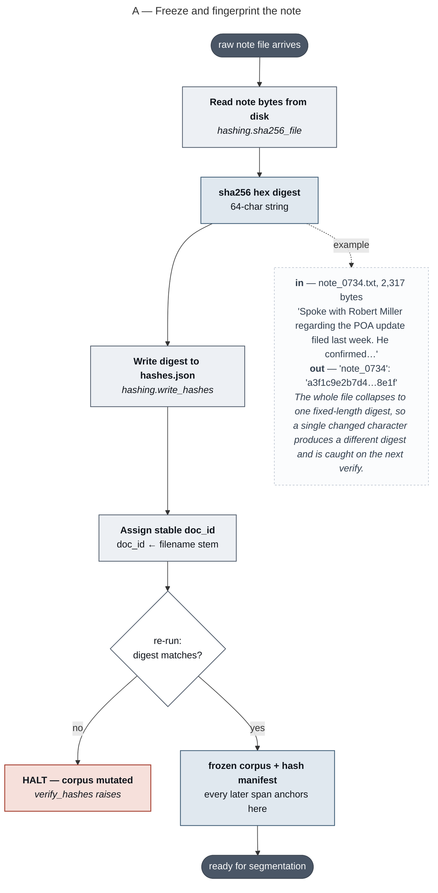

### B — Source claim identity, then segment and score the note

Source: [`02-claim-identity-and-segmentation.mermaid`](02-claim-identity-and-segmentation.mermaid)

```mermaid
---
title: "B — Source claim identity, then segment and score the note"
---
flowchart TD
  classDef act  fill:#EDF0F4,stroke:#4A5666,stroke-width:1.2px,color:#10151C
  classDef obj  fill:#E0E8EF,stroke:#3E5C76,stroke-width:1.3px,color:#10151C
  classDef dec  fill:#FFFFFF,stroke:#4A5666,stroke-width:1.2px,color:#10151C
  classDef bar  fill:#4A5666,stroke:#39424E,stroke-width:1px,color:#FFFFFF
  classDef bad  fill:#F6E0DB,stroke:#A33A2A,stroke-width:1.4px,color:#10151C
  classDef key  fill:#F6E7CE,stroke:#B4650A,stroke-width:1.6px,color:#10151C
  classDef muted fill:#FFFFFF,stroke:#B9C2CE,stroke-width:1px,stroke-dasharray:4 3,color:#4A5666
  classDef ex   fill:#FBFCFD,stroke:#B9C2CE,stroke-width:1px,stroke-dasharray:3 3,color:#33404F
  classDef warn fill:#FFF6E8,stroke:#B4650A,stroke-width:1.3px,stroke-dasharray:5 3,color:#3A2C16
  classDef term fill:#4A5666,stroke:#39424E,stroke-width:1px,color:#FFFFFF
  classDef research fill:#EEE9F5,stroke:#6B5B95,stroke-width:1.2px,stroke-dasharray:5 3,color:#2E2640
  classDef proposed fill:#E4F2EA,stroke:#2F6B4F,stroke-width:2px,stroke-dasharray:7 3,color:#12301F

  B0(["frozen note file"]):::term
  B1["<b>Parse claim_number + note_id from filename</b><br/>filename pattern: ClaimNumber_NoteID.txt"]:::act
  B2["<b>Join against the client's occurrence table</b><br/>Occurrence Number · Claim Number · Note ID<br/>client-provided, never extracted from text"]:::key
  B3["<b>doc_id → claim_id + occurrence_id</b><br/>structural metadata, known before any text is read"]:::obj
  B4["<b>Split note into physical lines</b><br/><i>profiling._line_spans</i>"]:::act
  B5{"line begins a quoted chain?"}:::dec
  B6["<b>kind = quoted</b><br/>a re-sent chain; a mention inside it is not a new sighting"]:::act
  B7["<b>kind = body</b><br/>everything else"]:::act
  B8["<b>Group runs of like lines into segments</b><br/><i>profiling.segment_document</i> — stateless, no latch"]:::act
  B9["<b>Score each segment; never gate on it</b><br/><i>boilerplate_score</i> over a disclaimer cue bundle<br/><i>casing.profile</i> → regime + case_informative"]:::key
  B10["<b>Fingerprint form-like segments</b><br/><i>profiling.template_fingerprint</i> — hash of the label sequence"]:::act
  B11["<b>MinHash shingles → near-dup groups</b><br/><i>profiling._minhash + assign_dup_groups</i><br/>content-based; the part of Layer 0 that generalizes cleanly"]:::act
  B12["<b>segments rows</b><br/>kind, char_start, char_end, dup_group_id,<br/>boilerplate_score, casing_regime, case_informative"]:::obj
  B13(["ready for chunking"]):::term

  B0 --> B1 --> B2 --> B3 --> B4 --> B5
  B5 -->|"yes"| B6
  B5 -->|"no"| B7
  B6 --> B8
  B7 --> B8
  B8 --> B9 --> B10 --> B11 --> B12 --> B13

  BX1["<b>in</b> — CLM00182_0734.txt, the filename as delivered<br/><b>out</b> — claim_number='CLM00182', note_id='0734'<br/><i>Parsed directly from the name; no text has been read yet.</i>"]:::ex
  B1 -.->|"example"| BX1

  BX2["<b>in</b> — join row: OCC0091 · CLM00182 · 0734<br/><b>out</b> — doc_id='note_0734' → claim_id='CLM00182', occurrence_id='OCC0091'<br/><i>Structural metadata established before extraction runs — not a claim about what the text says. The old CLM-plus-4-digits text fallback is gone: it only ever matched our own synthetic corpus, and on real data would mint an identity from any four digits following those letters.</i>"]:::ex
  B2 -.->|"example"| BX2

  BX3["<b>in</b> — 'This e-mail and any attachments are confidential and may be legally privileged. If you are not the intended recipient, any dissemination is unauthorized.'<br/><b>out</b> — boilerplate_score = 1.00<br/><i>Wording our generator never produced. The previous rule was three literal phrases and would have scored this 0, leaving every name inside a real disclaimer exposed to the name filter.</i>"]:::ex
  B9 -.->|"example"| BX3

  BX4["<b>in</b> — 'Counsel asserted attorney-client privilege over the file notes.'<br/><b>out</b> — boilerplate_score = 0.48, below the 0.5 flag<br/><i>Narrative that merely mentions privilege is not a disclaimer. And because the score is advisory, being wrong here costs a flag, never a deleted name.</i>"]:::ex
  B9 -.->|"example"| BX4

  BX5["<b>in</b> — an ALL CAPS header block above a normally-cased body<br/><b>out</b> — header: regime='upper', case_informative=0 · body: regime='mixed', case_informative=1<br/><i>Profiled per segment, because the common legacy shape is a case-degenerate header sitting on a clean narrative. Recorded for measurement — it no longer routes anything, see diagram 04.</i>"]:::ex
  B9 -.->|"example"| BX5

  BW["<b>What was removed here, and why</b><br/>Seven segment kinds became two. template_block, narrative, email_header, email_body and email_signature had <b>no consumer</b> in the production path, and were produced by the module's most fragile rules.<br/>· The signature rule matched only a bare double-hyphen line — the Usenet convention, which Outlook does not emit — and drove a latch that was <b>never cleared</b>, so one stray divider retyped the whole rest of a note as signature.<br/>· Boilerplate was a <b>hard kind</b>: a misclassification silently deleted every real name inside the segment, and a differently-worded disclaimer excluded nothing at all.<br/>Retired rules live in <i>src/research/corpus_heuristics.py</i>, unimported by the pipeline."]:::warn
  B8 -.->|"design note"| BW
```

### C — Cut the note into overlapping chunks

Source: [`03-chunking.mermaid`](03-chunking.mermaid)

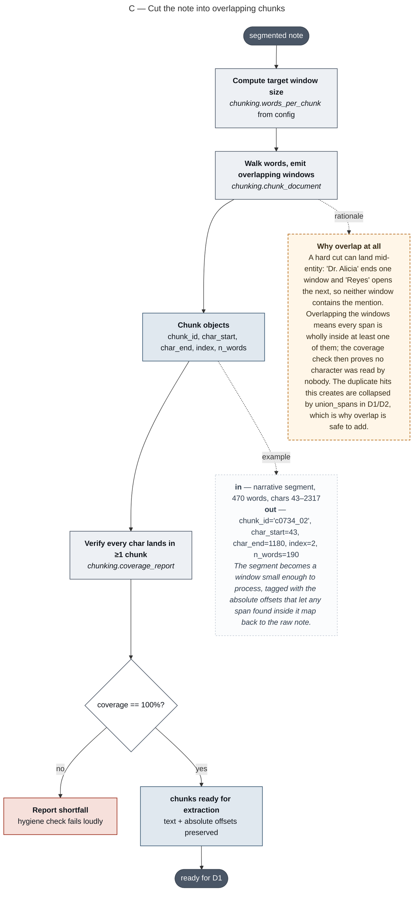

### D1 — Generate candidates: fork, extract, join, sweep

Source: [`04-generate-candidates.mermaid`](04-generate-candidates.mermaid)

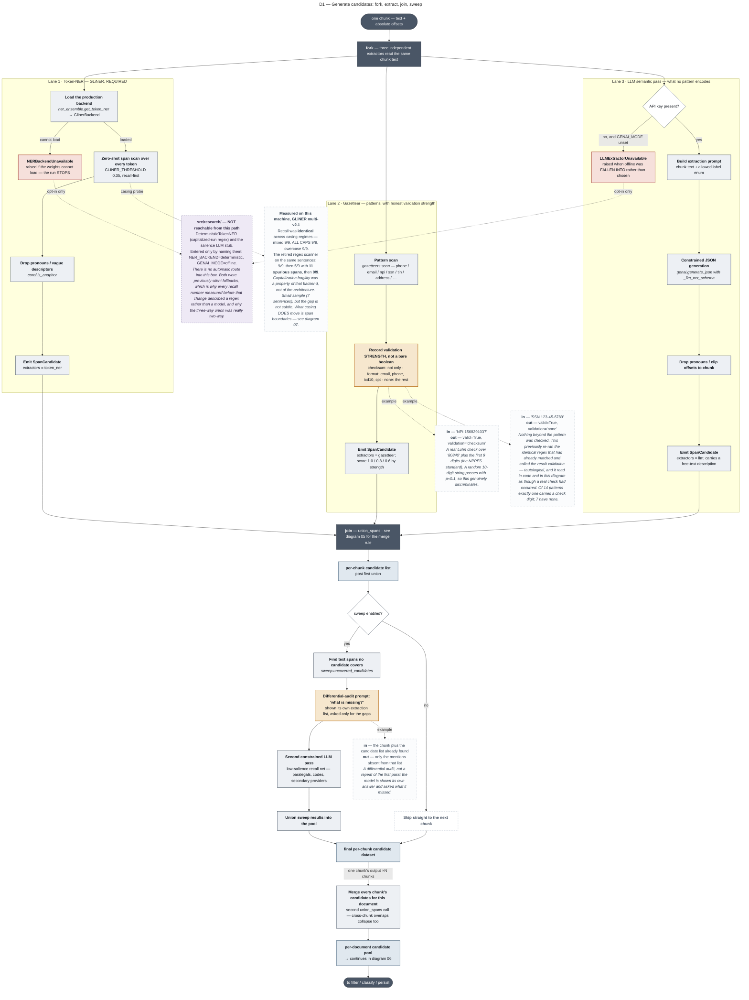

### D2 — How union_spans merges overlapping candidates

Source: [`05-union-overlapping-candidates.mermaid`](05-union-overlapping-candidates.mermaid)

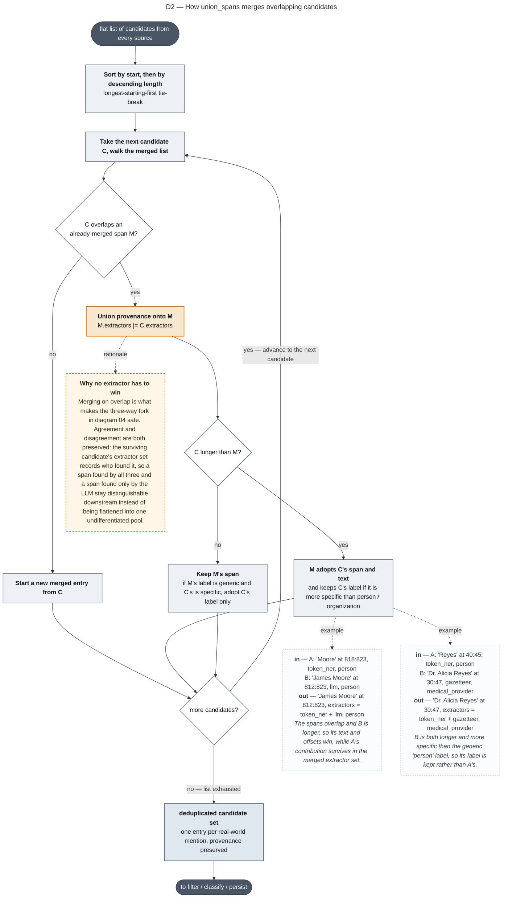

### D3 — Filter, classify, bind, and persist

Source: [`06-filter-classify-persist.mermaid`](06-filter-classify-persist.mermaid)

```mermaid
---
title: "D3 — Filter, classify, bind, and persist"
---
flowchart TD
  classDef act  fill:#EDF0F4,stroke:#4A5666,stroke-width:1.2px,color:#10151C
  classDef obj  fill:#E0E8EF,stroke:#3E5C76,stroke-width:1.3px,color:#10151C
  classDef dec  fill:#FFFFFF,stroke:#4A5666,stroke-width:1.2px,color:#10151C
  classDef bar  fill:#4A5666,stroke:#39424E,stroke-width:1px,color:#FFFFFF
  classDef bad  fill:#F6E0DB,stroke:#A33A2A,stroke-width:1.4px,color:#10151C
  classDef key  fill:#F6E7CE,stroke:#B4650A,stroke-width:1.6px,color:#10151C
  classDef muted fill:#FFFFFF,stroke:#B9C2CE,stroke-width:1px,stroke-dasharray:4 3,color:#4A5666
  classDef ex   fill:#FBFCFD,stroke:#B9C2CE,stroke-width:1px,stroke-dasharray:3 3,color:#33404F
  classDef warn fill:#FFF6E8,stroke:#B4650A,stroke-width:1.3px,stroke-dasharray:5 3,color:#3A2C16
  classDef term fill:#4A5666,stroke:#39424E,stroke-width:1px,color:#FFFFFF
  classDef research fill:#EEE9F5,stroke:#6B5B95,stroke-width:1.2px,stroke-dasharray:5 3,color:#2E2640
  classDef proposed fill:#E4F2EA,stroke:#2F6B4F,stroke-width:2px,stroke-dasharray:7 3,color:#12301F

  F0(["per-document candidate pool — from diagram 04"]):::term
  FORK["<b>fork</b> — every candidate is routed by its label"]:::bar
  F0 --> FORK

  subgraph NAMES["Name lane — a name has to look like a name"]
    direction TB
    N1["<b>label ∈ NAME_LABELS</b><br/>person / organization / attorney / repair_shop / …"]:::act
    N2["<b>Read boilerplate_score for this span</b><br/>ADVISORY — scored, counted, carried onto the row"]:::key
    N3{"passes<br/>_is_plausible_name?"}:::dec
    N3D["<b>Dropped</b><br/>n_dropped_shape += 1"]:::bad
    N4["<b>Classify entity_class</b><br/><i>_classify</i> over surface, label, left context, right context"]:::act
    N5["<b>Persist mentions row</b><br/>mention_id, surface, char_start, char_end,<br/>entity_class, inside_quoted, boilerplate_score"]:::act
    N6["<b>Persist has_name assertion</b><br/>source_span = the mention's OWN span"]:::act
    N1 --> N2 --> N3
    N3 -->|"no"| N3D
    N3 -->|"yes"| N4 --> N5 --> N6
  end

  subgraph IDS["Identifier lane — an identifier has to be found near a name, or not"]
    direction TB
    I1["<b>label ∈ IDENTIFIER_LABEL_TO_PREDICATE</b><br/>phone / email / npi / tin / ssn / address"]:::act
    I2["<b>subject_for on char_start</b><br/>same line, or ≤120 chars on the immediately preceding line"]:::act
    I3["<b>Persist identifier_observations row — always</b><br/>subject_mention_id = the binding result, NULL if none"]:::key
    I4{"a subject<br/>was found?"}:::dec
    I5["<b>Persist binding assertion</b> e.g. has_phone<br/>source_span = the IDENTIFIER's own location, not the name's"]:::key
    I6["<b>Orphan — no assertion</b><br/>the observation row still stands on its own"]:::key
    I1 --> I2 --> I3 --> I4
    I4 -->|"yes"| I5
    I4 -->|"no"| I6
  end

  FORK --> N1
  FORK --> I1

  JOIN["<b>join</b>"]:::bar
  N6 --> JOIN
  I5 --> JOIN
  I6 --> JOIN

  G1["<b>Scan raw text for allegation language</b><br/>regex over the SOURCE TEXT directly — not over the candidate pool"]:::act
  G2["<b>Bind to nearest mention, persist allegation assertion</b><br/>polarity 'alleged' — kept separate from asserted fact"]:::act
  G3["<b>Resolve coreference over every mention found above</b><br/><i>coref.RuleBasedCorefResolver.resolve</i> over raw_text + mentions"]:::act
  G4["<b>Persist coref_links row</b><br/>anaphor span + antecedent span + antecedent_mention_id"]:::act
  G5["<b>Record scan_ledger coverage for this document</b>"]:::obj
  G6["<b>Persist mentions, assertions, identifier_observations, coref_links</b><br/>one transaction per corpus run"]:::act
  G7(["to entity resolution — diagram 07"]):::term

  JOIN --> G1 -->|"match"| G2 --> G3 -->|"anaphor found"| G4 --> G5 --> G6 --> G7

  NB["<b>in</b> — a name inside a segment scoring boilerplate_score = 1.00<br/><b>out</b> — mention PERSISTED, boilerplate_score = 1.0 stored on the row<br/><i>Previously this was a hard gate and the mention was deleted with no trace. A miss cost precision; a false positive silently erased real names. Now the evidence survives and a consumer discounts it.</i>"]:::ex
  N2 -.->|"example"| NB

  IX1["<b>in</b> — SpanCandidate text='(312) 555-0148', label='phone', no name on this line or the previous one<br/><b>out</b> — identifier_observations kind='phone', value_norm='3125550148', subject_mention_id=NULL<br/><i>Recorded anyway. An identifier with no name nearby is exactly the case this system exists to catch, not a reason to drop it.</i>"]:::ex
  I6 -.->|"example"| IX1

  IX2["<b>in</b> — subject: mention m0000153, 'Robert Miller', chars 40–52<br/>identifier '(312) 555-0148', chars 918–932, bound via subject_for<br/><b>out</b> — Assertion predicate='has_phone', object_value_norm='3125550148', source_span_start=918, source_span_end=932<br/><i><b>This is what an evidence span is.</b> The subject points at the name's location; the evidence span points at the phone number's location — a different place. The fact is ABOUT the subject but PROVEN at the evidence span.</i>"]:::ex
  I5 -.->|"example"| IX2

  CX1["<b>Resolving anaphora to antecedent mentions</b> means finding the specific earlier word or phrase that a pronoun or later reference points back to.<br/><br/>'John gave Mary a present. She loved it.'<br/><b>Antecedents</b> — 'Mary' and 'a present'<br/><b>Anaphors</b> — 'She', referring to Mary, and 'it', referring to the present.<br/><i>Without this step 'She' is either dropped or becomes its own bogus entity.</i>"]:::warn
  G3 -.->|"what this means"| CX1

  CX2["<b>in</b> — '…Spoke with Robert Miller regarding the POA update. He confirmed the demand was served…'<br/>mention m0000153 = 'Robert Miller' at 40:52<br/><b>out</b> — CorefLink surface='He', start=95, end=97, antecedent_surface='Robert Miller', antecedent_start=40, antecedent_end=52, kind='pronoun'<br/><i>The anaphor keeps its own span, so the sentence it appears in stays traceable.</i>"]:::ex
  G4 -.->|"example"| CX2

  %% ---------------- PROPOSED CHANGE 1 -------------------------------
  PROP1["<b>PROPOSED — split entity_class into two fields</b><br/>Not yet built. This node replaces N4.<br/><br/><b>entity_type</b>: person | organization — stays CLOSED. It is a genuine binary and <i>entity_resolution.cannot_link_reason</i> uses it structurally to block person↔org merges.<br/><b>role</b>: OPEN vocabulary, normalized toward canonical forms, defaulting to <b>NULL</b> when unmatched.<br/><br/><i>Why: today ENTITY_CLASSES is a closed 5-tuple (claimant, attorney, medical_provider, repair_shop, adjuster) set PER MENTION, and role-in-claim is not a closed set in reality — witnesses, landlords, employers, public adjusters, SIU investigators and opposing counsel all exist. It is the same restrictive-box problem the predicate vocabulary had before it was opened.</i>"]:::proposed
  N4 -.->|"proposed replacement"| PROP1

  PROP1B["<b>The concrete defect this fixes</b><br/><i>_classify</i> ends in <b>LABEL_TO_CLASS.get(label, 'claimant')</b>.<br/>An unmatched 'person' is silently written as <b>claimant</b>; an unmatched 'organization' as <b>medical_provider</b>.<br/><br/>· 'Marisol Vega', actually a witness → stored claimant<br/>· 'Sunrise Property Mgmt', actually the landlord → stored medical_provider<br/><br/><i>That is a guess written into a field every downstream reader — and the client — treats as a fact. Under the proposal both become role=NULL, which is honest and is queryable as 'needs a role'.</i>"]:::warn
  PROP1 -.-> PROP1B
```

### E — Resolve mentions into entities

Source: [`07-entity-resolution.mermaid`](07-entity-resolution.mermaid)

```mermaid
---
title: "E — Resolve mentions into entities"
---
flowchart TD
  classDef act  fill:#EDF0F4,stroke:#4A5666,stroke-width:1.2px,color:#10151C
  classDef obj  fill:#E0E8EF,stroke:#3E5C76,stroke-width:1.3px,color:#10151C
  classDef dec  fill:#FFFFFF,stroke:#4A5666,stroke-width:1.2px,color:#10151C
  classDef bar  fill:#4A5666,stroke:#39424E,stroke-width:1px,color:#FFFFFF
  classDef bad  fill:#F6E0DB,stroke:#A33A2A,stroke-width:1.4px,color:#10151C
  classDef key  fill:#F6E7CE,stroke:#B4650A,stroke-width:1.6px,color:#10151C
  classDef muted fill:#FFFFFF,stroke:#B9C2CE,stroke-width:1px,stroke-dasharray:4 3,color:#4A5666
  classDef ex   fill:#FBFCFD,stroke:#B9C2CE,stroke-width:1px,stroke-dasharray:3 3,color:#33404F
  classDef warn fill:#FFF6E8,stroke:#B4650A,stroke-width:1.3px,stroke-dasharray:5 3,color:#3A2C16
  classDef term fill:#4A5666,stroke:#39424E,stroke-width:1px,color:#FFFFFF
  classDef research fill:#EEE9F5,stroke:#6B5B95,stroke-width:1.2px,stroke-dasharray:5 3,color:#2E2640
  classDef proposed fill:#E4F2EA,stroke:#2F6B4F,stroke-width:2px,stroke-dasharray:7 3,color:#12301F
  classDef vec  fill:#DDEEF6,stroke:#1F6F8B,stroke-width:1.6px,color:#0C2430

  E0(["all mentions for the corpus"]):::term
  E1["<b>Build one feature row per mention</b><br/><i>entity_resolution.build_mention_frame</i>"]:::act
  E2["<b>Derive the blocking keys from the surface</b><br/>full_name · name_sorted = sorted tokens<br/>first_name = toks[0] · last_name = toks[-1] · soundex(last)"]:::key
  E3["<b>Null out missing identifiers</b><br/>empty string would block-explode; NULL is excluded by Splink"]:::act
  E4["<b>mention frame</b><br/>name keys + email, phone7, npi, tin, dob, address_key"]:::obj

  %% ---------------- LANE 2: the embedding recall net ----------------
  V0[/"<b>mentions.faiss</b><br/>one vector per mention: norm_surface + class<br/><i>embed_index.run — diagram 09</i>"/]:::vec
  V1["<b>Class-filtered k-NN over the mention index</b><br/>top-25 neighbours per mention, filter applied INSIDE the index<br/><i>blocking.knn_edges</i>"]:::vec
  V2{"cosine ≥ EMB_BLOCK_SIM = 0.29 ?"}:::dec
  V3["<b>Neighbour edge kept</b>"]:::vec
  V4["<b>Dropped — not a neighbour</b>"]:::muted
  V5["<b>Connected components over the k-NN graph</b><br/><i>blocking.connected_components</i>"]:::vec
  V6{"component size"}:::dec
  V7["<b>emb_bucket = EB&lt;root&gt;</b><br/>2 … EMB_BLOCK_MAX_BUCKET members"]:::vec
  V8["<b>emb_bucket = NULL</b><br/>singleton — would propose no pairs anyway"]:::muted
  V9["<b>emb_bucket = NULL</b><br/>oversize — transitive chaining, dropped on purpose"]:::warn

  E5["<b>Declare blocking rules — ORDER IS LOAD-BEARING</b><br/>0 email · 1 npi · 2 tin · 3 phone7 · 4 address_key<br/>5 full_name · 6 name_sorted · 7 soundex+first_name · 8 last_name<br/><b>9 emb_bucket</b> ← the recall net<br/><i>entity_resolution.BLOCKING_RULES</i>"]:::key
  E6["<b>Estimate match prior from deterministic rules</b>"]:::act
  E7["<b>Estimate u by random sampling</b>"]:::act
  E8["<b>Train m by expectation-maximisation</b><br/>one pass per blocking rule; sparse blocks skipped"]:::act
  E9["<b>Score every blocked candidate pair</b><br/>ONE model scores both lanes<br/><i>linker.inference.predict</i>"]:::act
  E10["<b>same_as_edges rows</b><br/>mention_a, mention_b, probability, match_weight,<br/><b>blocked_by</b> = the rule that proposed it"]:::obj
  E11{"structural conflict?"}:::dec
  E12["<b>Edge suppressed before clustering</b><br/><i>cannot_link_reason</i> — person vs org, Jr/Sr, conflicting NPI"]:::bad
  E13["<b>Union-find over edges ≥ threshold</b><br/><i>entity_resolution.cluster_at</i>"]:::act
  E14["<b>entity_snapshot / entities / entity_members</b><br/>identity is a VIEW at T, never a destructive merge"]:::key
  E15["<b>Sweep T to plot the operating curve</b><br/>B³ precision / recall per threshold"]:::act
  E16(["to graph assembly — diagram 08"]):::term

  E0 --> E1 --> E2 --> E3 --> E4 --> E5
  E4 --> V0
  V0 --> V1 --> V2
  V2 -->|"no"| V4
  V2 -->|"yes"| V3 --> V5 --> V6
  V6 -->|"= 1"| V8
  V6 -->|"2 … 60"| V7
  V6 -->|"&gt; 60"| V9
  V7 --> E5
  V8 -.-> E5
  V9 -.-> E5
  E5 --> E6 --> E7 --> E8 --> E9 --> E10 --> E11
  E11 -->|"yes"| E12
  E11 -->|"no"| E13 --> E14 --> E15 --> E16

  %% ---------------- why the second lane exists ----------------------
  WHY["<b>Why a second candidate generator at all</b><br/>Blocking recall is a <b>hard ceiling</b> on ER recall. A pair no rule proposes is never scored, so it can never be merged — no matter how good the comparison model is.<br/><br/>The nine deterministic rules only fire when two mentions <b>share a key</b>. The pairs that costs are the realistic ones:<br/>· 'Bob Miller' vs 'Robert Miller Jr' — no shared key<br/>· 'Valley Auto Body' vs 'Valley Auto Body &amp; Paint'<br/>· an entity written differently in every note it appears in<br/><br/><i>Deterministic blocking is not wrong, it is incomplete. The fix is another way to propose, not a looser way to decide.</i>"]:::warn
  E5 -.->|"why rule 9"| WHY

  SPLIT["<b>The division of labour — this is the whole design</b><br/>The embedding lane only ever <b>PROPOSES</b>. Splink scores its pairs with the same EM-trained Fellegi-Sunter model it applies to deterministic candidates, so an embedding-found link carries the same calibrated probability and the same per-comparison breakdown.<br/><br/><i>Embeddings buy recall, which is what they are good at. They are kept out of the scoring decision, where 'the vectors were close' is not an explanation anyone can audit. That boundary is what keeps a production ER system defensible to a regulator.</i>"]:::key
  E9 -.->|"one model, two lanes"| SPLIT

  PROV["<b>How the lane is measured, not asserted</b><br/>Splink stamps every predicted pair with <b>match_key</b> — the index of the rule that generated it — and credits the FIRST rule that fires. So a pair credited to rule 9 is one that <b>no deterministic rule proposed at all</b>.<br/><br/>Stored per-edge as <b>same_as_edges.blocked_by</b>, so a reviewer can ask of any specific merge 'would deterministic blocking have caught this?' instead of only seeing an aggregate.<br/><br/><i>entity_resolution.lane_provenance aggregates it; the audit joins it against ground truth to say whether the lane cut under-merges without raising over-merges.</i>"]:::key
  E10 -.->|"provenance"| PROV

  CAP["<b>Why oversize components are dropped rather than split</b><br/>A loose threshold lets components chain transitively — A~B, B~C, C~D with A nothing like D. One runaway component of n mentions costs n²/2 pairs: the same blow-up the empty-string address_key guard at E3 exists to prevent.<br/><br/>Those mentions keep all nine deterministic rules, so dropping costs only what the lane would have added.<br/><br/><i>A giant component means the embedding signal was not discriminative there. The honest response is to contribute nothing rather than contribute noise.</i>"]:::warn
  V9 -.->|"why"| CAP

  EX1["<b>in</b> — mention pair m0000153 'Robert Miller' and m0000891 'R. Miller', same phone last-7<br/><b>out</b> — same_as_edges probability=0.94, match_weight=+6.2, blocked_by='phone7'<br/><i>The pair is scored, not merged. A number survives into storage where a yes/no decision would have destroyed the evidence.</i>"]:::ex
  E10 -.->|"example"| EX1

  MEAS["<b>Measured yield, live against gemini-embedding-001</b><br/>Twelve-mention labelled probe (notebook 04, final cell):<br/><br/>· <b>recall 7/7, precision 7/7</b> — three clean buckets, zero false pairs<br/>· the deterministic name rules propose <b>1 of those 7</b><br/>· the lane adds <b>6</b> true pairs no name rule proposes<br/><br/>&nbsp;&nbsp;Bob Miller ↔ Robert Miller Jr ↔ R. Miller<br/>&nbsp;&nbsp;Valley Auto Body ↔ … &amp; Paint ↔ Valley Autobody<br/>&nbsp;&nbsp;Dr. Alicia Reyes ↔ Alicia Reyes, MD<br/><br/><i>A mechanism check on a small labelled set, not a corpus result. The corpus-level question — does the lane cut under-merges without raising over-merges — is answerable from same_as_edges.blocked_by joined to ground truth, and is NOT yet measured.</i>"]:::key
  V7 -.->|"measured"| MEAS

  CALIB["<b>The threshold is model-specific, and getting it wrong is silent</b><br/>0.29 looks alarmingly low next to the 0.7–0.9 one expects from a sentence-transformer. It is correct for THIS model: gemini-embedding-001 compresses everything into a narrow band — co-referring pairs 0.30–0.34, unrelated pairs 0.25–0.29.<br/><br/>EMB_BLOCK_SIM was first set to <b>0.86</b>, carried over from sentence-transformer intuition. The lane produced <b>zero edges</b>. Resolution still ran, still clustered, still passed every assertion — it merged less, and nothing said why.<br/><br/><i>Now an exception: EmbeddingThresholdMiscalibrated fires when the floor exceeds every similarity in the index. Re-run the calibration cell in notebook 04 after changing EMBED_MODEL. The margin is ~0.01, which is a property of the model, not a tuning failure.</i>"]:::warn
  V2 -.->|"why 0.29"| CALIB

  OFFL["<b>The offline stub cannot serve this lane at all</b><br/>genai._offline_embedding hashes character shingles — it measures LEXICAL overlap, which is exactly what rules 5–8 already do, better and explainably.<br/><br/>Measured offline on the same probe: true pairs 0.7708–0.9040, false pairs 0.5180–<b>0.8354</b>. The distributions <b>OVERLAP</b> — the hardest false pair outscores six of the eight true pairs — so no threshold separates them and no recalibration can.<br/><br/><i>EmbeddingBackendUnsuitable is raised rather than emitting buckets that look like output and mean nothing. Set EMB_BLOCK_ENABLED=False to resolve deterministically on purpose.</i>"]:::bad
  CALIB -.-> OFFL

  EX4["<b>in</b> — 'Bob Miller' and 'Robert Miller Jr', no shared identifier, different first token, different soundex bucket<br/><b>out</b> — proposed ONLY by emb_bucket, then scored by Splink like any other pair; blocked_by='emb_bucket'<br/><i>Under deterministic blocking alone this pair is never scored, so it is never merged and never appears in any report — the failure is invisible, which is what makes it worth a whole lane.</i>"]:::ex
  V7 -.->|"example"| EX4

  EX2["<b>in</b> — all edges, threshold T=0.90<br/><b>out</b> — entity_snapshot rows grouping both mentions under one entity_id at that T<br/><i>Identity is recomputed per threshold, so raising or lowering T re-partitions the corpus without re-running resolution.</i>"]:::ex
  E14 -.->|"example"| EX2

  EX3["<b>in</b> — 'Miller Auto Body' (organization) and 'Robert Miller' (person), high name similarity<br/><b>out</b> — edge suppressed, never reaches clustering<br/><i>A hard structural constraint applied as edge suppression rather than a permanent veto. Note this is the ONE place entity_class is load-bearing — see the proposal in diagram 06, which keeps person/organization closed precisely so this keeps working.</i>"]:::ex
  E12 -.->|"example"| EX3

  CLASSF["<b>The class filter is not decoration</b><br/>EMB_BLOCK_SAME_CLASS keeps a person from ever bucketing with a repair shop. Without it the lane spends its k-NN budget proposing pairs that cannot_link_reason (E12) will suppress anyway — work done twice to reach the same answer.<br/><br/><i>Applied inside the index via IDSelector, BEFORE nearest-neighbour selection, so the top-k is exact over the filtered set rather than a post-filtered guess that can silently drop true neighbours.</i>"]:::ex
  V1 -.->|"note"| CLASSF

  %% ---------------- PROPOSED CHANGE 2 -------------------------------
  PROP2["<b>PROPOSED — normalize the mention surface before deriving keys</b><br/>Not yet built. This node inserts between E1 and E2.<br/><br/>Strip leading role and title tokens from the surface used for BLOCKING, while the stored mention surface and its char offsets stay exactly as extracted.<br/><br/><i>Model-agnostic, and it belongs here rather than in an extractor: the retired regex scanner had a version of this (_LEADING_NOISE), but as a corpus-fitted denylist inside extraction. The need was real; the location and the shape were wrong.</i>"]:::proposed
  E1 -.->|"proposed insertion point"| PROP2
  PROP2 -.-> E2

  PROP2B["<b>Measured evidence for it, this machine, GLiNER multi-v2.1</b><br/>Exact span-boundary agreement across casing regimes: <b>24/31 = 77%</b>. Recall was 100% in every regime — casing does not cost detections, it moves <b>boundaries</b>.<br/><br/>Observed disagreements:<br/>· 'adjuster Karen Wu' vs 'Karen Wu'<br/>· 'Claimant Deborah Fitzgerald' vs 'Deborah Fitzgerald'<br/>· 'SIU' found in mixed case, lost in BOTH ALL CAPS and lowercase<br/><br/><i>Role-word absorption also happens in MIXED case — 'Claimant Deborah Fitzgerald' was the normally-cased output — so this is not a casing bug. Casing only changes which words get absorbed.</i>"]:::ex
  PROP2 -.->|"why"| PROP2B

  PROP2C["<b>What it actually costs today</b><br/>Not invisibility. last_name = toks[-1], and role words are LEADING, so 'adjuster Karen Wu' and 'Karen Wu' both key to 'wu' and still meet under block_on(last_name).<br/><br/>But <b>three of nine deterministic rules miss</b>:<br/>· full_name — 'adjuster karen wu' ≠ 'karen wu'<br/>· name_sorted — 'adjuster karen wu' ≠ 'karen wu'<br/>· soundex+first_name — first_name 'adjuster' vs 'karen'<br/><br/>and when the pair does meet, <b>ForenameSurnameComparison(first_name, last_name) scores it DOWN</b> because first_name disagrees.<br/><br/><i>So the real cost is a depressed match probability on true pairs, not a missing pair. That is a subtler failure than it first looked, and it degrades the calibration the whole threshold story rests on.</i>"]:::warn
  PROP2B -.-> PROP2C

  PROP2D["<b>Rule 9 partly compensates — but does not replace this</b><br/>'adjuster Karen Wu' and 'Karen Wu' embed close together, so the lane proposes the pair even when three deterministic rules miss it. That recovers the CANDIDATE.<br/><br/>It does not recover the SCORE: ForenameSurnameComparison still sees first_name 'adjuster' vs 'karen' and scores the pair down whichever lane proposed it.<br/><br/><i>Blocking and comparison are separate failures. The recall net fixes the first and cannot touch the second, which is exactly why PROP2 is still open.</i>"]:::warn
  PROP2C -.-> PROP2D
```

### F — Assemble the global entity graph

Source: [`08-graph-assembly.mermaid`](08-graph-assembly.mermaid)

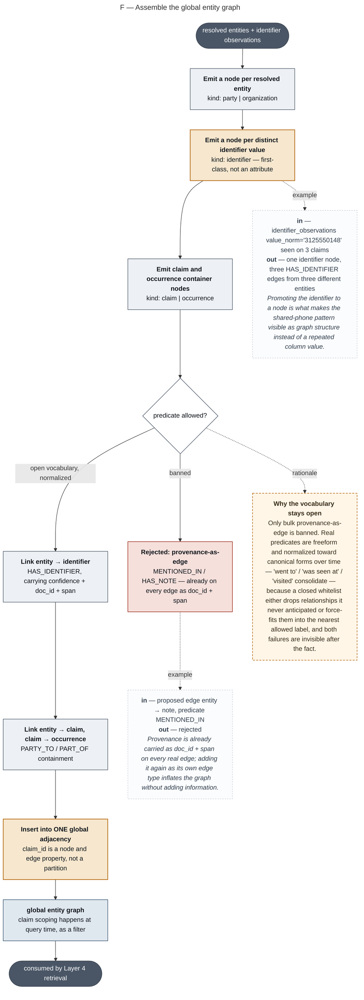

### F — The vector layer: two indices, two jobs

Source: [`09-vector-layer.mermaid`](09-vector-layer.mermaid)

```mermaid
---
title: "F — The vector layer: two indices, two jobs"
---
flowchart TD
  classDef act  fill:#EDF0F4,stroke:#4A5666,stroke-width:1.2px,color:#10151C
  classDef obj  fill:#E0E8EF,stroke:#3E5C76,stroke-width:1.3px,color:#10151C
  classDef dec  fill:#FFFFFF,stroke:#4A5666,stroke-width:1.2px,color:#10151C
  classDef bad  fill:#F6E0DB,stroke:#A33A2A,stroke-width:1.4px,color:#10151C
  classDef key  fill:#F6E7CE,stroke:#B4650A,stroke-width:1.6px,color:#10151C
  classDef muted fill:#FFFFFF,stroke:#B9C2CE,stroke-width:1px,stroke-dasharray:4 3,color:#4A5666
  classDef ex   fill:#FBFCFD,stroke:#B9C2CE,stroke-width:1px,stroke-dasharray:3 3,color:#33404F
  classDef warn fill:#FFF6E8,stroke:#B4650A,stroke-width:1.3px,stroke-dasharray:5 3,color:#3A2C16
  classDef term fill:#4A5666,stroke:#39424E,stroke-width:1px,color:#FFFFFF
  classDef vec  fill:#DDEEF6,stroke:#1F6F8B,stroke-width:1.6px,color:#0C2430
  classDef fixed fill:#E4F2EA,stroke:#2F6B4F,stroke-width:1.6px,color:#12301F

  subgraph ABSTRACTION["every vector op goes through one interface"]
    VS["<b>VectorStore (ABC)</b><br/>upsert · search(filter_fn | allowed_ids) · persist · load<br/><b>get_vector</b> · <b>knn_within(ids, k)</b><br/><i>src/vectorstore.py — the only file permitted to import faiss</i>"]:::key
    FS["<b>FaissVectorStore</b><br/>IndexFlatIP + IDMap2, sidecar parquet for metadata<br/>exact search — no ANN-recall confound in the evaluation"]:::act
    MS["<b>a managed store</b><br/>implement the same five methods, change nothing else"]:::muted
  end
  VS --> FS
  VS -.-> MS

  %% ------------------------------------------------------------------
  subgraph LANE_A["mentions.faiss — identity"]
    A0(["mentions table, after Layer 1"]):::term
    A1["<b>Build node text per mention</b><br/>norm_surface | class=… | ctx: ±EMB_BLOCK_CONTEXT_CHARS<br/>default <b>0</b> — name and class only<br/><i>embed_index.build_node_text</i>"]:::act
    A2["<b>Embed via genai.embed</b><br/>thread pool, cached by (model, text) hash"]:::act
    A3[/"<b>mentions.faiss</b> + mentions_faiss_meta.parquet<br/>id = mention_id · meta = entity_class, doc_id, claim_id"/]:::vec
    A4["<b>Consumer: blocking.attach_buckets</b><br/>class-filtered k-NN → components → emb_bucket<br/><i>rule 9 of the Splink blocking list — diagram 07</i>"]:::vec
    A0 --> A1 --> A2 --> A3 --> A4
  end

  %% ------------------------------------------------------------------
  subgraph LANE_B["chunks.faiss — retrieval"]
    B0(["raw notes"]):::term
    B1["<b>Overlapping chunking</b><br/><i>chunking.chunk_corpus — diagram 03</i>"]:::act
    B2["<b>Embed chunk text</b>"]:::act
    B3[/"<b>chunks.faiss</b> + chunks_meta.parquet<br/>id = chunk_id · meta = claim_id, occurrence_id, doc_id, span, text"/]:::vec
    B4["<b>Consumer: ClaimScopedAgent.retrieve_chunks</b><br/>Layer 4 step 2 — semantic entry into one claim<br/><i>claim filter applied INSIDE the index</i>"]:::vec
    B0 --> B1 --> B2 --> B3 --> B4
  end

  A4 --> OUT1(["entity resolution — diagram 07"]):::term
  B4 --> OUT2(["graph expansion + synthesis — Layer 4"]):::term

  %% ------------------------------------------------------------------
  WHYTWO["<b>Why two indices and not one</b><br/>They answer different questions and are keyed differently.<br/><br/>· <b>mentions.faiss</b> — 'which other mentions might be this same party?' Keyed by mention, name-dominant, class-filtered. Read once per resolution run.<br/>· <b>chunks.faiss</b> — 'which passages bear on this question?' Keyed by chunk, prose-dominant, claim-filtered. Read once per user question.<br/><br/><i>Collapsing them would mean one text representation serving two opposed objectives: name-dominant for identity, context-dominant for retrieval.</i>"]:::key
  VS -.-> WHYTWO

  CTX["<b>Context in the vector: the assumption, and what measurement said</b><br/><b>Assumed</b> — folding surrounding prose in would encode what the mention was DOING, pulling two different people who share a name apart. That was the argument for a non-zero window.<br/><br/><b>Measured</b> (notebook 04, live, 14 labelled mentions):<br/>&nbsp;&nbsp;window&nbsp;&nbsp;&nbsp;true-min&nbsp;&nbsp;false-max&nbsp;&nbsp;margin<br/>&nbsp;&nbsp;&nbsp;&nbsp;&nbsp;0&nbsp;&nbsp;&nbsp;&nbsp;&nbsp;0.3000&nbsp;&nbsp;&nbsp;&nbsp;0.2899&nbsp;&nbsp;&nbsp;0.0101<br/>&nbsp;&nbsp;&nbsp;&nbsp;40&nbsp;&nbsp;&nbsp;&nbsp;&nbsp;0.2718&nbsp;&nbsp;&nbsp;&nbsp;0.2622&nbsp;&nbsp;&nbsp;0.0096<br/>&nbsp;&nbsp;&nbsp;120&nbsp;&nbsp;&nbsp;&nbsp;&nbsp;0.2697&nbsp;&nbsp;&nbsp;&nbsp;0.2596&nbsp;&nbsp;&nbsp;0.0101<br/><br/>The margin barely moves, and context did <b>not</b> help on the pair the argument rested on — Dr. Alicia Reyes vs Dr. Alan Reyes. It only shifted the whole distribution down.<br/><br/><i>So the default is 0. Not because context is worthless, but because it bought nothing measurable here and it COUPLES two knobs: with context in the vector, EMB_BLOCK_SIM must be re-calibrated whenever the window moves. Caveat: 14 mentions is a small sample.</i>"]:::warn
  A1 -.->|"tradeoff"| CTX

  %% ---------------- what this diagram exists to record --------------
  HIST["<b>What this layer looked like before, and why it is worth recording</b><br/>Both indices were mis-wired in opposite directions and neither failure was visible from any output:<br/><br/>· <b>entities.faiss</b> was WRITE-ONLY. embed_index built it every run for a v1 resolution pass ('C1: embedding top-k class-filtered') that was deleted when v2 moved to Splink. The builder was never removed. Nothing in src/ read it.<br/>· <b>chunks.faiss</b> had a real consumer but was never built on the tested path — smoke_test called build_graph.build_graph() directly, not build_graph.run() — and agent.py caught the resulting FileNotFoundError with a bare `pass`.<br/><br/><i>So the index with no consumer was always written, and the index with a consumer was usually absent. The agent answered from graph expansion alone, returned zero citations, and reported no error: one of four retrieval layers silently missing behind output still shaped like a real answer.</i>"]:::bad
  A3 -.->|"history"| HIST
  B3 -.-> HIST

  FIX["<b>What changed</b><br/>· entities.faiss → <b>mentions.faiss</b>, named for what it holds — entities do not exist yet when it is built; resolving them is what it is for.<br/>· It now has a live consumer: the embedding blocking lane (rule 9).<br/>· agent.py raises <b>AgentStoreUnavailable</b> instead of `pass`.<br/>· smoke_test now builds both indices and asserts scoped retrieval returns hits, so a regression to either failure mode breaks the test rather than the numbers.<br/>· genai.embed runs on a thread pool — it was a serial loop, tolerable for chunks, not for one call per mention.<br/><br/><i>The rule this restores: an artifact with no consumer is deleted or given one. It is never left being written.</i>"]:::fixed
  HIST --> FIX

  EXA["<b>in</b> — mention m0000153 'Bob Miller', class claimant<br/><b>out</b> — node text 'bob miller | class=claimant' → 768-dim unit vector<br/><i>Its nearest same-class neighbour is 'Robert Miller Jr' at cosine <b>0.3000</b> (measured, gemini-embedding-001) — above the 0.29 floor, and a pair no deterministic rule proposes. Note how close that is to the floor: this model compresses the whole range, which is the point the calibration note makes.</i>"]:::ex
  A2 -.->|"example"| EXA

  EXB["<b>in</b> — question 'who treated the claimant?' scoped to CLM0005<br/><b>out</b> — top-5 chunks, every one with claim_id=CLM0005, filter applied by IDSelector before nearest-neighbour selection<br/><i>Scope isolation is structural: there is no code path that returns another claim's chunk and then filters it out.</i>"]:::ex
  B4 -.->|"example"| EXB

  CALIB["<b>EMB_BLOCK_SIM is model-specific, and getting it wrong is silent</b><br/>Embedding models differ enormously in how they use the cosine range:<br/><br/>· sentence-transformers — co-referring 0.75–0.95, unrelated 0.1–0.4<br/>· <b>gemini-embedding-001 — co-referring 0.30–0.34, unrelated 0.25–0.29</b><br/><br/>The threshold was first set to <b>0.86</b>, a sensible number from the first row. Against gemini-embedding-001 it produced <b>zero edges</b>: resolution still ran, still produced clusters, still passed every assertion, and simply merged less. Nothing said why.<br/><br/><i>Measured, live, on 14 hand-labelled mentions — true pairs min 0.3000, false pairs max 0.2899. The operating value is 0.29, and the margin is ~0.01.</i>"]:::warn
  A2 -.->|"calibration"| CALIB

  CALIBG["<b>So the miscalibration is now an exception, not a shrug</b><br/><b>EmbeddingThresholdMiscalibrated</b> — raised when EMB_BLOCK_SIM exceeds the highest similarity anywhere in the index. No pair can clear the floor, so the lane is structurally dead, and that is distinguishable from 'found nothing worth proposing'.<br/><br/><b>EmbeddingBackendUnsuitable</b> — raised when the lane is enabled in offline mode. The offline stub hashes character shingles, which measures LEXICAL overlap: exactly what the deterministic name rules already do, better and explainably. Measured offline on the same probe, true pairs 0.7708–0.9040 and false pairs 0.5180–<b>0.8354</b> — the distributions <b>overlap</b>, so no threshold separates them and no recalibration can fix it.<br/><br/><i>Both refuse rather than degrade. The lane's whole value is the pairs nothing else proposes; a lane that silently proposes nothing is worse than no lane, because the numbers still look fine.</i>"]:::fixed
  CALIB --> CALIBG

  RESULT["<b>Measured yield, live against gemini-embedding-001</b><br/>On a 12-mention labelled probe (notebook 04, final cell):<br/><br/>· <b>recall 7/7, precision 7/7</b> — three clean buckets, zero false pairs<br/>· deterministic name rules propose <b>1 of those 7</b><br/>· the lane adds <b>6</b> true pairs no name rule proposes:<br/>&nbsp;&nbsp;Bob Miller ↔ Robert Miller Jr ↔ R. Miller<br/>&nbsp;&nbsp;Valley Auto Body ↔ &amp; Paint ↔ Autobody<br/>&nbsp;&nbsp;Dr. Alicia Reyes ↔ Alicia Reyes, MD<br/><br/><i>Small labelled set, so read it as a mechanism check rather than a corpus-level result. The corpus-level number is the audit's under-merge count, which is not yet re-measured.</i>"]:::key
  A4 -.->|"measured"| RESULT

  KNN["<b>knn_within is on the interface for a reason</b><br/>'which of these mentions look like each other' is one operation, so it is named once rather than open-coded by the caller. The ABC carries a correct default (one query per id); FaissVectorStore overrides it with a batched form.<br/><br/>That override is not a micro-optimisation. The default builds a fresh <b>IDSelectorBatch per query</b>, which is O(n) to construct — so O(n²) selector building across a class group before a single distance is computed. Batched, the selector is built once and the group is searched as a matrix.<br/><br/><b>Measured</b> (random unit vectors, dim 768, verified to return identical results):<br/>&nbsp;&nbsp;n=2000&nbsp;&nbsp;batched <b>0.15s</b> vs 3.35s<br/>&nbsp;&nbsp;n=8000&nbsp;&nbsp;batched <b>1.80s</b> vs 13.6s<br/><br/><i>The corpus runs 23k mentions. A managed store should translate knn_within into one filtered batch query rather than inheriting the default.</i>"]:::fixed
  VS -.->|"contract"| KNN

  GAP["<b>Still open</b><br/>Neither index is bitemporal. Re-running Layer 1 after a corpus correction rebuilds both from scratch; there is no incremental upsert path keyed on changed documents, and no record of which model version produced a given vector.<br/><br/><i>At POC scale a rebuild is cheap and exactness is worth more. At production volume both become required, and the EMBED_MODEL string would have to be stored alongside the vectors — comparing cosines across two model versions is meaningless.</i>"]:::warn
  FIX -.-> GAP
```

### G — The operational path: notes arrive, the dataset updates

Source: [`10-operational-ingest.mermaid`](10-operational-ingest.mermaid)

```mermaid
---
title: "G — The operational path: notes arrive, the dataset updates"
---
flowchart TD
  classDef act  fill:#EDF0F4,stroke:#4A5666,stroke-width:1.2px,color:#10151C
  classDef obj  fill:#E0E8EF,stroke:#3E5C76,stroke-width:1.3px,color:#10151C
  classDef dec  fill:#FFFFFF,stroke:#4A5666,stroke-width:1.2px,color:#10151C
  classDef bad  fill:#F6E0DB,stroke:#A33A2A,stroke-width:1.4px,color:#10151C
  classDef key  fill:#F6E7CE,stroke:#B4650A,stroke-width:1.6px,color:#10151C
  classDef muted fill:#FFFFFF,stroke:#B9C2CE,stroke-width:1px,stroke-dasharray:4 3,color:#4A5666
  classDef ex   fill:#FBFCFD,stroke:#B9C2CE,stroke-width:1px,stroke-dasharray:3 3,color:#33404F
  classDef warn fill:#FFF6E8,stroke:#B4650A,stroke-width:1.3px,stroke-dasharray:5 3,color:#3A2C16
  classDef term fill:#4A5666,stroke:#39424E,stroke-width:1px,color:#FFFFFF
  classDef vec  fill:#DDEEF6,stroke:#1F6F8B,stroke-width:1.6px,color:#0C2430
  classDef fixed fill:#E4F2EA,stroke:#2F6B4F,stroke-width:1.6px,color:#12301F

  %% ================= PHASE 1 =================
  subgraph BACKFILL["PHASE 1 — BACKFILL (onboarding, once)"]
    B0(["the client's note history"]):::term
    B1["<b>Profile every note</b><br/>segment · boilerplate score · casing regime · near-dup"]:::act
    B2["<b>Extract, Layer 1</b><br/>chunk -> coref -> union(token-NER u gazetteer u LLM) -> sweep"]:::act
    B3["<b>Embed every mention</b><br/><i>-> mentions.faiss</i>"]:::vec
    B4["<b>Resolve: TRAIN by EM, score the corpus</b><br/>10 blocking rules -> Fellegi-Sunter<br/><i>entity_resolution.run</i>"]:::key
    B5[/"<b>splink_model.json</b><br/>the trained m/u parameters"/]:::key
    B6[/"<b>mention_blocks</b><br/>emb_bucket per mention"/]:::vec
    B7["<b>Dossiers, graph, chunk index</b>"]:::act
    B0 --> B1 --> B2 --> B3 --> B4
    B4 --> B5
    B4 --> B6
    B4 --> B7
  end

  %% ================= PHASE 2 =================
  subgraph INGEST["PHASE 2 — INGEST (steady state, per arriving note)"]
    I0(["a note arrives"]):::term
    IG{"backfilled?"}:::dec
    IX["<b>NotBackfilled</b><br/>refuses rather than training a model on one note"]:::bad
    I1["<b>Profile THIS note</b><br/>dup-checked against stored segments, not just the batch"]:::act
    I2["<b>Extract THIS note</b><br/>replaces only its own rows -- idempotent re-ingest"]:::act
    I3["<b>Embed its mentions</b><br/>UPSERT into the existing index"]:::vec
    I4["<b>Attach to existing blocks</b><br/>k-NN -> adopt a stored emb_bucket<br/><i>blocking.buckets_for_new</i>"]:::vec
    I5["<b>Score ONLY the new pairs</b><br/>against the ALREADY-TRAINED model<br/><i>find_matches_to_new_records</i>"]:::key
    I6["<b>Append to same_as_edges</b><br/>nothing rewritten"]:::obj
    I7["<b>Re-cluster the whole corpus</b><br/>union-find over stored edges<br/><i>cluster_at</i>"]:::act
    I8["<b>The dataset</b><br/>entities · dossiers · graph"]:::obj
    I0 --> IG
    IG -->|"no"| IX
    IG -->|"yes"| I1 --> I2 --> I3 --> I4 --> I5 --> I6 --> I7 --> I8
  end

  B5 -.->|"scored against"| I5
  B6 -.->|"attached to"| I4

  %% ================= NOTES =================
  WHY["<b>Why the split, and why it is not an optimisation</b><br/>A full resolve is 23k mentions and 2.9M scored pairs, about two minutes. Running that per arriving note is absurd -- and it is also WRONG.<br/><br/>Retraining on every note re-estimates the m/u parameters, so every probability already written down was scored by a different model than the next one will be. Two edges reading 0.62 would not mean the same thing, and a human who reviewed one of them reviewed a number that has since moved.<br/><br/><i>So the model is frozen at backfill by design, not by laziness. Picking up drift is a periodic RE-backfill, which is a deliberate, dated, auditable event.</i>"]:::key
  I5 -.->|"why"| WHY

  RECLUST["<b>Why re-clustering the whole corpus is still fine</b><br/>Clustering is union-find over stored edges: linear, cheap, and already the design -- identity is a THRESHOLD-DERIVED VIEW, never a stored merge.<br/><br/>That is what lets one arriving note legitimately merge two entities that were previously separate, without anything being un-written. The edges do not change; the partition over them does.<br/><br/><i>The expensive half of resolution is SCORING, and that is the half this path makes incremental.</i>"]:::fixed
  I7 -.->|"note"| RECLUST

  UNDER["<b>The trade this makes, stated plainly</b><br/>An arriving mention that bridges two existing embedding blocks JOINS one rather than merging them. A full re-partition would have merged them.<br/><br/>Bucket labels are referenced by edges already written down with blocked_by provenance, so silently re-partitioning underneath would invalidate a record of how a stored decision was reached.<br/><br/><i>Under-merging on the ingest path, collapsed by a periodic re-backfill. The alternative -- rewriting history on every note -- is worse.</i>"]:::warn
  I4 -.->|"limit"| UNDER

  IDEM["<b>Re-ingesting a note is idempotent</b><br/>The extraction pass deletes only the rows belonging to the notes being processed (assertions by source_doc_id, mentions/ledger/coref/identifiers by doc_id) and leaves every other note's extraction -- and the entities built from it -- untouched.<br/><br/>The whole-corpus pass still wipes everything, because there a rebuild really does invalidate the resolution downstream of it.<br/><br/><i>Same function, two delete scopes, chosen by whether doc_ids was passed.</i>"]:::ex
  I2 -.->|"note"| IDEM

  DUP["<b>Near-duplicate detection has to look backwards</b><br/>A one-note batch contains no duplicates by definition, so batch-local dup detection would never fire on the ingest path -- and a note quoting an email from six weeks ago is exactly the case that matters.<br/><br/>So arriving segments are matched against the MinHash of segments already stored, which join the older dup group and are marked non-canonical (the canonical copy arrived first and is not in this batch).<br/><br/><i>Cost: this is the one part of an ingest that is O(corpus) rather than O(new notes), because segment text is not stored -- only offsets -- so the note files are re-read. Cheap next to NER; a stored minhash column is the fix if the corpus grows.</i>"]:::warn
  I1 -.->|"note"| DUP

  PERF["<b>What actually made this watchable</b><br/>Three lanes were calling a batch-capable API one item at a time, with the batching primitive sitting right there unused:<br/><br/>· <b>LLM lane</b> -- one blocking Gemini call per chunk while GENAI_MAX_WORKERS=8 idled. 160 chunks: unfinished after 15 min serial, <b>115s</b> batched.<br/>· <b>token-NER lane</b> -- GLiNER one chunk at a time instead of GLiNER.inference over a batch.<br/>· <b>embeddings</b> -- a serial request loop; fine for chunks, not for one call per mention.<br/><br/><i>Same defect three times, in three modules written at different times. The batching primitive existing is not the same as it being used.</i>"]:::fixed
  B2 -.->|"performance"| PERF

  LOG["<b>Every stage says what it DECIDED</b><br/>src/runlog.py. Not a progress bar: the thing worth watching is what each stage concluded -- how many mentions each extractor found, how many pairs each blocking lane proposed, which entity an arriving note matched.<br/><br/><i>Long stages used to run silent, and silence is indistinguishable from a hang. That is how a pathological .iterrows() over 2.9M edges passed for normal slowness.</i>"]:::fixed
  I8 -.->|"visibility"| LOG

  SAME["<b>Same engines, different question</b><br/>Both paths call the same profiling, extraction, embedding, resolution and graph code over the same tables. What differs is what is asked:<br/><br/>· research (notebooks 01-11) -- a generated corpus with a sealed manifest, every stage over everything, accuracy measured. <i>How good is this system?</i><br/>· operational (notebook 30) -- notes from a feed, only the new ones processed, no manifest anywhere. <i>What does it do with a note?</i><br/><br/><i>The leakage guard makes 'same engines' checkable rather than asserted: no pipeline module may reference ground truth, so the manifest is genuinely unreachable from this path.</i>"]:::key
  I0 -.->|"context"| SAME
```

### H — Proposed evidence-first target: a real claim note becomes a traceable fact

Source: [`11-evidence-first-target.mermaid`](11-evidence-first-target.mermaid)

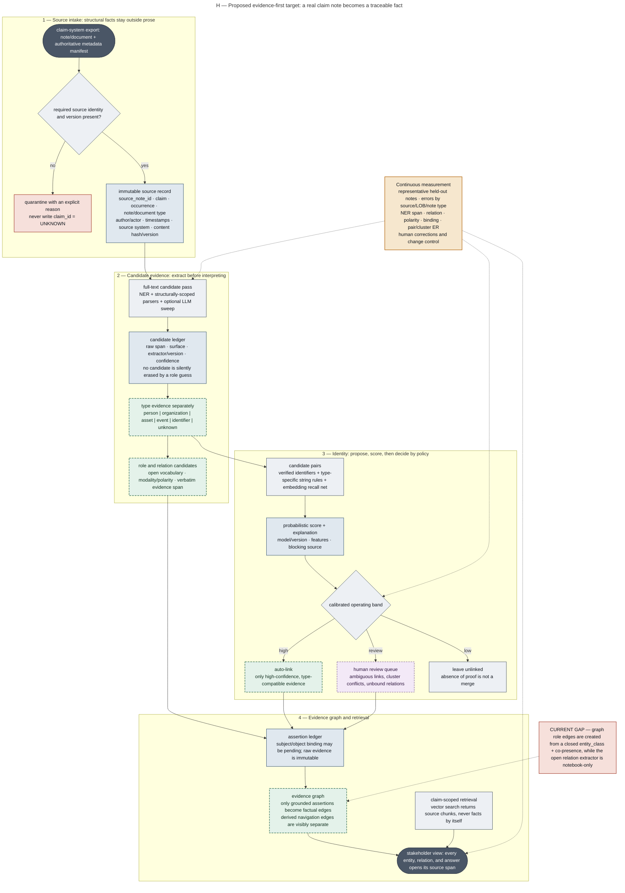
