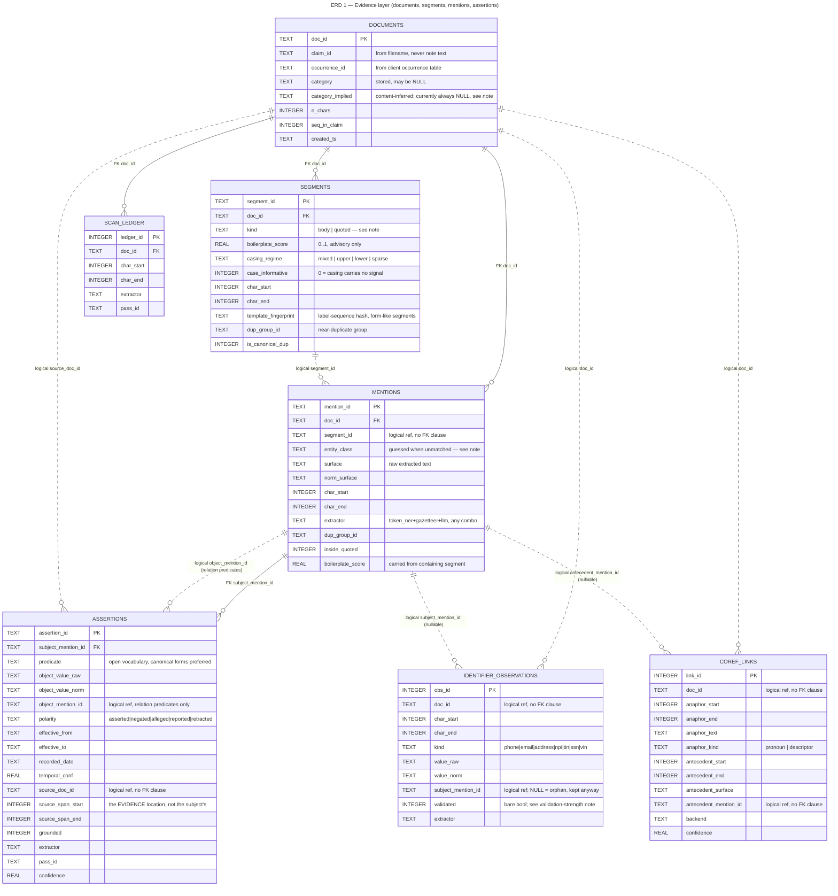
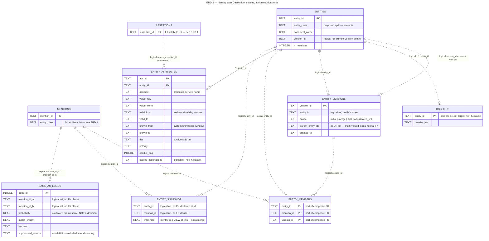
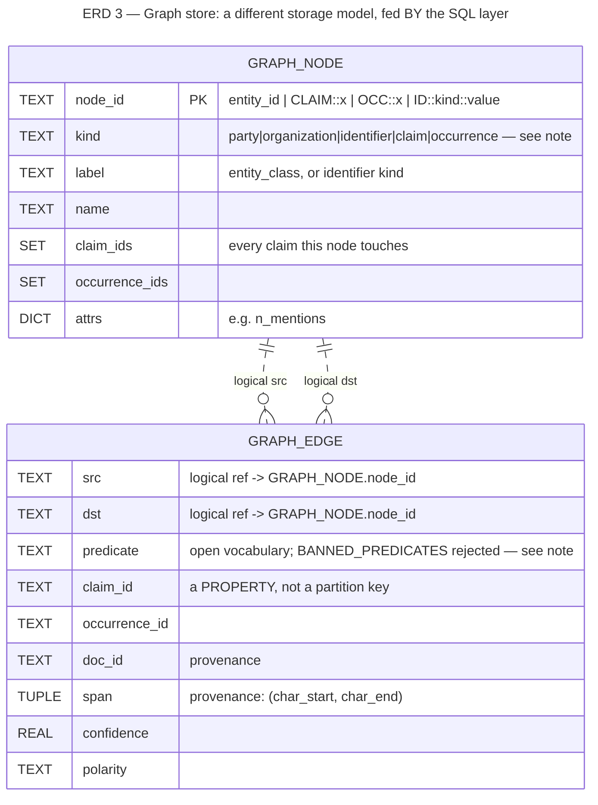

# Entity-intelligence schema — ERDs

Structural reference for where data lives and how tables relate. Companion to
[`../README.md`](../README.md), which shows the *process* (activity diagrams);
this shows the *shape* (data model). Three diagrams, because one 14-table ERD
is not readable, and because the graph store genuinely is a different storage
model, not a 15th table.

Read alongside `src/contracts.py` (the DDL, single source of truth) and
`src/graph_store.py` (`GraphNode` / `GraphEdge`).

## Reading these

Standard crow's-foot cardinality (`||` one, `o{` zero-or-many, etc.), with one
deliberate repurposing:

| line | means |
|---|---|
| **solid** (`--`) | a `FOREIGN KEY` clause exists in the DDL — SQLite enforces it (`documents.doc_id`) |
| **dashed** (`..`) | a *logical* reference only — the column exists and is used that way in code, but no `FOREIGN KEY` clause declares it |

That split is the main finding of this pass: **most references in this schema
are logical, not enforced.** `src/contracts.py` declares exactly **5**
`FOREIGN KEY` clauses in the whole DDL. Across the 24 relationship lines drawn
in these three diagrams, 5 are solid and 19 are dashed. This appears to be
unconsidered rather than deliberate — the module docstring's stated design
principle is an
append-only, immutable-by-convention log, which doesn't obviously require
skipping FK enforcement, and SQLite's bulk-insert path this pipeline uses
would not be meaningfully slower with `PRAGMA foreign_keys=ON`. Whether to
tighten this is an open question, not a decision made here.

## Diagrams

1. **[Evidence layer](01-evidence-layer.mermaid)** — `documents`, `segments`,
   `mentions`, `assertions`, `identifier_observations`, `coref_links`,
   `scan_ledger`. Everything Layer 0/1 writes.
2. **[Identity layer](02-identity-layer.mermaid)** — `same_as_edges`,
   `entity_snapshot`, `entities`, `entity_members`, `entity_versions`,
   `entity_attributes`, `dossiers`. Everything Layer 2/3 writes.
   `mentions` reappears as the bridge table, trimmed to its key column —
   see diagram 1 for its full attribute list.
3. **[Graph store](03-graph-store.mermaid)** — `GraphNode` / `GraphEdge`.
   **Not SQL.** An in-memory igraph structure, serialized separately
   (`store/claims_graph.pkl`), built by `build_graph.py` by reading FROM the
   tables above. Shown here because it answers the same "where does data
   live" question, not because it belongs in the SQLite ERD.

## Notable shapes, while building this

- **`entity_snapshot` has no declared primary key at all** — not even a
  composite one. Consistent with its own comment ("materialized view of
  identity at one operating threshold"): it's meant to be recomputed
  wholesale per threshold sweep, not addressed row-by-row. Still worth
  knowing before writing anything that assumes row identity here.
- **`identifier_observations.validated` is a bare 0/1**, collapsing the
  validation-*strength* distinction the gazetteer layer now computes
  (`checksum` / `format` / `none` — see diagram 04 in the parent folder).
  The richer signal exists in `gazetteers.GazetteerHit.validation` at
  extraction time and is not currently carried into this column.
- **Graph node kinds: 7 declared, 5 ever constructed.** `NODE_KINDS` in
  `graph_store.py` includes `event` and `allegation`; `build_graph.py` never
  emits either. Same pattern as the old `SEGMENT_KINDS` finding — a
  vocabulary wider than what the code actually produces.
- **`ORG_CLASSES = {"repair_shop"}` — only one of the five `entity_class`
  values is treated as an organization node.** `medical_provider` and
  `attorney` entities become `party` nodes (the same graph kind as a person),
  not `organization`. Whether that's intentional — a solo practitioner and a
  hospital both filed under `medical_provider` with no way to tell them apart
  as graph node kinds — is worth confirming; it isn't obviously right or
  obviously wrong, but it is easy to miss reading `build_graph.py` alone.
- **`entity_class` sits on three different tables** (`mentions`, `entities`,
  and implicitly `dossiers` via join) and means something slightly different
  on each: per-mention guess, per-entity rollup, and profile-rendering input.
  The proposed `entity_type` / `role` split (parent folder, diagram 06) would
  touch `mentions.entity_class` and `entities.entity_class` identically, so
  fixing it once fixes it everywhere this value is read.

## SQL → graph provenance

What `build_graph.py` actually reads to build each node/edge kind — the
mapping ERD 3 can't show on its own, since it only has the two dataclasses:

| graph object | kind | built from |
|---|---|---|
| node | `party` / `organization` | one per row in `entities`, split by `entity_class ∈ ORG_CLASSES` |
| node | `claim` | distinct `claim_id` values seen across resolved entities |
| node | `occurrence` | distinct `occurrence_id` values, joined from `documents` |
| node | `identifier` | one per distinct `(kind, value_norm)` in `identifier_observations` — **including orphans**, i.e. rows with `subject_mention_id IS NULL` |
| edge | `PART_OF` | claim node → occurrence node (containment) |
| edge | `PARTY_TO` | entity node → claim node, carrying `doc_id` + `span` provenance |
| edge | role edges (`REPRESENTED_BY`, `TREATED_BY`, `ADJUSTED_BY`, `REPAIRED_BY`, …) | entity → entity, anchored on the claim's `claimant`-class entity; predicate chosen from `entity_class` via `ROLE_PREDICATE` |
| edge | `HAS_IDENTIFIER` | identifier node → owning entity, only when `identifier_observations.subject_mention_id` resolves to an entity; confidence 0.95 if `validated` else 0.7 |
| edge | `OBSERVED_ON` | identifier node → claim node, **only for orphan identifiers** — the one path that lets a later query still attribute an unbound phone/email to a claim |

Note this table is downstream of the proposed `entity_type`/`role` split: role
edges are chosen from `entity_class` today, so once that field splits, the
role-edge predicate should read from `role`, not `entity_type`.

### ERD 1 — Evidence layer (documents, segments, mentions, assertions)

Source: [`01-evidence-layer.mermaid`](01-evidence-layer.mermaid)

### ERD 2 — Identity layer (resolution, entities, attributes, dossiers)

Source: [`02-identity-layer.mermaid`](02-identity-layer.mermaid)

### ERD 3 — Graph store: a different storage model, fed BY the SQL layer

Source: [`03-graph-store.mermaid`](03-graph-store.mermaid)

