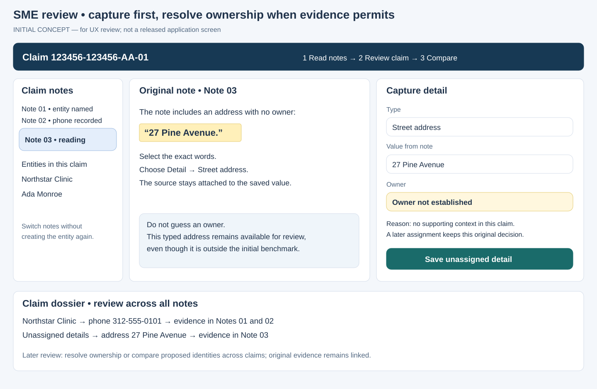
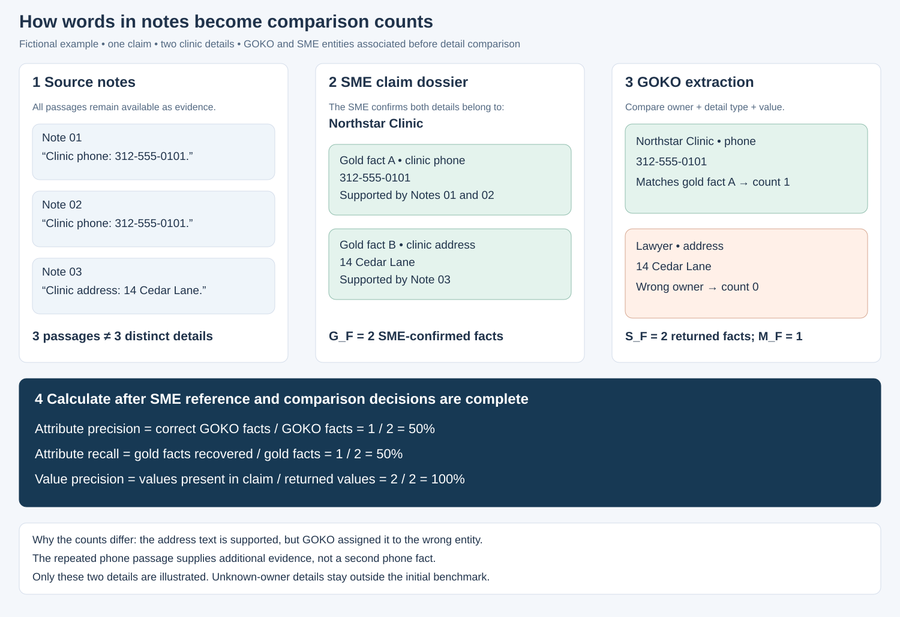

# Entity Intelligence: Evaluation Methodology and SME Review Design

*Initial discussion proposal for executive, business, data and design teams*

This lightpaper proposes an evaluation method, a supporting information model and an SME review experience. It is a starting point for agreement, not a final specification or a statement that every feature has been delivered. A UX specialist will review the concepts with SMEs to identify a simpler, more efficient workflow before the interface is finalized.

## Purpose and expected outcomes

Entity intelligence is useful when it identifies the right people and organizations, brings together their information accurately, and supports reliable watchlist decisions. This evaluation will establish how well GOKO’s current results meet those objectives and provide a consistent benchmark for measuring improvements in the proposed system.

The method combines GOKO’s existing datasets with structured review by subject-matter experts (SMEs). SMEs will create an independently reviewed reference, commonly called **gold data**, from the original claim notes. Both systems will then be compared with that reference using the same source material, information cutoff and scoring definitions.

The evaluation will answer four business questions:

1. How completely and precisely does each system identify entities within a claim?
2. How accurately does it recover details and assign them to the correct entity?
3. How reliably does it recognize the same entity across claims while preserving each claim’s context?
4. How effectively does watchlist matching distinguish genuine matches from false alerts, and where are genuine matches missed?

The initial comparison will cover capabilities supported by GOKO’s available outputs. Cross-claim identity resolution and more detailed evidence-location measures will be evaluated separately where comparable GOKO results are unavailable. Results will explain both performance and the evidence supporting each conclusion.

## 1. Establishing a fair and reusable benchmark

We propose selecting claims for which GOKO has identified entities, preserving their complete notes at a defined point in time, and capturing the corresponding GOKO results. The sample will also seek newer claims with lower overall note volume, representation from multiple clients, and multiple coverage groups. This combination will help distinguish challenges caused by extraction from those associated with long or complex claim histories.

The final sample size remains to be agreed. **The proposed minimum is 100 distinct claims per coverage group**, with equal representation across agreed note-taking-quality bands. SMEs will recommend the definitions and optimal distribution of those bands, considering clarity, completeness, ambiguity and repeated material. Note volume will be recorded separately: a short note is not necessarily a poor-quality note. Any adjustment to equal allocation will be agreed before sample selection.

The minimum is a planning baseline. More claims may be needed to evaluate rare watchlist matches, specific error types or individual client segments with useful confidence. Because selecting claims with existing GOKO entities excludes claims where nothing was identified, a supplementary sample of those claims will be needed before extending conclusions to the full portfolio.

### A shared point-in-time reference

Each benchmark release will preserve three linked components:

- **Source evidence:** the complete note contents, claim-to-note associations, source identifiers and the information cutoff.
- **System results:** GOKO’s entity, detail, category and watchlist outputs for that same evidence, together with available processing dates, configuration information and watchlist version.
- **SME reference:** reviewed entities, facts, identity decisions, categories and watchlist judgments, with their evidence and review history.

An export date alone does not establish that GOKO processed the same note version. The preparation stage will reconcile those inputs. Where alignment cannot be established, the comparison will be identified as non-equivalent until a matching snapshot or rerun is available.

Successive versions of the proposed system will receive the same permitted evidence. Improvements will therefore reflect changes in the system rather than additional notes, a newer watchlist or more favorable reference labels. If SMEs correct the reference, the benchmark will receive a new version and both systems will be rescored against it.

A development collection will support iterative improvement, while a separate held-out collection will support final assessment. Claims sharing source notes or confirmed identities will be grouped when creating these collections to reduce information leakage. This follows the established principle of evaluating on groups that were not available during development. [Method reference](https://scikit-learn.org/stable/modules/cross_validation.html#group-k-fold).

## 2. Translating GOKO’s data into comparable evidence

The evaluation requires two inputs from GOKO: a complete set of claim notes and a structured extract of the entities, details, categories and watchlist results produced from those notes. The extract may be delivered as a spreadsheet or another agreed format. Each note must be associated with its claim or claims so that SMEs can inspect the complete evidence, including notes that GOKO did not cite. The field labels below reflect the information described during discovery; they illustrate the content to be supplied rather than prescribe final column names.

| Evaluation purpose | Information to supply; illustrative field labels | How they will be used |
|---|---|---|
| Assemble complete claims | `Claim_Number`; note filenames such as `123456-123456-AA-01_1234567890.txt` | Bring together all supplied notes for a claim. The claim prefix determines membership, independently of which notes GOKO cites. |
| Identify entities and distinguish result types | `Entity_Name`, `GenAI_entityNameCleaned`, `entity_NER`, and `RecordType` values such as `Entity`, `GenAI_only` and `Exact_search` | Compare identified people and organizations with the SME reference. Confirm which result types represent entity extraction and which represent watchlist activity before counting extracted entities. |
| Evaluate details and ownership | `entity_address`, `entity_city`, `entity_state`, `entity_zip`, `entity_phone`, `entity_tin` | Compare each supplied value with the evidence and determine whether it belongs to the entity to which GOKO assigned it. |
| Evaluate categories | `entity_category`, `entity_subcategory` | Compare with independently reviewed categories under shared definitions, including whether a category describes a claim role or a general occupation. |
| Trace cited notes | `GenAI_Note_ID`, `exact_search_Note_ID` | Open cited source documents during comparison. An entity’s note list does not, by itself, identify which document supports each individual detail. |
| Evaluate watchlist decisions | `entity_watchlist_flag`, `GenAI_tok_sort_similarity`, `exact_search_Matched_Watchlist_Entity_Name`, `Watchlist_Entity_ID`, `Watchlist_Entity_Name` | Identify the particular candidate pairing, its method, similarity and actual flag decision. Several watchlist candidates may relate to one extracted entity. |
| Support watchlist identity review | `Watchlist_Address`, `Watchlist_State`, `Watchlist_Zip_Code`, `Watchlist_Phone`, `Watchlist_TIN` | Present available watchlist attributes alongside claim evidence so SMEs can assess identity beyond name similarity. Missing values remain unknown. |

The developed application’s importer will need to map the agreed field labels and separate comma-delimited note citations. It will also need to recognize spreadsheet formatting artifacts: for example, `1234567890.0` should locate note `1234567890` while retaining the value originally supplied. A note identifier can be associated with several claims, so lookup and review must preserve the claim association. This preparation makes source navigation reliable; it does not establish which entity a passage describes.

Before benchmarking, GOKO and the evaluation team will confirm how repeated entity reports and multiple watchlist candidates are represented. A repeated name is not sufficient to establish either a duplicate or a distinct identity. The same extracted entity must not be counted several times simply because several watchlist entries were considered.

The extraction information will also need to be supplemented with information about snapshot timing, candidate-search coverage and watchlist version. For example, the presence of low-similarity candidates does not establish that every considered candidate was retained in the export. These clarifications determine which performance claims the available evidence can support.

### 2.1. Proposed Gold Annotator output model

We propose a versioned relational model that separates source evidence, SME interpretation and system-comparison decisions. It is a **design proposal for the information we seek to provide**, not a committed database contract. Names below describe logical records and relationships; physical tables and export formats may change after architecture and UX review. An ID identifies an item, while a referenced ID links it to another item.

| Proposed record | Illustrative contents | Relationship and purpose |
|---|---|---|
| Benchmark release | Release ID, source cutoff, reference version, rule versions, approval status | Identifies the exact source and review versions used in a published comparison. |
| Claim | Claim ID, client, coverage, note-quality band | Provides the business context for evidence and reporting. |
| Source note version | Note-version ID, original note ID, original text or immutable source reference, fingerprint, source date | Preserves a particular version of a note without treating its numeric ID as globally unique. |
| Claim–note association | Claim ID, note-version ID | Supports several notes per claim and the same source note in several claims. |
| Claim entity | Entity ID, claim ID, SME label, type, review status | Identifies a person, organization or other subject within a claim. Vehicle subjects will need to be represented if VIN ownership is captured. |
| Evidence observation | Observation ID, claim–note association, selected words, source positions, reviewer, revision | Preserves every captured passage, including repeated passages. |
| Detail statement | Detail ID, claim ID, detail type, raw value, optional normalized value, normalization version, qualification, review status | Captures addresses, phone numbers and identifiers independently of whether an owner is known. |
| Detail–evidence association | Detail ID, observation ID, support/conflict/repetition role | Allows three passages to support one clinic phone statement while retaining all three sources. |
| Detail ownership decision | Decision ID, detail ID, entity ID when known, assigned/unassigned/disputed status, reason, reviewer, revision | Keeps ownership separate from the existence of a detail. An unassigned decision has no entity ID. More than one supported owner requires explicit decisions, not an inferred merge. |
| Identifier context / address grouping | Detail ID, identifier scheme, issuer or jurisdiction where relevant, masked/partial status, or address-group ID and component role | Distinguishes an SSN from a TIN, an issuing jurisdiction for a bar number, and components of one address from components of another. |
| Category decision | Entity ID, category, taxonomy version, status, supporting observations, reviewer, revision | Records the SME’s independent classification and its evidence. |
| Action and participants | Statement ID, action/relation, source observations, time/negation/attribution; participant entity IDs and roles | Preserves who did what and under what qualifications, including more than two participants. |
| Cross-claim identity decision | Two claim-entity IDs, same/different/unresolved outcome, evidence, reviewer, revision | Supports reviewed global identity groups without overwriting claim-specific entities. |
| System comparison decision | GOKO result reference and snapshot ID, reference entity/detail ID when matched, correct/incorrect/unresolved outcome, reason | Stores how a system result was checked against the gold reference, separately from the independent reference itself. |
| Watchlist review | Candidate reference, extracted-entity reference, watchlist-entry reference and version, SME outcome, evidence, reason | Supports several candidate reviews per extracted entity. Method, score and actual flag are retained with the versioned GOKO candidate input. |
| Release membership and review history | Release ID, exact record IDs/revisions, reviewer decisions and superseded decisions | Makes a published reference reproducible even after subsequent corrections. |

Item IDs would serve as primary keys; references such as a detail’s claim ID would serve as foreign keys. Association records would connect several items on either side, while revision identifiers would distinguish successive decisions. An unassigned ownership decision would permit an empty entity reference. If one value is supported for two owners, each owner–detail association would be a separate fact for counting. These logical records could be delivered through several linked exports or a database. The versioned GOKO inputs remain separate from the SME reference and are connected by comparison references; this model does not claim to specify GOKO’s internal schema. Integrity rules will require evidence and local ownership to remain within the appropriate claim, preserve earlier revisions, and bind a released benchmark to exact versions. A source-note association alone never establishes cross-claim identity.

**Identifier capture.** SMEs should be able to record Social Security numbers (SSNs), Taxpayer Identification Numbers (TINs), National Provider Identifiers (NPIs), Attorney Bar numbers, Vehicle Identification Numbers (VINs), and other named identifier types. Values will be retained as text so leading zeros and partial or masked forms are preserved. A format check will not be treated as identity verification. Issuer or jurisdiction will be retained where necessary to interpret a value. Capture does not automatically add a new field to the common benchmark: SSN, NPI, Bar number and VIN metrics require corresponding GOKO outputs and agreed comparison rules.

**Unassigned details.** If a note contains an address without enough context to identify its owner, the SME should still save it as an address, with its source and an explicit “Owner not established” decision. It can later be assigned through a new reviewed decision. Unassigned details will be exported and visible for later research, but excluded from the initial benchmark calculations in this proposal. A potentially corresponding GOKO detail whose correctness cannot be resolved will be set aside and reported, rather than automatically labeled unsupported. A later benchmark may assess owner-independent detail capture or successful ownership resolution using a separately approved reference and denominator.

## 3. The proposed SME review experience

The following conceptual screen illustrates the information an SME needs together. It is a design discussion aid, not a screenshot or a final interface specification. A UX specialist should test whether fewer panels or a different sequence would reduce effort.



*Figure 1. Selected words become a sourced detail. The SME can attach it to a claim entity or preserve it without an owner. The claim dossier brings evidence from different notes together; a later review links identities across claims.*

### Build the reference across the complete claim

The first review will be organized by unique claim, with all associated notes available together. GOKO’s extraction results will remain hidden while SMEs establish the reference. SMEs will identify entities and attach source-supported details, descriptions and actions to them as they progress through the notes.

This directly addresses information scattered across a claim. If one note introduces a clinic and another supplies its phone number, the SME will select the phone passage and attach it to the existing clinic. The annotator should keep the claim’s entity list available while the SME moves between notes. A consolidated claim view will bring the selected evidence together for review.

At the end of the claim, the SME will examine each entity’s consolidated evidence, check completeness and ownership, and assign a category where the evidence supports one. Insufficient or conflicting evidence will remain an explicit outcome. Supporting quotations will open in their source notes, allowing reviewers to inspect context without reconstructing the claim manually. The completed reference will be frozen before comparison with GOKO.

The review will preserve distinctions that materially affect correctness. A clinic’s address does not automatically belong to a doctor who works there. A denied visit is different from a confirmed visit. Repeated text is additional occurrence evidence, but not necessarily independent corroboration. Historical or disputed values will retain those qualifications.

### Review identities and shared information across claims

A second review will address entities and items across completed claims. Separating this stage allows SMEs to make identity judgments with the claim evidence assembled, rather than deciding global identity while reading an incomplete history.

The proposed experience will present candidate entity groups with their claim associations, names, identifiers, addresses, descriptions and actions. Algorithms may suggest groups using several signals, but an SME will decide **same entity**, **different entities** or **insufficient evidence**. Shared addresses or phone numbers alone will not establish identity. Conflicting evidence will remain visible, and accepted links will be reversible with a recorded reason.

Once an identity is confirmed, its combined view will show the evidence across its claims while retaining the source of each fact. Information established only in claim B will not be treated as information that GOKO should have extracted from claim A. Cross-claim performance will be measured using explicitly permitted cross-claim inputs.

Reviewing shared items will serve a separate purpose. An address-focused view, for example, will help SMEs assess equivalent address expressions and the entities associated with them without merging those entities. Actions will retain who participated, in what role, under what circumstances and according to which source.

Candidate groups will be reviewed independently of the identity results of the systems being compared. An additional sample outside the proposed groups will help assess missed links. Otherwise, review would establish the quality of suggested matches without establishing how many genuine relationships were overlooked.

### Compare system results after the reference is established

The comparison stage will associate each system-identified entity with the appropriate reference entity, or record an unsupported or unresolved identification. SMEs will then assess watchlist candidates using claim evidence and available watchlist attributes. Similarity and flag status should be hidden during identity judgment where practical, then available for threshold analysis afterward.

This sequence gives SMEs a focused task at each stage: establish claim evidence, assess cross-claim identity, and judge system comparisons. Cross-claim reference decisions will be completed before exposing identity-linking results when that capability is being benchmarked. A second reviewer will independently assess a sample of complete claims and identity decisions; disagreements will be resolved with their original judgments preserved.

## 4. Measuring entity and detail quality

The evaluation will use standard metric names. **Precision** measures how much of what a system reports is correct; **recall** measures how much of the reference it recovers. Both are necessary: a system can achieve high precision while omitting substantial information. [Metric definitions](https://scikit-learn.org/stable/auto_examples/model_selection/plot_precision_recall.html).

The calculation reference at the end of this paper gives explicit formulas and the information needed from each source. Its quantities are conceptual counts; section 2.1 illustrates how the required information could be organized.

### Entity identification

**Entity precision** asks: of the people and organizations GOKO extracted from the selected claims, how many correspond to people or organizations the SMEs established from those claims’ notes? **Entity recall** asks: of the people and organizations the SMEs established, how many did GOKO extract? The SMEs create the answer key; GOKO supplies the results being checked. The same calculations will be repeated separately for the proposed system.

```text
Entity precision = GOKO-extracted entities confirmed against the SME reference / GOKO-extracted entities included in the comparison
Entity recall = SME-established entities found by GOKO / SME-established entities included in the comparison
```

“Included in the comparison” means the claim has complete source material, SME review is finished and the entity belongs to the agreed study scope. It does not mean that the extraction was correct: incorrect extractions stay in the precision denominator.

Matching will account for name variants without treating name similarity as identity proof. Each GOKO extraction can be counted as a correct identification of at most one SME-established entity, and each SME-established entity can provide credit once. For example, if GOKO separately extracts the same clinic twice, it cannot receive two correct-identification credits for the single clinic in the reference. By contrast, displaying one clinic extraction beside three watchlist candidates is not three separate extractions; the data team will establish that distinction from GOKO’s result meaning. Merged identities, split identities and unsupported extractions will be reported as distinct error categories.

**Entity-type accuracy** will compare `entity_NER` with the reviewed type. **Category accuracy** will compare `entity_category` with the independently assigned claim category. The report will state which GOKO assignments were checked and which SME labels remain unresolved. Missing GOKO labels count as errors when the SME label is established. **Category evaluability coverage** will show the proportion of aligned extracted entities with sufficient reference evidence for a category judgment. Subcategory evaluation will be separate and limited to agreed labels supported by the notes.

### Details: value, owner and completeness

The primary detail comparison concerns an **entity–detail statement**: for example, “Northstar Clinic has phone 312-555-0101.” This paper also calls that statement a fact for counting purposes; it means the notes support the statement, not that the phone has been independently verified. If three notes repeat that same clinic phone number, the answer key contains one phone fact linked to three evidence passages. If a note gives a second phone number, that is a second fact. Different owners or materially different time qualifications also remain separate.

| Metric | Definition | What it tells the business |
|---|---|---|
| Attribute precision | Correct owner–detail-type–value extractions ÷ all GOKO-extracted details included in the comparison | How often reported details can be used for the entity to which they were assigned. |
| Attribute recall | Correctly recovered reference facts ÷ all eligible reference facts | How much of the available information the system captures. |
| Attribute false-negative rate | Missed reference facts ÷ all eligible reference facts; equal to 1 − attribute recall | How much information remains missing, including details of entities the system did not identify. |
| Value precision | Reported values supported under the same detail type somewhere in the claim ÷ all GOKO-extracted details included in the comparison | Whether values are grounded in the claim, considered separately from their owner. |
| Conditional attribution accuracy | Supported values assigned to the correct entity ÷ supported values with resolved ownership | Whether otherwise valid information has been attached to the right entity. |
| Unsupported-value rate | Values absent from the reference for that detail type ÷ all GOKO-extracted details included in the comparison | The proportion requiring investigation for transcription, truncation or unsupported generation. This does not establish fabrication. |

The reference will allow several valid values for an entity. An address or identifier without an established owner will also be retained, as described in section 2.1, but will not enter the initial benchmark totals. An empty extracted-detail field represents an omission when an eligible reference fact exists; it is not itself a reported false value. Unknown ownership and unresolved conflicting evidence will be identified separately rather than converted into guessed labels. When source material is missing, that limitation will be reported rather than interpreted as system failure.

### Agree equivalence before calculating results

GOKO’s described detail fields provide the information needed for component-level comparison. Meaningful benchmarking also requires agreed rules for when differently formatted values are equivalent.

| Detail | Proposed treatment |
|---|---|
| TIN | Preserve leading zeros and distinguish missing or masked digits. Ignore only agreed presentation separators. |
| Phone | Preserve country codes and extensions; standardize presentation without changing the represented number. |
| ZIP code | Preserve leading zeros and agree whether ZIP+4 is required, optional or assessed separately. |
| Address | Compare street, unit, city, state and ZIP both as components and as a complete associated location. Agree abbreviations and partial-address treatment. |
| Multiple or historical values | Retain each value and its context. Agree whether the task concerns any supported value or a value valid at the benchmark cutoff. |

A comma in an address will not automatically be interpreted as a separator between values. Address components from different locations will not be combined into an apparently correct address. These policies will be versioned and applied equally to GOKO and the proposed system.

The annotator will support this method by showing the extracted value, its proposed owner and the relevant reference evidence together. Reviewers will be able to distinguish wrong value, wrong owner, missing information and insufficient evidence. The proposed design will retain address bundles, material time qualifications and unassigned details alongside the source evidence.

### From selected words to a metric



*Figure 2. Fictional example: three note passages support two distinct clinic details. GOKO’s correct clinic phone contributes one successful comparison; the clinic address assigned to a lawyer does not. Both values appear in the notes, which explains why value precision can exceed attribute precision.*

The data team performs the comparison after SMEs establish the reference and confirm which GOKO entity corresponds to which reference entity. The scoring process checks the entity, detail type and value together. It does not count highlighted words or passages as successful extractions.

### Illustrative comparison

Suppose a claim establishes four facts: a clinic’s address, phone and TIN, and a lawyer’s phone. A system reports the correct clinic address, places the clinic phone on the lawyer, mistypes the clinic TIN, and reports the lawyer phone correctly.

Attribute precision and attribute recall are both **50%**: two of four facts are correctly reported with their owners. Value precision is **75%**, because three reported values occur in the evidence. Conditional attribution accuracy is approximately **67%**, because two of those three supported values have the correct owner. The unsupported-value rate is **25%**, including the mistyped TIN.

This separation makes the improvement opportunity clear: the system needs both better transcription and better ownership assignment. One broad “accuracy” percentage would obscure that distinction.

## 5. Evaluating watchlist matching above and below the threshold

GOKO’s candidate information below 90 similarity creates an opportunity to assess genuine matches that may not have become alerts. The proposed review will include candidates on both sides of the operational threshold, using `Watchlist_Entity_ID` to identify the particular watchlist entity and preserving `entity_watchlist_flag` as the historical decision.

Similarity and identity are different. A score of 89 is not an 89% probability that two entities are the same. The benchmark will confirm the actual threshold rule, including treatment of exactly 90 and any additional filters, rather than inferring it from the export.

SMEs will compare the claim entity with the candidate’s name, address, phone and TIN where available. Their outcomes will be **same identity**, **different identity** or **insufficient evidence**, accompanied by a reason. One extracted entity may have several candidates, each requiring its own identity decision.

For a defined candidate population, the evaluation will distinguish:

| Operational outcome | SME confirms the same identity | SME confirms different identities |
|---|---|---|
| Alert generated | True positive | False positive |
| No alert generated | False negative | True negative |

**Watchlist precision** will measure confirmed genuine alerts divided by all decidable alerts. **Candidate-conditional watchlist recall** will measure genuine matches alerted divided by all genuine matches found within the supplied candidate population. **Candidate-conditional false-positive rate** will measure incorrect alerts divided by all confirmed nonmatches in that population. **Review abstention rate** will report the proportion for which SMEs could not determine identity.

These measures will be reported separately for Exact search and GenAI, as well as for alternative threshold scenarios. Actual historical decisions will remain distinguishable from simulated decisions. Review will cover all candidates where feasible; otherwise, documented sampling probabilities will support weighted estimates. Score bands will separate values below 90 from those at or above it. Missing and invalid scores will remain visible.

### What lower-scoring candidates can and cannot establish

Reviewing supplied candidates below the threshold identifies missed alerts **among candidates GOKO made available**. It does not establish end-to-end recall when an entity was never extracted, a candidate was never generated, or a comparison was prevented by category rules.

A complementary audit will therefore sample reference entities, including entities GOKO missed or did not flag, and assess them against the complete frozen watchlist under an agreed search procedure. This requires watchlist access and an understanding of candidate-export completeness. Category-related missed matches will also require the relevant category rules and review of comparisons that would become eligible under a corrected category.

The proposed annotator design will separate an extracted entity from its candidate list. Reviewers will see completion status for candidate identity decisions independently of extraction review. The proposed workflow will cover both alerted and unalerted candidates, with separate threshold analysis and an independent audit of potentially missed matches.

## 6. Cross-claim evaluation and evidence relationships

After SMEs confirm identities across claims, **pairwise identity precision** will measure how often proposed same-identity links are correct. **Pairwise identity recall** will measure how many reference identity links are recovered within the defined evaluation population. Erroneous merges and splits will also be reported because their operational consequences differ. Candidate-only review is insufficient to establish the complete recall denominator.

The evaluation needs explicit associations between claims, entities, facts and source evidence. An address can relate to several entities; an entity can have several addresses; an action can involve several participants with different roles. Each association may also require time, uncertainty and supporting evidence.

These requirements do not prescribe a graph database. Relational associations can preserve them, while a graph-style view can help reviewers inspect complex connections. The technical requirement is to retain the meaning and origin of each relationship, including conflicting decisions. The UX requirement is to make those relationships understandable without turning a suggested connection into an accepted identity automatically.

The resulting entity view will allow a reviewer to move from a consolidated fact to its supporting claim and note, inspect contradictions, and correct a link with history preserved. An item-focused view will support address or identifier consistency review without assuming that common values establish common identity.

## 7. Reporting results and extending the benchmark

Results will combine an overall scorecard with breakdowns by coverage, client, note-taking quality and note volume. Pooled precision and recall will describe performance across all items included in the comparison; average per-claim results will show whether that performance is consistent across claims. **Claim-level exact-match accuracy**, reported separately for entities and for entities with details, will measure the proportion of completed claims with no in-scope omissions or incorrect extractions.

Every reported fraction will include its counts, scope and unresolved cases. A zero denominator will be unavailable rather than scored as zero. Confidence estimates will account for related claims and shared evidence. Balanced quality-band sampling will support comparisons between bands; a portfolio estimate will require the corresponding population weights.

Independent SME review and adjudication will address disagreements over completeness, ownership, categories and identity. Agreement will be assessed on those decisions. Annotation overlap, measured using Jaccard similarity, can supplement review quality checks but cannot establish agreement on ownership or identity by itself. AI suggestion acceptance and editing statistics will remain workflow diagnostics rather than extraction performance measures.

### Future evidence-location measures

GOKO does not supply exact character spans. The shared benchmark will therefore award credit for correct entities and facts without requiring exact source positions. The annotator’s quotations remain valuable for verifying the reference, but missing GOKO spans will not be treated as an error.

As comparable outputs become available, separate evaluations can assess:

- **Span precision and recall:** require matching source versions, defined offset conventions and labeled evidence spans. Exact-boundary and overlap-based results will be reported separately using one-to-one matching.
- **Coreference precision and recall:** require identified mentions and reference identity links, including pronouns. Results will distinguish mention detection from linking performance.
- **Evidence-support precision:** requires an assertion, its cited evidence and a judgment that the evidence supports its owner, value and qualifications. Text overlap alone is insufficient.
- **Relation or event precision and recall:** requires aligned participants, roles, action definitions, negation and material time or attribution. A denied visit will not match an affirmative visit.

These evaluations will remain separate from the common GOKO comparison until both systems provide the information needed for a fair assessment.

## 8. Delivery approach and alignment

The proposed delivery will connect import preparation, claim-level annotation, consolidated entity review and a frozen SME reference. Usability testing should establish whether SMEs can locate evidence, choose an existing entity, preserve an unassigned detail and complete a claim without unnecessary navigation. The illustrative screens in this paper describe the intended interactions rather than a finished interface.

Implementation will align scoring with the agreed entity and detail definitions, including repeated information and equivalent value formats. It will also support typed identifiers, unassigned details, cross-claim review, watchlist candidate review and versioned benchmark packaging. Each benchmark release will preserve original notes and GOKO results together. Product, engineering and UX teams will agree the delivery sequence; benchmark results will be published only after the implemented counting rules have been checked against the agreed method.

Cross-functional alignment will focus on five decisions: the sampling and quality-band plan; category and detail-comparison definitions; the meaning and completeness of GOKO’s extraction and candidate outputs; the point-in-time snapshot and watchlist requirements; and the SME adjudication process. Business and SME teams will establish meaning and acceptable uncertainty, data teams will establish input completeness and reproducibility, and product and engineering teams will translate those decisions into the review experience.

The intended deliverable is a repeatable benchmark that explains what improved, for which claims and information types, and on what evidence—while giving SMEs a practical way to establish and maintain that evidence.

## Calculation reference: from evidence to metrics

This reference explains how the proposed measures will be calculated. The letters below represent counts or comparison sets, not required field names. The export contracts can evolve while preserving these meanings. All fractions are multiplied by 100 when displayed as percentages. A zero denominator produces “not evaluable,” not 0%.

### A. Information to assemble

The evaluation process will bring together three sources of information:

| Source | Information required | Purpose in the calculation |
|---|---|---|
| Gold Annotator: claim reference | Claim and source-note associations; completed review status; reference entities; supported names and types; reference version | Establish the complete population of entities that should have been found within each eligible claim. |
| Gold Annotator: facts and categories | Detail type, value, owner, supporting evidence and material qualifications; reviewed category or unresolved status | Establish which facts and classifications are supported, including information absent from GOKO’s results. |
| GOKO: extraction results | Claim association, extracted entity and its details, assigned type/category, and enough information to distinguish repeated presentation from a separate extraction | Establish what GOKO actually returned. GOKO’s entity, detail and category information supply this content; the meaning of its result types must be agreed. |
| Gold Annotator: comparison decisions | Association of a GOKO entity with a reference entity, or unsupported/unresolved outcome; any reviewed value-equivalence and ownership decisions | Connect the two sources without requiring identical names or formats. |
| GOKO and SME watchlist review | Candidate entity pair, method, score, actual alert status and watchlist version; SME same/different/insufficient-evidence judgment | Establish true and false alerts and missed matches within the reviewed candidate population. |
| Cross-claim review and system results | Accepted reference identity links, system-proposed links and a defined set of assessed entity pairs | Establish correct, incorrect and missed cross-claim identity links. |

The proposed annotator outputs must preserve these reference and review decisions. Section 2.1 illustrates a logical model for doing so. The final export format and implementation will be agreed through design and validation; this calculation reference does not assume a particular existing export.

The preparation sequence is: select the same frozen claims; establish eligible reference entities and facts; interpret GOKO’s extraction units; apply agreed normalization; associate extracted entities with the reference; and classify comparison outcomes. Counts are calculated from those outcomes. A source quotation remains available for audit but is not a GOKO matching requirement.

The data team establishes the comparison population before calculating totals, using the agreed study scope and SME review decisions. Unassigned details and new identifier types without corresponding GOKO outputs remain available in the proposed exports but do not enter this initial benchmark. Unresolved cases and missing source packets are reported separately. An unsupported extraction is an error, not an eligibility exclusion. An absent extracted entity leaves its reference entity and eligible facts in the recall denominators. Ambiguous associations require adjudication or an explicitly disclosed exclusion, rather than silently counting potentially correct information as incorrect.

### B. Entities and classifications

For the selected claims with complete notes and finished SME review, let:

- **G_E** = number of reference entities, counting an entity separately in each claim where it is established.
- **S_E** = number of entities GOKO extracted from the selected claims for comparison. Several watchlist candidates referring to one extraction do not create several extracted entities; genuinely duplicated extractions remain visible as errors.
- **M_E** = number of GOKO-extracted entities confirmed to correspond to SME-established entities. Each GOKO extraction and each SME entity can contribute once to this count, so repeated extractions cannot claim the same reference entity several times.

The formulas are:

```text
Entity precision = M_E / S_E
Entity recall    = M_E / G_E
```

For example, 10 reference entities, 8 extracted entities and 7 correct matches give precision `7 / 8 = 87.5%` and recall `7 / 10 = 70%`. There is one incorrect extraction and three missed reference entities. Genuine duplicate extractions remain in `S_E` but cannot create additional matches; several watchlist candidates for the same extraction do not increase `S_E`.

For classifications, the evaluation uses the aligned entities with a resolved gold label:

```text
Category accuracy = correct category assignments / aligned entities with a resolved gold category
Category evaluability coverage = aligned entities with a resolved gold category / all aligned entities
Entity-type accuracy = correct type assignments / aligned entities with a resolved in-scope gold type
```

The gold labels come from SME review; GOKO’s assignments come from `entity_category` and `entity_NER`. A missing system label counts as incorrect when the reference label is resolved. An unresolved reference category is excluded from category accuracy but remains visible in category evaluability coverage. Subcategory accuracy, if included, uses the same formula with an agreed subcategory reference. The benchmark implementation will apply these missing-label rules consistently to each system.

### C. Extracted details and ownership

A comparison fact is an entity–detail statement, such as a clinic having a particular phone number, with any qualification required by the agreed task. Gold facts come from SME annotations grouped under their owners; GOKO facts come from its extracted detail values and the entities to which they are assigned. Normalization determines equivalence without overwriting the originals.

Let:

- **G_F** = number of SME-confirmed entity–detail statements within the agreed benchmark scope. If three notes state the same clinic’s same phone number, that contributes **one** to G_F, with all three passages retained as evidence. A second phone number or the same number assigned to a different entity contributes another statement.
- **S_F** = number of entity–detail statements returned by GOKO and included by the data team in the comparison with the SME reference. For example, a clinic address and clinic phone are two statements. Repeated delivery of the same extraction because it has several watchlist candidates is counted once. A genuine duplicate extraction remains a separate result and is reported as a duplication error. GOKO and the data team must establish which situation its extract represents before counting; identical text alone cannot decide this.
- **M_F** = number of GOKO entity–detail statements that correspond to an SME-confirmed statement about the same entity, same detail type and equivalent value, including any required qualification. Each GOKO statement and each SME statement may contribute to **at most one** successful comparison. For example, GOKO’s “Northstar Clinic — phone — 312-555-0101” matches the SME’s statement once, even when three notes support it. Assigning that phone to a lawyer does not match the clinic’s statement.

```text
Attribute precision           = M_F / S_F
Attribute recall              = M_F / G_F
Attribute false-negative rate = (G_F - M_F) / G_F
```

An address component can be the comparison fact for a component score. A complete address must instead be treated as one associated bundle for a complete-address score. Both systems must use the same unit. A correct value assigned to the wrong entity cannot enter `M_F`.

Separate value and attribution diagnostics use these counts:

- **S_V** = extracted details for which value support can be adjudicated.
- **V** = those details whose equivalent value is supported under the same detail type somewhere in the permitted claim evidence, regardless of assigned owner.
- **U** = those details whose value is unsupported under that type in that claim.
- **V_O** = supported-value details for which ownership can also be adjudicated.
- **O** = those ownership-decidable details assigned to the correct entity.

```text
Value precision                  = V / S_V
Unsupported-value rate           = U / S_V
Conditional attribution accuracy = O / V_O
```

When the reviewers can determine support for every value included in the comparison, `S_V = V + U`; value precision and unsupported-value rate then sum to 100%. If all supported values also have resolved ownership, `V_O = V`. Otherwise the undecidable counts are disclosed. These diagnostics need not share the attribute metrics’ denominator because ownership or qualification can remain unresolved even when a value is visibly present.

In the four-fact example in Section 4, `G_F = 4`, `S_F = 4` and `M_F = 2`. Therefore attribute precision and recall are `2 / 4 = 50%`, and the false-negative rate is `(4 - 2) / 4 = 50%`. For value diagnostics, `S_V = 4`, `V = 3`, `U = 1`, `V_O = 3` and `O = 2`: value precision is 75%, unsupported-value rate is 25%, and conditional attribution accuracy is approximately 67%.

### D. Watchlist decisions

The unit is a particular identified-entity/watchlist-entity pair. GOKO supplies the candidate and alert decision; the SME supplies the identity judgment. Within a declared reviewed candidate population:

```text
TP = alerted pairs judged to be the same identity
FP = alerted pairs judged to be different identities
FN = unalerted pairs judged to be the same identity
TN = unalerted pairs judged to be different identities
A  = reviewed pairs judged to have insufficient evidence
```

```text
Watchlist precision                       = TP / (TP + FP)
Candidate-conditional watchlist recall    = TP / (TP + FN)
Candidate-conditional false-negative rate = FN / (TP + FN)
Candidate-conditional false-positive rate = FP / (FP + TN)
Review abstention rate                   = A / (TP + FP + FN + TN + A)
```

For example, `TP = 18`, `FP = 2`, `FN = 6`, `TN = 24` and `A = 5` produce precision of 90%, candidate-conditional recall of 75%, a false-positive rate of about 7.7%, and abstention of about 9.1%. The six genuine unalerted matches can be found only if review includes unalerted candidates. This example does not establish matches missing from the candidate population itself.

For threshold analysis, replace the historical alert decision with the decision produced by the agreed rule at threshold `t`, keeping SME identity judgments unchanged, and recalculate `TP(t)`, `FP(t)`, `FN(t)` and `TN(t)`. Method and category restrictions remain part of the rule. Missing scores are not automatically below-threshold outcomes. Historical and simulated results are reported separately.

If only a probability sample is reviewed, replace each count by the sum of its items’ sampling weights, commonly `1 / selection probability`. Numerator and denominator must use the same weights and population. Pending reviews are reported separately from abstentions. Overall entity-level watchlist recall requires an independent audit: reference entities with at least one correct alert divided by all audited reference entities confirmed to have a watchlist match. Supplied candidate judgments alone do not establish that denominator.

### E. Cross-claim identity and claim-level results

Within a defined, adjudicated population of cross-claim entity pairs, let **G_L** be the reference set of same-identity links and **S_L** the system’s proposed same-identity links. Each unordered pair counts once; unresolved pairs are disclosed and excluded from the decided population. Group membership can be translated into those pairs without requiring a particular storage model.

```text
Pairwise identity precision = number of links in both S_L and G_L / number of links in S_L
Pairwise identity recall    = number of links in both S_L and G_L / number of links in G_L
```

Gold Annotator’s proposed cross-claim review supplies `G_L`; the system being compared supplies `S_L`. Recall requires reference links beyond the system’s own suggestions. Claims sharing an address do not enter `G_L` unless identity has actually been established.

```text
Claim-level exact-match accuracy = fully correct eligible claims / all eligible completed claims
```

For the entity-only variant, a fully correct claim has no missed or incorrect entity extractions. For the entity-plus-detail variant, it must also have no missed or incorrect eligible facts. Unresolved claims are disclosed separately; marking a claim reviewed does not mean the system was correct.

For any metric with numerator `n_c` and denominator `d_c` for claim `c`:

```text
Pooled result (micro average) = sum(n_c) / sum(d_c)
Mean claim result (macro average) = sum(n_c / d_c) / number of claims with d_c > 0
```

Both use the same eligibility rules. The pooled result weights claims through their item counts; the mean claim result gives each evaluable claim equal weight. Subgroup calculations repeat the formulas within each coverage, client or quality band.

### F. Future evidence measures

The future evaluations in Section 7 follow the same logic, with different comparison units:

```text
Span precision = matched extracted spans / system-returned spans included in the comparison
Span recall = matched reference spans / eligible reference spans
Coreference-link precision = correct system identity links between mentions / system-proposed links included in the comparison
Coreference-link recall = recovered reference identity links between mentions / eligible reference links
Evidence-support precision = supported cited assertions / system assertions whose cited support the reviewers can judge
Relation/event precision = correctly matched extracted relations or events / system-returned relations or events included in the comparison
Relation/event recall = recovered reference relations or events / eligible reference relations or events
```

Each requires the task-specific reference and system information described in Section 7. Matching conventions, roles and qualifications are agreed before counting. These formulas do not turn GOKO’s note citations into spans or imply that GOKO currently provides the required outputs.

For an annotation-overlap diagnostic, `Jaccard similarity = annotations shared by both reviewers / annotations recorded by either reviewer`. One proposed comparison defines shared annotations by their kind, source positions and detail type within the same claim and note. This requires two reviewers’ annotation sets, not GOKO output, and remains distinct from agreement about entity identity or fact ownership.
