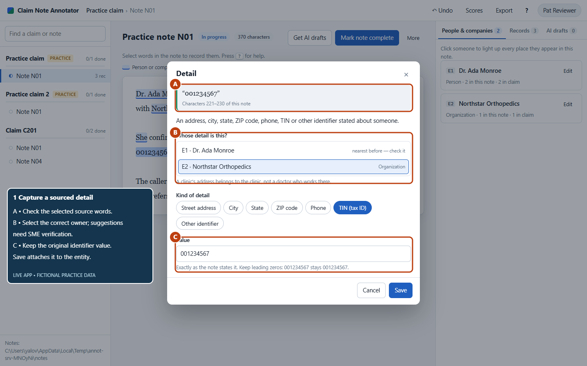
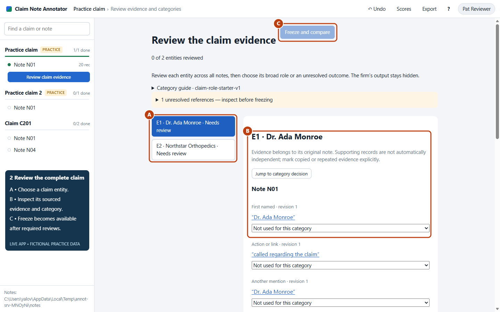
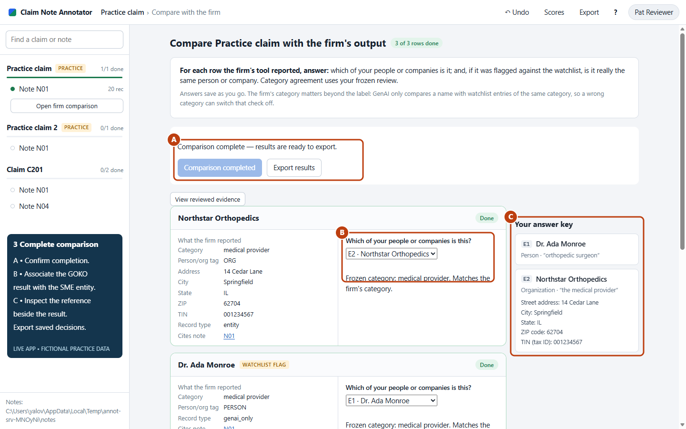

# Entity Intelligence: Evaluation Benchmark and SME Review Platform

*Initial proposal for executive sponsors, product and delivery leadership, and the data, engineering and design teams.*

**Status: a proposal to align on, not a finished specification and not a claim that the work is already built.** Where something exists today as a working prototype, this document says so. Where something is proposed and not yet built, it says that too. A UX specialist will review the review experience with subject-matter experts before any interface is finalized.

---

## Read this first

### What we are proposing, in plain language

We process insurance claims. Each claim accumulates **claim notes**: free-text records written by adjusters, investigators and other staff over the life of the claim. Buried in that text are the people and organizations involved — claimants, doctors, clinics, attorneys, repair shops, witnesses — along with their addresses, phone numbers and tax identifiers.

We already run a software system that reads those notes and pulls out those people, organizations and their details automatically. This document calls that system **GOKO**. It also checks the names it finds against a **watchlist** of parties who warrant closer scrutiny, and raises an alert when it thinks it has found one.

**Here is the problem: nobody can currently say how well that system works.** Not "it seems to work well" or "one of our analysts found a mistake last week", but a defensible number: *out of everything in these claims that should have been found, it found this percentage, and of what it reported, this percentage was correct.*

We are proposing to build that number, and to build it in a way that can be re-run every time the system changes.

### How we get there

We take a fixed set of real claims. We have experienced staff — **subject-matter experts**, or **SMEs** — read the notes for those claims and write down, by hand, every person and organization they find and every detail about them, citing the exact sentence in the note that supports each entry. They do this **without seeing what GOKO produced**, so their answers are genuinely independent.

That hand-built set of answers is the **answer key**. The industry term is **gold data**, and this document uses both phrases interchangeably.

Once the answer key is complete and locked, we compare GOKO's output against it and count the agreements and disagreements. That produces the score. Because the claims, the notes and the answer key are all frozen and versioned, we can run the same comparison against a new version of the system next quarter and the difference in score is a real difference in system quality, not an artifact of different test data.

To make the SME work practical, we need a purpose-built web application — the **Gold Annotator** — that shows a reviewer the claim's notes, lets them highlight text and attach it to a person or organization, and keeps a complete audit trail of who decided what and why. A working prototype of this application exists and is shown in Part 2 §3.

### The decision we are asking for

We are asking sponsors to approve three things:

1. **The method.** That the evaluation approach described in Part 2 is the right way to measure this, and that its results will be accepted as the basis for decisions about the system.
2. **The resources.** Engineering and data capacity to build the annotation platform and the scoring pipeline, and — critically — committed SME reviewer time, which is the single hardest constraint in this plan.
3. **The unblocking.** Sponsor help clearing the two access dependencies that can stall this for months if left to normal channels: a decision on where the data and application will live (Part 3 §11), and access to the watchlist data and the claim note archive under an approved data-handling arrangement.

### What we are NOT asking for

We are not asking for a decision about replacing GOKO, changing a vendor, or funding a new extraction system. This proposal produces the evidence that such a decision would need. It deliberately stops there.

---

## How to read this document

This document is long because it serves six different audiences. **You are not expected to read all of it.** Find your row.

| If you are… | Read | Skim | Skip unless curious |
|---|---|---|---|
| **Executive sponsor** | Read this first (above), Part 1 | Part 3 §9 (phases), §12 (risks) | Parts 2 and 4 |
| **Product Owner** | Read this first, Part 1 (all of it, especially §3 and §4) | Part 2 §5–§6, Part 3 §9–§12 | Part 4 |
| **Business Analyst** | Read this first, Glossary, Part 3 §8–§10 | Part 2 (all) | Part 4 §C–§F |
| **Project Manager** | Read this first, Part 3 §9, §11, §12, §13 | Part 1, Part 2 §3 | Part 4 |
| **Web developers (front and back end)** | Glossary, Part 2 §3, Part 3 §8, §10, §11 | Part 2 §2.1, Part 1 | Part 4 §C–§F |
| **Data engineers** | Part 2 §2, §2.1, Part 3 §10, §11 | Part 2 §7, Part 4 §A | Part 1 |
| **Data scientists** | Part 2 §4–§7, Part 4 (all) | Part 2 §2.1, Part 3 §10 | Part 1 §4 |
| **Data architects** | Part 2 §2.1, Part 3 §10, §11, Part 4 §A | Part 2 §2, §6 | Part 1 |

**A note for the Product Owner, Business Analyst and Project Manager:** you do not need to understand the statistics in Part 4 to lead this successfully. What you need is in the Glossary below, Part 1, and Part 3. Part 3 §13 gives you the specific questions to ask in a standup that will tell you whether this project is actually healthy, phrased so you can ask them without knowing the underlying mathematics.

---

## Glossary

Everything in this document that is not everyday English. Terms are grouped by where you will run into them.

### The domain

| Term | What it means here |
|---|---|
| **Claim** | One insurance claim, identified by a claim number. It is the unit of work: SMEs review one complete claim at a time. |
| **Claim note** | One free-text document written by staff about a claim. A claim typically has many notes, written over months or years. In our systems these arrive as plain text files, one per note. |
| **Note packet** | All the notes belonging to one claim, gathered together. Assembling the complete packet matters: a detail may appear in a note that GOKO never cited. |
| **Coverage group** | The line of business or claim type (for example bodily injury versus property). Claims in different coverage groups read differently, so results are reported per group. |
| **Entity** | A person or organization that appears in a claim: a claimant, a doctor, a clinic, an attorney, a body shop, a witness. "Entity extraction" means automatically finding these in text. |
| **Detail** (also **attribute**) | A fact attached to an entity: an address, a phone number, a tax ID. |
| **Watchlist** | A maintained list of parties that warrant closer scrutiny. Names found in claims are checked against it. |
| **Alert** / **flag** | What happens when the system decides a name in a claim matches a watchlist entry closely enough to warrant attention. |
| **Similarity score** | A number, here on a 0–100 scale, describing how closely two names resemble each other as text. **It is not a probability that they are the same party.** A score of 89 does not mean "89% likely the same person". |
| **Threshold** | The score at or above which the system raises an alert. Today that is 90. |
| **SME** (subject-matter expert) | An experienced claims professional who builds the answer key. Their judgment is the standard the systems are measured against. |
| **GOKO** | The name used throughout this document for the entity-extraction and watchlist-matching capability currently in use. Where the document says "the current system", it means GOKO. |

### The identifiers SMEs will capture

| Term | What it is |
|---|---|
| **TIN** | Taxpayer Identification Number — identifies a business to the tax authority. |
| **SSN** | Social Security Number — identifies an individual. Highly sensitive. |
| **NPI** | National Provider Identifier — a unique number for a healthcare provider. |
| **Bar number** | An attorney's license number, issued per state, so the issuing state matters for interpretation. |
| **VIN** | Vehicle Identification Number — identifies a specific vehicle. |

### The method

| Term | What it means here |
|---|---|
| **Gold data** / **answer key** / **reference** | The set of correct answers, built by SMEs from the notes alone, without seeing any system's output. All three phrases mean the same thing in this document. |
| **Annotation** | One recorded SME decision: highlighting a passage and saying what it is, who it belongs to, and why. |
| **Benchmark** | A frozen, versioned package containing the claims, their notes at a fixed point in time, the system output for those same notes, and the answer key. Re-running the comparison against a benchmark gives a repeatable score. |
| **Snapshot** / **point in time** | A fixed capture of the data as it stood on a particular date. Essential because claims keep accumulating notes: if the system read the claim in March and the SME reads it in September, the SME will find things that did not exist when the system ran, and the system will look wrong when it was not. |
| **Freeze** | Locking a claim's answer key so later edits cannot silently change a published score. |
| **Adjudication** | Resolving a disagreement between two SME reviewers, with both original judgments preserved. |
| **Blind review** | SMEs build the answer key with GOKO's output hidden, so their answers are not anchored to what the machine already said. |

### The measurements

Most of these are standard terms from measurement practice. Definitions with worked examples are in Part 2 §4 and Part 4.

| Term | Plain meaning |
|---|---|
| **Precision** | *Of what the system reported, how much was right?* High precision means few false reports. |
| **Recall** | *Of what was actually there, how much did the system find?* High recall means few misses. |
| **Why both** | A system that reports only one name per claim, very carefully, can have near-perfect precision while missing almost everything. A system that reports every capitalized word has high recall and useless precision. Neither number is meaningful alone. |
| **True positive** | The system raised an alert, and the SME confirmed it was genuinely the same party. A correct catch. |
| **False positive** | The system raised an alert, and the SME confirmed it was a different party. A wasted investigation. |
| **False negative** | The system did not raise an alert, but the SME confirmed the parties were genuinely the same. A miss. |
| **True negative** | The system did not alert, and the parties were genuinely different. Correct restraint. |
| **Attribution** / **ownership** | Which entity a detail belongs to. A clinic's phone number recorded against a doctor who works there is a correct value with the wrong owner — a distinct kind of error from a mistyped number, and it needs a different fix. |
| **Cross-claim identity resolution** | Recognizing that "Dr. A. Monroe" in one claim and "Ada Monroe MD" in another are the same person. |
| **Normalization** | Agreeing when two differently formatted values mean the same thing, for example `(312) 555-0101` and `312-555-0101`. |
| **Held-out set** | Claims deliberately set aside and not looked at during development, used for the final honest score. Without this, a team tunes the system to the test and the score stops meaning anything. |
| **Micro average** (pooled) | Add up all the correct answers across all claims, divide by all the opportunities. Big claims influence it more. |
| **Macro average** (mean per claim) | Score each claim separately, then average the scores. Every claim counts equally. Reporting both reveals whether performance is consistent or carried by a few claims. |
| **Span** | The exact character positions of a passage in a note. Our SMEs record these; GOKO does not produce them, which is why span-level scoring is a future track rather than part of the shared benchmark. |
| **Coreference** | Linking different mentions of the same party within a text, including pronouns ("she", "the clinic"). |

---

# Part 1 — The business case

*Primary audience: executive sponsors and the Product Owner. Everyone else can skim this and move to Part 2.*

## 1. The problem we are solving

We have an automated system reading claim notes and telling us who is involved in each claim and which of them appear on a watchlist. Decisions get made on that output. But we have no measurement of how good it is.

That gap produces four concrete problems:

**We cannot tell improvement from noise.** When a new version ships, the only evidence we have that it is better is that it is newer. There is nothing to compare against.

**We cannot prioritize the fix.** "Accuracy is about 80%" — 80% of what? If the system reports mostly correct values but attaches them to the wrong people, the fix is one thing. If the values themselves are wrong, it is a completely different fix. A single accuracy percentage hides the distinction, and engineering effort gets spent on the wrong problem. Part 2 §4 shows a worked example where one blended score of 50% conceals two separate defects with two separate remedies.

**We cannot tune the watchlist threshold responsibly.** The system alerts at a similarity of 90. Nobody can currently say what we would gain or lose by moving it to 85. Lower it and investigators drown in false alerts; raise it and genuine matches go unnoticed. Right now that is a guess.

**We cannot answer the question we will eventually be asked.** "How do you know this system works?" is a question that arrives from audit, from regulators, or from a client, and it arrives without warning. "We spot-check it" is not a durable answer.

## 2. What we are building

Three connected things.

**1. A reusable benchmark.** A frozen, versioned package: a fixed set of claims, their notes exactly as they stood at a fixed date, GOKO's output for those same notes, and the SME answer key. Any system — GOKO today, a revised GOKO, a replacement — gets scored against the identical package under identical rules.

**2. An annotation platform.** A web application SMEs use to build the answer key: read the notes, highlight the evidence, attach details to the right party, record their reasoning, and lock the result. A working prototype exists today and is shown in Part 2 §3.

**3. A scorecard.** Regular, reproducible reporting: how well the system identifies parties, how accurately it captures their details, how reliably it recognizes the same party across claims, and how well its watchlist matching separates genuine matches from noise — broken down by coverage group, client and note quality, with the supporting counts always shown alongside every percentage.

## 3. What this is worth

This section is what the Product Owner takes into a stakeholder conversation.

| Value lever | What changes | How we would put a number on it |
|---|---|---|
| **Investigator time on false alerts** | Measuring watchlist precision tells us what proportion of alerts are wrong. Threshold analysis (Part 2 §5) tells us what a different threshold would do to that proportion, before we change anything in production. | Alert volume × average handling time × measured false-positive rate. Operations owns the handling-time figure; this project supplies the rate. |
| **Missed watchlist matches** | Reviewing candidates *below* the alert threshold surfaces genuine matches that never became alerts. Today these are invisible by construction — nothing reports what it did not flag. | Count of confirmed missed matches in the reviewed sample, extrapolated with the documented sampling weights. Exposure value per missed match is a business input, not ours. |
| **Engineering effort aimed correctly** | The metrics separate "wrong value" from "right value, wrong owner" from "not found at all". Each has a different remedy and a different cost to fix. | Comparison of the current effort split against the measured error distribution. |
| **Shipping with confidence** | A frozen benchmark makes every release a measured release. Regressions get caught before they reach production rather than after someone notices. | Avoided rework and incident cost; use historical incidents as the baseline. |
| **Build/buy/keep decisions** | Any conversation about replacing or extending the system currently runs on assertion. With a benchmark, a vendor claim becomes testable against our own data. | Directly: the benchmark is the evaluation instrument for any such procurement. |
| **A durable data asset** | The answer key does not expire when this evaluation ends. It is reusable for every future version, and it is the same kind of data needed to train or tune a future model. | Cost of building equivalent labelled data later, when it will be needed urgently and under time pressure. |
| **Defensible governance** | A documented, independently reviewed, reproducible evaluation is an artifact we can put in front of audit. | Risk reduction; qualitative but real. |

**The honest framing.** This project does not itself improve extraction accuracy by a single percentage point. It produces the measurement that makes improvement possible, directable and provable. That is a reasonable thing to say out loud to a sponsor — it is more credible than claiming the benchmark itself creates value, and it is the argument that holds up when challenged.

## 4. Questions you will be asked, and the answers

*Written for the Product Owner to use directly.*

**"Can't we just spot-check a few claims?"**
Spot-checking tells you that errors exist. It cannot tell you the rate, it cannot tell you whether the rate improved, and different people spot-checking different claims produce different impressions. The difference between a spot check and a benchmark is the difference between an anecdote and a measurement.

**"Why can't AI build the answer key? Why do we need people?"**
Because the answer key is the standard we are measuring the AI against. Using AI output to grade AI output measures agreement between two systems, not correctness. The tool may propose draft annotations to save typing, but every entry is accepted, corrected or rejected by a person, and that decision is recorded with their name on it.

**"Why hide the current system's output from the reviewers? That seems like extra work."**
Because people shown an answer tend to agree with it. If a reviewer sees that GOKO found three parties in a claim, they will look for three parties. Blind review is what makes the answer key independent, and independence is the entire basis of the score.

**"100 claims per coverage group sounds like a lot of SME time."**
It is, and that is the main cost of this project. The number comes from needing enough claims that the resulting percentages are stable rather than driven by a handful of cases, and from needing to report results separately per coverage group and per note-quality band rather than as one blended figure. The number is a proposal, not a fixed requirement, and Part 3 §9 sequences the work so a small pilot proves the approach before the full sample is committed.

**"What if the current system scores badly? Is this an attack on it?"**
No, and the design is deliberately fair to it. Both systems are compared against the same answer key, on the same notes, with the same cutoff date and the same rules. Where the benchmark cannot judge something fairly — because the needed information was never supplied — that case is reported as unresolved rather than counted as a failure. The purpose is a number we trust, whichever direction it points.

**"When do we get a number?"**
A pilot number on a small sample comes at the end of Phase 1; the first full scorecard comes at the end of Phase 2 (Part 3 §9). Both dates depend on when SME time is committed and when the data-access and environment decisions land. Those are the schedule drivers, not the engineering.

**"Why do we need a custom application? Why not a spreadsheet?"**
Because the answer key needs every entry tied to the exact sentence that supports it, in a specific note, in a specific claim, with the reviewer's name, the time, and a full history of revisions — and because a reviewer needs to move between a claim's notes while keeping its running list of parties visible. A spreadsheet loses the link between an answer and its evidence, which is precisely the link that makes the answer key auditable. It also cannot enforce blind review.

**"Why does everything have to be frozen at a point in time?"**
Claims keep accumulating notes. If the system read a claim in March and an SME reads it in September, the SME will legitimately find parties who first appeared in June. Scoring that as a system failure would be wrong. Freezing the notes at a fixed date means both sides are judged on the same evidence.

**"What happens after the first scorecard?"**
The benchmark is re-run against each subsequent system version. The marginal cost of the second and every later run is small, because the expensive part — the answer key — already exists.

## 5. Scope

**In scope**

- Building the frozen benchmark: claim selection, note snapshot, system-output snapshot.
- Building and operating the annotation platform for SME review.
- The comparison and scoring pipeline, and the reporting scorecard.
- Evaluation of entity identification, detail capture and ownership, categories, and watchlist matching including candidates below the alert threshold.
- Cross-claim identity evaluation, where comparable system output exists.

**Out of scope for this proposal**

- Changing, tuning or replacing the production extraction system. This project measures; it does not modify.
- Changing the production watchlist threshold. We will report what different thresholds would have done. Acting on that is a separate decision with its own approval.
- Evidence-location and linguistic measures (spans, coreference, relation extraction). These need output the current system does not produce; Part 2 §7 keeps them on the roadmap and out of the first benchmark.
- Any claim about the full claim portfolio drawn from a sample that only contains claims where the system already found something. Part 2 §1 explains why a supplementary sample is required before generalizing.

## 6. What success looks like

By the end of Phase 2 we should be able to put a single page in front of a sponsor that states, with the counts behind every figure:

- what proportion of the parties in these claims the system finds, and what proportion of what it reports is real;
- how accurately it captures details, separated into *wrong value* and *right value on the wrong party*;
- how many of its watchlist alerts are genuine, and how many genuine matches it did not alert on within the reviewed population;
- how all of the above varies by coverage group, client and note quality;
- and a re-runnable package that will produce a directly comparable page for the next version of the system.

---

# Part 2 — How the evaluation works

*Primary audience: everyone. Each section opens with a plain-language summary — non-technical readers can read the summaries and move on.*

The four business questions this evaluation answers:

1. How completely and precisely does each system identify the people and organizations in a claim?
2. How accurately does it capture their details, and does it attach each detail to the right party?
3. How reliably does it recognize the same party across different claims, while keeping each claim's own context intact?
4. How effectively does watchlist matching separate genuine matches from false alerts, and where are genuine matches being missed?

The first benchmark covers what GOKO's available output can support. Cross-claim identity resolution and evidence-location measures are evaluated separately, because comparable output does not exist for them yet. Every result is reported with the evidence behind it.

## 1. Establishing a fair and reusable benchmark

> **In plain terms:** pick a set of claims, take a photograph of them and of the system's output at one moment in time, and never change it. That frozen package is what every version of every system gets scored against, so score differences mean system differences and nothing else.

We propose selecting claims where GOKO has identified entities, preserving their complete notes at a defined point in time, and capturing the corresponding GOKO results. The sample will also seek newer claims with lower overall note volume, representation from multiple clients, and multiple coverage groups. This combination helps distinguish difficulties caused by extraction itself from those caused by long or complex claim histories.

The final sample size remains to be agreed. **The proposed minimum is 100 distinct claims per coverage group**, with equal representation across agreed note-quality bands.

> **What a "note-quality band" is:** notes vary enormously in how well they are written. Some are clear and complete; some are terse, ambiguous or full of copy-pasted repetition. If we do not group claims by note quality, a bad overall score could mean "the system is weak" or it could mean "we happened to sample the messiest claims", and we would not be able to tell which. SMEs will define the bands — considering clarity, completeness, ambiguity and repeated material — and recommend how to distribute the sample across them.

Note volume is recorded separately from note quality: a short note is not necessarily a poor-quality note. Any adjustment to equal allocation across bands will be agreed before sample selection.

The minimum is a planning baseline. More claims may be needed to evaluate rare watchlist matches, specific error types or individual client segments with useful confidence. And because selecting claims where GOKO already found entities excludes the claims where it found nothing, **a supplementary sample of those claims is required before any conclusion is extended to the whole portfolio.** This is a genuine limitation, and it is stated here so it is not discovered later.

### A shared point-in-time reference

Each benchmark release preserves three linked components:

- **Source evidence** — the complete note contents, which notes belong to which claims, the source identifiers, and the information cutoff date.
- **System results** — GOKO's entity, detail, category and watchlist output for that same evidence, together with processing dates, configuration information and the watchlist version in force.
- **SME reference** — the reviewed entities, facts, identity decisions, categories and watchlist judgments, with their supporting evidence and full review history.

> **Why this is more work than it sounds:** an export date does not prove that GOKO read the same version of the notes that we are giving the SMEs. Reconciling those inputs is real work in the preparation stage. Where we cannot establish that both sides saw the same evidence, the comparison is labelled non-equivalent and set aside until we have a matching snapshot or a rerun. Reporting a score we cannot stand behind is worse than reporting none.

Successive versions of any system receive the same permitted evidence. Improvements therefore reflect changes in the system, not additional notes, a newer watchlist, or more forgiving reference labels. If SMEs later correct the answer key, the benchmark gets a new version number and **both** systems are rescored against it.

A **development collection** supports iterative improvement; a separate **held-out collection** supports final assessment.

> **Why a held-out set matters, in one sentence:** if a team can see the test answers while tuning the system, the system gets tuned to the test and the final score stops describing reality.

Claims that share source notes or confirmed identities are grouped when creating these collections, so that information does not leak from the development set into the held-out set. This follows the established principle of evaluating on groups that were not available during development. [Method reference](https://scikit-learn.org/stable/modules/cross_validation.html#group-k-fold).

## 2. Translating the current system's data into comparable evidence

> **In plain terms:** before anything can be measured, we need two things from the business, and we need to understand exactly what they mean. First, **the notes** — a complete set of the claim note text files. Second, **the extract** — a structured export, most likely a spreadsheet, with one row per person or organization the current system found, carrying its details, its category, and any watchlist match it considered. Neither of these is exotic; both need careful handling.

Each note must be associated with its claim or claims, so SMEs can inspect the complete evidence — **including notes that GOKO never cited.** If we only supply the notes GOKO used, we can never discover what it missed.

The table below describes the information we need. The field labels are illustrative: they reflect what was described during discovery and show the *kind* of content required. They are not a demand for specific column names, and the actual names will be confirmed with whoever produces the extract.

| Evaluation purpose | Information to supply; illustrative field labels | How it will be used |
|---|---|---|
| Assemble complete claims | `Claim_Number`; note filenames such as `123456-123456-AA-01_1234567890.txt` | Bring together all supplied notes for a claim. The claim prefix in the filename determines membership, independently of which notes GOKO cites. |
| Identify entities and distinguish result types | `Entity_Name`, `GenAI_entityNameCleaned`, `entity_NER`, and `RecordType` values such as `Entity`, `GenAI_only` and `Exact_search` | Compare the people and organizations found against the SME answer key. We must confirm which of these result types represent an extracted entity and which represent watchlist activity **before** counting anything, or the counts will be wrong. |
| Evaluate details and ownership | `entity_address`, `entity_city`, `entity_state`, `entity_zip`, `entity_phone`, `entity_tin` | Compare each value with the evidence and determine whether it belongs to the party GOKO assigned it to. |
| Evaluate categories | `entity_category`, `entity_subcategory` | Compare with the independently reviewed category under shared definitions, including whether the category describes a role in the claim or a general occupation. |
| Trace cited notes | `GenAI_Note_ID`, `exact_search_Note_ID` | Open the cited source documents during comparison. Note: an entity's note list does not, by itself, say which document supports which individual detail. |
| Evaluate watchlist decisions | `entity_watchlist_flag`, `GenAI_tok_sort_similarity`, `exact_search_Matched_Watchlist_Entity_Name`, `Watchlist_Entity_ID`, `Watchlist_Entity_Name` | Identify the specific candidate pairing, the method that produced it, its similarity score, and the actual alert decision. One extracted party may have several watchlist candidates. |
| Support watchlist identity review | `Watchlist_Address`, `Watchlist_State`, `Watchlist_Zip_Code`, `Watchlist_Phone`, `Watchlist_TIN` | Show the watchlist entry's own attributes next to the claim evidence, so SMEs can judge identity on more than name similarity. Missing values stay unknown; they are not treated as mismatches. |

### What the import layer has to handle

*For developers and data engineers; others can skip to §2.1.*

The application's importer must map the agreed field labels and split comma-separated note citations into individual references. It must also survive spreadsheet formatting artifacts: `1234567890.0` must resolve to note `1234567890` while the originally supplied value is retained unchanged in the stored data and exports. The same note identifier can appear under several claims, so lookup and review must always preserve the claim association.

This preparation makes source navigation reliable. It does **not** establish which entity a passage describes — that remains an SME judgment.

### Three things to settle with the data owners before counting anything

These are not technicalities; each one can invalidate a headline number.

1. **What a repeated row means.** Before benchmarking, we and the data owners confirm how repeated entity reports and multiple watchlist candidates are represented in the extract. A repeated name does not by itself prove either a duplicate or a distinct party. The same extracted entity must not be counted several times merely because several watchlist entries were considered against it.
2. **Whether the export is complete.** The presence of low-similarity candidates does not prove that every candidate considered was retained in the export. If candidates were filtered before export, any recall figure computed from them describes the filtered set, not the system.
3. **Snapshot timing and watchlist version.** Which notes were read, when, and against which version of the watchlist. Without these, we cannot state what the numbers apply to.

These clarifications determine which performance claims the available evidence can actually support. Getting them wrong produces confident, wrong numbers.

### 2.1. Proposed information model for the annotation platform

> **In plain terms:** this is the proposed shape of the data the annotation platform stores. Its guiding principle is separation: *what the notes say*, *what the SME concluded*, and *how a system's output compared* are three different things and are never mixed together. Business readers can skip to §3; data architects, data engineers and the developers building the platform should read it closely, because this is the starting point for the table design conversation.

This is a **design proposal for the information we intend to hold**, not a committed database contract. The names below describe logical records and their relationships. Physical tables, keys and export formats will be settled with the data architects after architecture and UX review. An ID identifies an item; a referenced ID links it to another item.

| Proposed record | Illustrative contents | Relationship and purpose |
|---|---|---|
| Benchmark release | Release ID, source cutoff, reference version, rule versions, approval status | Identifies the exact source and review versions used in a published comparison. |
| Claim | Claim ID, client, coverage, note-quality band | Provides business context for evidence and reporting. |
| Source note version | Note-version ID, original note ID, original text or immutable source reference, fingerprint, source date | Preserves one particular version of a note, without treating its numeric ID as globally unique. |
| Claim–note association | Claim ID, note-version ID | Supports many notes per claim, and the same source note appearing in several claims. |
| Claim entity | Entity ID, claim ID, SME label, type, review status | A person, organization or other subject within one claim. Vehicles will need representation if VIN ownership is captured. |
| Evidence observation | Observation ID, claim–note association, selected words, source positions, reviewer, revision | Preserves every captured passage, including repeated ones. |
| Detail statement | Detail ID, claim ID, detail type, raw value, optional normalized value, normalization version, qualification, review status | Captures addresses, phone numbers and identifiers **independently of whether an owner is known**. |
| Detail–evidence association | Detail ID, observation ID, support/conflict/repetition role | Lets three passages support one clinic phone statement while retaining all three sources. |
| Detail ownership decision | Decision ID, detail ID, entity ID when known, assigned/unassigned/disputed status, reason, reviewer, revision | Keeps *who owns this* separate from *does this exist*. An unassigned decision carries no entity ID. Two supported owners require two explicit decisions, never an inferred merge. |
| Identifier context / address grouping | Detail ID, identifier scheme, issuer or jurisdiction where relevant, masked/partial status; or address-group ID and component role | Distinguishes an SSN from a TIN, records the issuing state for a bar number, and keeps the components of one address from being mixed with another's. |
| Category decision | Entity ID, category, taxonomy version, status, supporting observations, reviewer, revision | The SME's independent classification and the evidence for it. |
| Action and participants | Statement ID, action/relation, source observations, time/negation/attribution; participant entity IDs and roles | Preserves who did what, under what qualifications, with more than two participants where needed. |
| Cross-claim identity decision | Two claim-entity IDs, same/different/unresolved outcome, evidence, reviewer, revision | Supports reviewed global identity groups **without overwriting** the claim-specific entities. |
| System comparison decision | System result reference and snapshot ID, reference entity/detail ID when matched, correct/incorrect/unresolved outcome, reason | Records how a system result was checked against the answer key — stored separately from the answer key itself. |
| Watchlist review | Candidate reference, extracted-entity reference, watchlist-entry reference and version, SME outcome, evidence, reason | Supports several candidate reviews per extracted entity. Method, score and the actual historical flag are retained with the versioned candidate input. |
| Release membership and review history | Release ID, exact record IDs and revisions, reviewer decisions and superseded decisions | Makes a published score reproducible even after later corrections. |

**Notes for the schema conversation.** Item IDs would serve as primary keys; references such as a detail's claim ID would serve as foreign keys. Association records connect several items on either side. Revision identifiers distinguish successive decisions rather than overwriting them. An unassigned ownership decision must permit an empty entity reference — this is a deliberate requirement, not a nullable field by accident. If one value is supported for two owners, each owner–detail association is a separate fact for counting purposes.

These logical records can be delivered as several linked exports or as a database; that choice is open. The versioned system inputs stay separate from the SME answer key and are connected only through comparison references. **This model does not attempt to describe GOKO's internal schema and makes no claim about it.**

Integrity rules will require that evidence and claim-local ownership stay within the correct claim, that earlier revisions are preserved, and that a released benchmark binds to exact record versions. A shared source note never, by itself, establishes cross-claim identity.

**Identifier capture.** SMEs should be able to record SSNs, TINs, NPIs, attorney bar numbers, VINs and other named identifier types. Values are retained as text, so leading zeros and partial or masked forms survive. A format check is not identity verification. Issuer or jurisdiction is retained where it is needed to interpret a value. Note that **capture does not automatically add a field to the benchmark**: SSN, NPI, bar-number and VIN metrics also require corresponding system output and agreed comparison rules before they can be scored.

**Unassigned details.** If a note contains an address with no way to tell whose it is, the SME should still be able to save it as an address, with its source and an explicit "Owner not established" decision. It can be assigned later through a new recorded decision, without erasing the original one. Unassigned details are exported and remain visible for later research, but are **excluded from the initial benchmark calculations** in this proposal. Correspondingly, a GOKO detail whose correctness cannot be resolved because reference ownership is unknown is set aside and reported, rather than automatically marked wrong. A later benchmark may assess owner-independent detail capture, or successful ownership resolution, using a separately approved answer key and denominator.

## 3. The proposed SME review experience

> **In plain terms:** this is what an SME actually does, screen by screen. The screenshots below are from the working prototype running on **fictional practice data** — no real claim or client data appears in them. They show how the review flows today. They are not a final interface design: a UX specialist will work with SMEs to simplify the interaction before anything is finalized.

The numbered stages and lettered callouts explain the flow; the underlying application controls and wording are shown as they are. The unassigned-detail capability and the expanded identifier types described in §2.1 are **proposed extensions and are not in the prototype**.

### Stage 1 — Build the answer key across the complete claim

The first review is organized by claim, with all of that claim's notes available together. **GOKO's output stays hidden throughout this stage.** SMEs identify the parties and attach source-supported details, descriptions and actions to them as they work through the notes.

This directly addresses the core difficulty: information is scattered across a claim. If one note introduces a clinic and a different note, written three months later, supplies its phone number, the SME selects the phone passage and attaches it to the clinic that already exists in their list. The annotator keeps the claim's running entity list available as the SME moves between notes, and a consolidated claim view brings the selected evidence together at the end.



*Figure 1a — Capturing a sourced detail. **A** is the text the SME selected from the note. **B** is the owner choice: which party this detail belongs to. **C** is the original value, preserved exactly as written. In this practice example the SME picks the clinic rather than the suggested doctor before saving the TIN — exactly the ownership judgment the metrics in §4 are designed to measure. Note that the current form requires an owner; the proposed "Owner not established" option in §2.1 does not exist yet.*

At the end of the claim, the SME examines each party's consolidated evidence, checks it for completeness and correct ownership, and assigns a category where the evidence supports one. "Insufficient evidence" and "conflicting evidence" stay available as explicit outcomes — the reviewer is never forced to guess. Supporting quotations open in their source notes, so a reviewer can check context without reconstructing the claim by hand. The completed answer key is then **frozen** before any comparison with GOKO.



*Figure 1b — Reviewing the claim dossier. **A** selects a party found in the claim. **B** shows that party's linked source evidence, each item traceable to the note it came from. **C** is the freeze control, which locks the answer key once the required reviews are complete; it is greyed out in this capture because review is unfinished. This practice claim has one note — the proposed workflow must also be tested on claims with many notes, which is where the real difficulty lies.*

The review preserves distinctions that materially change whether an answer is correct:

- A clinic's address does not automatically belong to a doctor who works there.
- A *denied* visit is not the same as a *confirmed* visit.
- Repeated text is additional occurrence evidence, but not necessarily independent corroboration — the same sentence copy-pasted into four notes is one fact, not four.
- Historical or disputed values keep those qualifications attached.

### Stage 2 — Review identities and shared information across claims

A second, separate review handles parties and items *across* completed claims. Separating it is deliberate: it lets SMEs judge whether two parties are the same person with the full claim evidence already assembled, instead of making that call while still reading an incomplete history.

The proposed experience presents candidate groups of entities together with their claim associations, names, identifiers, addresses, descriptions and actions. Algorithms may *suggest* groups using several signals, but an SME decides **same entity**, **different entities** or **insufficient evidence**. A shared address or phone number alone never establishes identity. Conflicting evidence stays visible, and an accepted link can be reversed with a recorded reason.

Once an identity is confirmed, the combined view shows the evidence across its claims while retaining the source of each fact. Critically: **information established only in claim B is never treated as information GOKO should have extracted from claim A.** Cross-claim performance is measured only using explicitly permitted cross-claim inputs.

Reviewing shared *items* serves a different purpose. An address-focused view, for example, helps SMEs assess whether several differently written addresses are the same location, and see which parties are associated with it — **without merging those parties**. Actions retain who participated, in what role, under what circumstances and from which source.

Candidate groups are reviewed independently of the identity results produced by the systems under comparison. An additional sample drawn from *outside* the proposed groups is needed to assess missed links; otherwise the review would establish how good the suggested matches are while saying nothing about how many real relationships were never suggested at all.

### Stage 3 — Compare system results, after the answer key is locked

Only now does GOKO's output become visible. The comparison stage associates each system-identified party with the appropriate answer-key party, or records it as unsupported or unresolved. SMEs then assess watchlist candidates using the claim evidence and the available watchlist attributes. Similarity scores and flag status are hidden during the identity judgment where practical, then made available afterwards for threshold analysis — so the reviewer's identity call is not anchored to the machine's score.



*Figure 1c — Completing the comparison. **A** confirms that the required comparison decisions have been saved. **B** associates a GOKO result with an SME-established party. **C** keeps the answer key visible alongside it. Export then makes those decisions available for analysis. "Complete" means the review is finished — it does not mean every GOKO result was correct.*

This sequence gives the SME one focused task at a time: establish the claim evidence, then judge cross-claim identity, then judge the system comparison. Where cross-claim identity linking is itself being benchmarked, the reference identity decisions are completed before any system identity results are exposed.

**Quality control.** A second reviewer independently assesses a sample of complete claims and identity decisions. Disagreements are adjudicated, and both original judgments are preserved rather than overwritten.

## 4. Measuring entity and detail quality

> **In plain terms:** two questions, asked separately every time. *Of what the system reported, how much was right?* — that is **precision**. *Of what was actually there, how much did it find?* — that is **recall**. We never report one without the other, because each can be made to look excellent by sacrificing the other.

[Standard metric definitions](https://scikit-learn.org/stable/auto_examples/model_selection/plot_precision_recall.html). The calculation reference in Part 4 gives the explicit formulas and the information needed from each source. Its quantities are conceptual counts; §2.1 illustrates one way the underlying information could be organized.

### Entity identification

**Entity precision** asks: of the people and organizations GOKO extracted from these claims, how many correspond to people or organizations the SMEs established from those same claims' notes?

**Entity recall** asks: of the people and organizations the SMEs established, how many did GOKO find?

The SMEs create the answer key; GOKO supplies the answers being checked. The same calculations are repeated separately for any other system being evaluated.

```text
Entity precision = GOKO-extracted entities confirmed against the SME answer key / GOKO-extracted entities included in the comparison
Entity recall    = SME-established entities found by GOKO / SME-established entities included in the comparison
```

"Included in the comparison" means the claim has complete source material, SME review is finished, and the entity is within the agreed study scope. **It does not mean the extraction was correct** — incorrect extractions stay in the precision denominator, which is where they belong.

**Counting rules that prevent inflated scores.** Matching accounts for name variants without treating name similarity as proof of identity. Each GOKO extraction can be credited as a correct identification of at most one answer-key party, and each answer-key party can give credit once. So if GOKO separately extracts the same clinic twice, it does not earn two credits for the one clinic in the answer key. Conversely, one clinic extraction displayed beside three watchlist candidates is **not** three extractions — the data team establishes that distinction from the meaning of GOKO's result types before counting begins (see §2). Merged identities, split identities and unsupported extractions are reported as distinct error categories, because they have different causes and different fixes.

**Entity-type accuracy** compares `entity_NER` with the reviewed type. **Category accuracy** compares `entity_category` with the independently assigned claim category. The report states which system assignments were checked and which SME labels remain unresolved. A missing system label counts as an error when the SME label is established. **Category evaluability coverage** reports the proportion of aligned entities where the reference evidence was sufficient to make a category judgment at all — this is a transparency measure, so that a high accuracy figure computed on a small judgeable subset cannot be mistaken for a high accuracy figure overall. Subcategory evaluation is separate and limited to agreed labels the notes actually support.

### Details: value, owner and completeness

> **The key idea:** the thing being counted is a complete statement — *"Northstar Clinic has phone 312-555-0101"* — not a loose value. This document also calls such a statement a **fact**. Saying it is a fact means the notes support it; it does not mean the phone number has been independently verified against the phone company.

If three notes repeat that same clinic phone number, the answer key holds **one** phone fact linked to three evidence passages. If a note gives a second, different phone number, that is a second fact. Different owners, or materially different time qualifications, also produce separate facts.

| Metric | Definition | What it tells the business |
|---|---|---|
| **Attribute precision** | Correct owner + detail-type + value extractions ÷ all extracted details included in the comparison | How often a reported detail can actually be used for the party it was assigned to. |
| **Attribute recall** | Correctly recovered answer-key facts ÷ all eligible answer-key facts | How much of the available information the system captures. |
| **Attribute false-negative rate** | Missed answer-key facts ÷ all eligible answer-key facts; equals 1 − attribute recall | How much information is still missing, including details belonging to parties the system never identified at all. |
| **Value precision** | Reported values supported under the same detail type somewhere in the claim ÷ all extracted details included in the comparison | Whether the values are grounded in the claim, considered separately from who they were attached to. |
| **Conditional attribution accuracy** | Supported values assigned to the correct party ÷ supported values with resolved ownership | Whether otherwise-valid information ended up on the right party. |
| **Unsupported-value rate** | Values absent from the answer key for that detail type ÷ all extracted details included in the comparison | The proportion needing investigation for transcription error, truncation, or unsupported generation. **This does not establish fabrication** and should not be described as such. |

The answer key allows several valid values for one party. An address or identifier with no established owner is retained as described in §2.1, but does not enter the initial benchmark totals. An empty extracted-detail field is an omission when an eligible answer-key fact exists; it is not itself a reported false value. Unknown ownership and unresolved conflicting evidence are reported separately rather than converted into guessed labels. Where source material is missing, that limitation is reported as a limitation — not interpreted as system failure.

### Agree equivalence rules before calculating anything

> **Why this section exists:** `(312) 555-0101` and `312-555-0101` are the same phone number. `02134` and `2134` are the same ZIP code, unless a spreadsheet ate the leading zero, in which case one of them is now wrong. Unless we agree these rules in advance and apply them identically to every system, the scores measure formatting conventions rather than extraction quality.

| Detail | Proposed treatment |
|---|---|
| **TIN** | Preserve leading zeros; distinguish missing digits from masked digits. Ignore only the presentation separators we have agreed to ignore. |
| **Phone** | Preserve country codes and extensions. Standardize presentation without changing the number represented. |
| **ZIP code** | Preserve leading zeros. Agree whether ZIP+4 is required, optional, or assessed separately. |
| **Address** | Compare street, unit, city, state and ZIP both as individual components and as one complete location. Agree abbreviation handling and partial-address treatment. |
| **Multiple or historical values** | Retain each value with its context. Agree whether the task asks for *any* supported value or the value that was valid at the benchmark cutoff. |

Two specific traps: a comma inside an address is not automatically a separator between two values; and address components belonging to different locations must never be combined into a single apparently-correct address. These policies are versioned and applied identically to every system compared.

The annotator supports this by showing the extracted value, its proposed owner and the relevant answer-key evidence together, so the reviewer can distinguish *wrong value* from *wrong owner* from *missing information* from *insufficient evidence*. The proposed design retains address bundles, material time qualifications and unassigned details alongside the source evidence.

### A worked example — why one blended score is not enough

Suppose a claim establishes four facts: a clinic's address, its phone number and its TIN, plus a lawyer's phone number.

A system reports:
- the clinic address, correctly;
- the clinic's phone number, but attaches it to the lawyer;
- the clinic's TIN, mistyped;
- the lawyer's phone number, correctly.

The results:

| Measure | Result | Why |
|---|---|---|
| Attribute precision | **50%** | Two of four reported facts are right, with the right owner. |
| Attribute recall | **50%** | Two of the four facts in the answer key were recovered. |
| Value precision | **75%** | Three of the four reported values do appear in the evidence. |
| Conditional attribution accuracy | **≈67%** | Of those three real values, two are on the right party. |
| Unsupported-value rate | **25%** | One value — the mistyped TIN — is not in the evidence at all. |

Read as one number, this system is "50% accurate", and that number tells an engineer nothing. Read as five, it says something specific and actionable: **the system has a transcription problem and a separate ownership problem, and they need different fixes.** That is the entire reason this evaluation reports several numbers instead of one.

## 5. Evaluating watchlist matching, above and below the alert threshold

> **In plain terms:** the system alerts when name similarity reaches 90. We will review not only the alerts it raised — checking how many were genuine — but also the near-misses it considered and discarded, checking how many of *those* were genuine. The second half is the part nobody can see today, because a system does not report what it decided not to tell you about.

The proposed review includes candidates on both sides of the operational threshold, using `Watchlist_Entity_ID` to identify the specific watchlist entry and preserving `entity_watchlist_flag` as the historical decision that was actually taken.

**Similarity is not identity.** A score of 89 is not an 89% probability that two parties are the same. Before any analysis, the benchmark confirms the actual production threshold rule — including how exactly 90 is treated and whether any additional filters apply — rather than inferring the rule from the export.

SMEs compare the claim party against the candidate's name, address, phone and TIN where available. Their outcome is **same identity**, **different identity** or **insufficient evidence**, always with a reason. One extracted party may have several candidates, and each one needs its own identity decision.

For a defined candidate population:

| Operational outcome | SME confirms same identity | SME confirms different identities |
|---|---|---|
| **Alert generated** | True positive *(a correct catch)* | False positive *(a wasted investigation)* |
| **No alert generated** | False negative *(a miss)* | True negative *(correct restraint)* |

- **Watchlist precision** — confirmed genuine alerts ÷ all decidable alerts. *Of the alerts we raised, how many were real?*
- **Candidate-conditional watchlist recall** — genuine matches alerted ÷ all genuine matches found within the supplied candidate population. *Of the real matches the system considered, how many did it act on?*
- **Candidate-conditional false-positive rate** — incorrect alerts ÷ all confirmed non-matches in that population.
- **Review abstention rate** — the proportion where SMEs could not determine identity either way. Reported openly rather than forced into a decision.

Results are reported separately for the Exact-search method and the GenAI method, and for alternative threshold scenarios. Actual historical decisions stay clearly distinguishable from simulated ones. Review covers all candidates where feasible; where it does not, documented sampling probabilities support weighted estimates. Score bands separate values below 90 from those at or above it, and missing or invalid scores stay visible rather than being silently dropped.

### What below-threshold review can and cannot establish

This matters, because it is easy to overclaim here.

Reviewing supplied candidates below the threshold identifies missed alerts **among the candidates GOKO made available**. It does **not** establish end-to-end recall, because it cannot see three failure modes: the party was never extracted from the notes at all; no candidate was ever generated for it; or a comparison was blocked by a category rule.

A complementary audit is therefore required. It samples answer-key parties — **including parties GOKO missed entirely or never flagged** — and assesses them against the complete frozen watchlist under an agreed search procedure. This needs watchlist access and an understanding of how complete the candidate export is. Category-related misses additionally require the relevant category rules, plus review of the comparisons that would have become eligible under a corrected category.

In the proposed annotator design, an extracted party is kept separate from its candidate list, and completion status for candidate identity decisions is tracked independently of extraction review. The workflow covers alerted and unalerted candidates alike, with separate threshold analysis and an independent audit of potentially missed matches.

## 6. Cross-claim evaluation and evidence relationships

> **In plain terms:** the same doctor appears in fifteen claims under four different spellings. Can the system tell that they are one person? And when it says two parties are the same, is it right?

After SMEs confirm identities across claims, **pairwise identity precision** measures how often the system's proposed same-identity links are correct, and **pairwise identity recall** measures how many of the reference identity links it recovered within the defined evaluation population. Erroneous merges and erroneous splits are reported separately, because their operational consequences differ: wrongly merging two people creates a fictitious combined history, while wrongly splitting one person hides a pattern. Reviewing only the system's own candidates cannot establish the recall denominator — that requires looking beyond what the system proposed.

**What this demands of the data.** The evaluation needs explicit, retained associations between claims, parties, facts and source evidence. One address can relate to several parties; one party can have several addresses; one action can involve several participants in different roles. Each association may also carry time, uncertainty and its own supporting evidence.

**This does not require a graph database.** *(Note for the data science and architecture readers:)* relational associations can preserve all of it, and a graph-style **view** can help reviewers inspect complex connections without the storage layer being a graph. The technical requirement is to retain the meaning and origin of every relationship, including relationships that were considered and rejected. The UX requirement is to make those relationships understandable without a merely *suggested* connection silently becoming an *accepted* identity. Where the graph model genuinely adds value is in exploratory network analysis over the confirmed links — which is a downstream use of this data, not a prerequisite for building it.

The resulting entity view lets a reviewer move from a consolidated fact to the claim and note that support it, inspect contradictions, and correct a link with the history preserved. An item-focused view supports address or identifier consistency review without assuming that a shared value proves a shared identity.

## 7. Reporting results and extending the benchmark

> **In plain terms:** what actually gets published, and what the rules are for publishing it.

Results combine an overall scorecard with breakdowns by coverage group, client, note-quality band and note volume. **Pooled** (micro-average) precision and recall describe performance across all items; **average per-claim** (macro-average) results show whether that performance is consistent across claims or carried by a few large ones. **Claim-level exact-match accuracy** — reported separately for entities alone and for entities with their details — measures the proportion of completed claims with no in-scope omissions and no incorrect extractions at all. It is a demanding measure, and a useful one, because a claim that is 90% right may still be operationally unusable.

Publishing rules, applied without exception:

- Every reported fraction is published with its numerator, denominator, scope, and count of unresolved cases.
- A zero denominator is reported as **not evaluable**, never as 0%.
- Confidence estimates account for related claims and shared evidence, rather than assuming every claim is independent.
- Balanced quality-band sampling supports comparison *between* bands; producing a portfolio-wide estimate additionally requires the population weights, and will not be published without them.

Independent SME review and adjudication resolve disagreements about completeness, ownership, categories and identity, and agreement rates on those decisions are themselves reported. Annotation overlap, measured with Jaccard similarity, can supplement review quality checks but cannot by itself establish agreement about ownership or identity. AI suggestion acceptance and editing statistics stay classified as workflow diagnostics — they describe how the tool is being used, not how well extraction performs, and must never be reported as an accuracy measure.

### Future evidence-location measures

GOKO does not supply exact character positions for its findings. The shared benchmark therefore awards credit for correct parties and facts **without** requiring exact source positions. The annotator's quotations remain valuable for verifying the answer key, but missing positional data on GOKO's side is not treated as an error.

As comparable output becomes available, these can be evaluated separately:

- **Span precision and recall** — needs matching source versions, defined offset conventions and labelled evidence spans. Exact-boundary and overlap-based results reported separately, with one-to-one matching.
- **Coreference precision and recall** — needs identified mentions and reference identity links, including pronouns. Mention detection is reported separately from linking performance.
- **Evidence-support precision** — needs an assertion, its cited evidence, and a judgment that the evidence genuinely supports its owner, value and qualifications. Text overlap alone is not sufficient.
- **Relation or event precision and recall** — needs aligned participants, roles, action definitions, negation, and material time or attribution. A *denied* visit must not match an *affirmative* visit.

These stay separate from the common comparison until both systems provide what a fair assessment requires. They are listed so the roadmap is visible, not because they are being proposed for the first release.

---

# Part 3 — Delivering it

*Primary audience: Product Owner, Business Analyst, Project Manager, and the engineering and data teams. This part exists so that the method in Part 2 can be turned into tickets, sequenced, staffed and tracked.*

## 8. Who owns what

Nine named responsibilities. Every one of them needs an owner before Phase 1 starts; unowned rows become the blockers discovered in month three.

| Responsibility | Owner | What "owning it" means in practice |
|---|---|---|
| **Business value and stakeholder alignment** | Product Owner | Keeps sponsors bought in. Owns scope decisions and the priority order of the backlog. Signs off that the reported metrics answer the questions the business actually has. |
| **Requirements and acceptance criteria** | Business Analyst | Turns Part 2 into written work items with testable acceptance criteria. Owns the decision log in §13. Facilitates the definition sessions where SMEs and data teams settle the rules. |
| **Sequencing, blockers, delivery** | Project Manager | Owns the phase plan, dependency tracking, and escalation of the two external dependencies in §12 that will not clear themselves. |
| **Annotation platform** | Web developers (front and back end) | Build the review experience. Own its data access layer, import, export and audit trail. Collaborate with the Data Architect on the schema and with UX on the interaction design. |
| **Data intake, snapshots and pipelines** | Data Engineers | Own getting notes and system output into the platform reliably and reproducibly: extract, validation, point-in-time snapshot capture, versioning, and the export feed to the scoring layer. |
| **Schema and data architecture** | Data Architects | Own the physical model derived from Part 2 §2.1, key and constraint design, environment portability, retention, and how sensitive identifiers are stored and protected. |
| **Metrics, sampling and analysis** | Data Scientist | Owns the sampling design, the scoring implementation, the graph and network analysis over confirmed identity links, and the statistical claims in the published scorecard. Owns the check that the implemented counting rules match Part 4. |
| **The answer key itself** | SME lead | Owns annotation guidelines, reviewer training, throughput, adjudication of disagreements, and the definitions of categories and note-quality bands. |
| **Review experience design** | UX specialist | Owns the interaction study with SMEs and the simplification of the review flow before the interface is finalized. |

**The dependency that is easy to underestimate:** the Data Scientist, the SME lead and the Data Engineers must agree on the meaning of the system's result types (Part 2 §2, "three things to settle") *before* any counting logic is written. If that agreement happens after the code, the code gets rewritten.

## 9. Phases

Durations are deliberately omitted. They depend on committed SME hours per week and on when the access decisions in §11 and §12 land, and quoting a week count before those are known would be inventing a number. What is fixed is the **order** and the **exit criteria** — the PM can attach dates once capacity and access are confirmed.

### Phase 0 — Align and unblock

**Goal:** remove the things that will otherwise stall Phase 2 while everyone waits.

| Work | Lead |
|---|---|
| Agree the four business questions and the metric set; confirm the reported scorecard answers them | PO |
| Agree category definitions and the note-quality bands | SME lead + BA |
| Settle the three data-meaning questions in Part 2 §2 with the data owners: result-type meaning, export completeness, snapshot and watchlist versioning | Data Scientist + DE |
| Agree the value-equivalence rules in Part 2 §4 | BA + DS + SME lead |
| Make the environment decision in §11 and, if Azure is chosen, **submit the resource group request on day one of this phase** | PM (escalated by sponsor) |
| Start the data-handling and access approvals for notes and watchlist | PM + PO |
| UX study with SMEs on the current prototype | UX + SME lead |

**Exit criteria:** written definitions exist for categories, quality bands and equivalence rules; the result-type meanings are confirmed in writing by the data owners; the environment path is chosen and any long-lead request is submitted; SME time is committed in writing.

### Phase 1 — Prove the loop on a small sample

**Goal:** run the complete process end to end on a small number of claims and produce a real, caveated number. This phase exists to find the problems while they are cheap.

| Work | Lead |
|---|---|
| Intake and snapshot pipeline for a small claim set | DE |
| Schema implemented from Part 2 §2.1 (subset sufficient for claim-level review) | DA + web devs |
| Annotation platform: claim-level review, evidence capture, freeze, export | Web devs |
| SME reviewer training and guideline v1 | SME lead |
| Double-annotate a subset; measure reviewer agreement; adjudicate | SME lead + DS |
| Scoring implementation for entity and detail metrics | DS |
| Pilot scorecard with explicit caveats | DS + PO |

**Exit criteria:** a complete claim's answer key can be built, frozen, exported and scored without manual intervention; two reviewers produce acceptably consistent answer keys on the same claims; per-claim SME effort is measured, which is what makes the Phase 2 estimate real rather than notional.

### Phase 2 — Scale to the agreed benchmark

**Goal:** the first defensible scorecard.

| Work | Lead |
|---|---|
| Sample selection across coverage groups and quality bands, including the supplementary sample of claims where the system found nothing | DS + PO |
| Full intake at benchmark scale; development and held-out collections created with grouping to prevent leakage | DE + DS |
| Annotation platform: comparison stage and watchlist candidate review | Web devs |
| Watchlist review including below-threshold candidates | SME lead |
| Threshold analysis | DS |
| Benchmark release packaging and versioning | DE + DA |
| Full scorecard with breakdowns | DS + PO |

**Exit criteria:** a versioned benchmark release exists that a second person can independently re-run to identical numbers; the scorecard is published with counts, scope and unresolved cases on every figure.

### Phase 3 — Extend

**Goal:** the capabilities deliberately deferred, now that the core works.

- Cross-claim identity review and pairwise identity metrics (Part 2 §6).
- The independent watchlist audit over parties the system missed entirely (Part 2 §5).
- Typed identifier capture — SSN, NPI, bar number, VIN — and unassigned details (Part 2 §2.1). These are specified but not built.
- Graph and network analysis over the confirmed identity links.
- Evidence-location measures (Part 2 §7), only where comparable system output has become available.

**Rule for Phase 3:** none of these change the Phase 2 metric definitions or denominators retroactively. A new capability produces a new metric with its own approved scope, not a quiet redefinition of an existing one. This rule is what keeps quarter-over-quarter comparisons honest.

## 10. What each team builds

*This section is the raw material for the Business Analyst's work items. Each block lists the deliverable, the acceptance criteria that make it testable, and the cross-team dependency that will bite if it is missed.*

### Web developers — the annotation platform

**What exists today.** A working prototype: a Python web application using only the standard library, serving plain HTML, CSS and JavaScript, storing annotations in SQLite, reading note files from disk without copying them. It supports claim-level annotation, evidence capture with exact character positions, claim review and freeze, system-output comparison, watchlist decisions, undo, and export. It runs locally with no installation and no internet access. That last property is not an accident — it is what makes a local-first pilot possible while approvals are pending (§11).

**What is proposed and not built** (specified in detail in the platform's own requirements document):
- Typed identifiers beyond TIN and a generic "other": SSN, NPI, attorney bar number, VIN, each with its scheme, issuer or jurisdiction, and explicit masked/partial status.
- Saving a detail with **no owner** — currently the form requires one. This is the single most-requested change and it touches validation, the ownership decision history, undo, review completion, export and scoring exclusions.
- Cross-claim identity review (Stage 2 in Part 2 §3).
- A claim-level view of unassigned details and a path to resolve them later.

**Acceptance criteria to write work items against:**

1. A reviewer can open a claim, see every supplied note for it, and select text in any of them; the selection is stored with its exact character offsets and a fingerprint of the note file.
2. A reviewer can attach a selected passage to a party that was created while reading a *different* note in the same claim, without leaving the note they are on.
3. Saving a detail with "Owner not established" succeeds, and that detail is retrievable in the claim review and in the export, with its type, value and source intact.
4. Assigning an owner later appends a new decision; the original unassigned decision remains readable, and undo restores the unassigned state as one coherent action.
5. Each identifier type survives entry, draft review and export with its exact original characters, including leading zeros and masking.
6. A bar number retains its issuing jurisdiction. A VIN is never forced onto a person as if it were a personal identifier.
7. The system's output is not reachable through any route in the UI or API until the claim's answer key is frozen.
8. If a note file changes on disk after annotation has begun, the application stops accepting saves against it and explains why. Positions in a changed file cannot be trusted.
9. Every stored record carries the reviewer, the timestamp and a revision number. Nothing is destructively overwritten.

**Open technical decisions for the team:** whether to keep the standard-library-only approach (maximum portability, zero install friction, no dependency approvals needed) or adopt a framework such as FastAPI with a modern front end (faster feature development, easier hiring, but requires package approval in a locked-down environment). Recommendation: keep the zero-dependency approach through Phase 1, because it is what lets the pilot run anywhere; revisit for Phase 2 once the environment decision in §11 is settled.

**Dependency that will bite:** the schema. Do not let the platform's storage layer diverge from the Data Architect's model. Agree the physical tables for Part 2 §2.1's records before Phase 1 implementation starts, and treat the annotation platform's SQLite schema as the same logical model expressed in a different engine — not as a separate design.

### Data engineers — intake, snapshots and pipelines

**Deliverables:**

1. **Note intake.** Collect every note for each selected claim, associate each with its claim or claims, record a content fingerprint and a source date. Handle the same note ID appearing under several claim prefixes without collapsing them.
2. **System-output intake.** Import the structured extract; map the agreed fields; split comma-separated note citations; handle the numeric-formatting artifact where `1234567890.0` must resolve to note `1234567890` while the original value is preserved in storage and export.
3. **Snapshot capture.** Record, for each benchmark release, the note cutoff, the system processing dates, the configuration in force and the watchlist version. Fail loudly when these cannot be established — a missing snapshot is a blocking condition, not a warning.
4. **Reconciliation.** Verify that the system output corresponds to the same note versions being given to SMEs. Where it cannot be verified, mark the affected claims non-equivalent and exclude them from the comparison with a recorded reason.
5. **Release packaging and versioning.** Produce an immutable, re-runnable benchmark release: notes, system output, answer key, rule versions, all bound together by exact record versions.
6. **The feed to scoring.** Deliver the answer key, the system output and the comparison decisions to the scoring layer in the form Part 4 §A describes.

**Acceptance criteria:**

1. Re-running the intake for a given release produces byte-identical inputs.
2. Every claim in a release either has a verified matching snapshot or carries an explicit non-equivalence reason.
3. A note supplied for a claim but never cited by the system is present in the SME's packet.
4. Values with leading zeros survive the full round trip from source through storage to export, unchanged.
5. The release manifest is sufficient for a person who was not involved to reproduce the scorecard.

**Dependency that will bite:** the three data-meaning questions in Part 2 §2. Pipeline logic that de-duplicates or fans out rows encodes an assumption about what a repeated row means. Write that logic after the answer is confirmed, not before.

### Data scientist — sampling, scoring and analysis

**Deliverables:**

1. **Sampling design.** Claim selection across coverage groups and note-quality bands; the supplementary sample of claims with no system output; documented selection probabilities wherever review is sampled rather than exhaustive; the grouping rule that keeps shared notes and shared identities from spanning the development and held-out collections.
2. **Scoring implementation** of every formula in Part 4, with the counting rules enforced — in particular one-to-one matching, and the rule that repeated presentation of one extraction is not several extractions.
3. **Threshold analysis** for watchlist matching, keeping the SME identity judgments fixed while varying the alert rule, and reporting historical and simulated outcomes separately.
4. **Uncertainty reporting** that accounts for related claims and shared evidence rather than treating each claim as independent.
5. **Reviewer agreement analysis** on double-annotated claims.
6. **Graph and network analysis** over confirmed cross-claim identity links, and the entity-network views that support it (Phase 3).
7. **Verification** that the implemented counting rules match the agreed method — this is an explicit deliverable, done before any number is published, not an assumption.

**Acceptance criteria:**

1. Every published figure emits its numerator, denominator and scope alongside it.
2. A zero denominator produces "not evaluable" and never 0%.
3. Duplicate extractions appear in the precision denominator and cannot generate more than one match credit.
4. Several watchlist candidates for one extraction do not inflate the extracted-entity count.
5. Scoring the same frozen release twice produces identical numbers.
6. The pooled and per-claim averages are both reported, and a material divergence between them is flagged rather than left for a reader to notice.

**Dependency that will bite:** the answer key's completeness status. Scoring against claims whose review is unfinished makes incomplete pairing look like missed entities and produces a falsely low recall. The scoring layer must refuse to publish for any claim not marked complete.

### Data architects — schema and environment

**Deliverables:**

1. The physical model derived from Part 2 §2.1: tables, keys, constraints, and the revision and history strategy.
2. A portability decision: which SQL features are permitted, so the same logical schema can run on SQLite locally and on the eventual target platform without a redesign (§11).
3. The sensitive-data design: how SSNs, TINs and other identifiers are stored, who can read them, whether any masking applies at rest, and what the retention and deletion rules are.
4. The relationship model supporting Part 2 §6 — many-to-many associations between parties, facts, evidence and claims, each carrying time, uncertainty and provenance, and each preserving rejected as well as accepted decisions.
5. Lineage: for any published figure, the ability to trace back to the exact record revisions that produced it.

**Acceptance criteria:**

1. Evidence and claim-local ownership cannot reference records outside their own claim; this is enforced by constraint, not by convention.
2. An unassigned ownership decision is representable, with an empty entity reference, without violating any constraint.
3. Superseded decisions are retained and queryable; nothing is destructively overwritten.
4. A benchmark release binds to exact record versions, so a later correction cannot silently alter a published score.
5. The same logical schema deploys to the local and target environments with no structural change.

**Design principle to hold to:** the SME answer key and the system output are stored separately and joined only through explicit comparison decision records. They must never be merged into one table, however convenient that looks — the separation is what makes the answer key independent and re-usable against a second system.

## 11. Where this runs — the environment decision

> **Why this section is here:** in many organizations, getting a cloud resource group approved takes longer than building the thing that goes in it. If we sequence the project so that nothing can start until infrastructure is provisioned, the honest schedule is "unknown, plus several months". This section proposes a path that does not have that shape. **This is a decision the sponsor needs to make in Phase 0.**

### The three options

| Option | What it means | Advantages | Costs and risks |
|---|---|---|---|
| **A. Local first** | The annotation platform runs on approved workstations or one managed server. Annotations in SQLite. Notes read from an approved location. Nothing leaves the controlled environment. | Starts immediately — no provisioning wait. The prototype already works this way today, with no installs and no internet. Smallest data-governance footprint, because the data does not move. | Not multi-user at scale. Backup and consolidation of several reviewers' databases must be handled deliberately. Needs a defined migration path or it becomes a permanent shadow system. |
| **B. Azure relational database** | A provisioned resource group with a managed SQL database; the platform deployed as a web application. | Proper multi-user access, managed backup, established access control, fits the enterprise operating model. | Provisioning and approval lead time is the risk, and it is largely outside this project's control. Cost and ownership need a funded owner. |
| **C. Databricks** | Annotation storage and analysis on the existing Databricks platform. | Co-located with the analytics and graph work. Strong for large-scale aggregation and the network analysis in Phase 3. | A transactional annotation application with per-keystroke writes, revision history and constraint enforcement is not what this platform is optimized for. Better suited to analysis over exported annotation data than to being the annotation system of record. |

### Recommendation

**Run A and B in parallel, with C for analytics.**

1. **Start on A immediately.** Phase 0 and Phase 1 run entirely local. This gets SME review, guideline development and the first real numbers moving while approvals are in flight. The prototype already supports it, so the marginal cost is zero.
2. **Submit the Option B request on day one of Phase 0.** Not when Phase 1 finishes. The whole point is to overlap the waiting with the work. This is the specific item where sponsor escalation has the most leverage — every week saved on the approval is a week removed from the critical path.
3. **Design for portability from the start.** The Data Architect's model (§10) uses portable SQL. The platform's data access layer stays behind a thin abstraction. Migrating from local storage to a managed database then becomes a deployment task rather than a rewrite. This constraint costs very little if adopted on day one and a great deal if retrofitted.
4. **Use C for what it is good at.** Export benchmark releases and scored results into Databricks for the graph and network analysis and for cross-release aggregation. It does not need to be the annotation system of record for that to work.

### What sponsors need to decide, explicitly

- **Can real claim notes be annotated in Option A's environment, and under what conditions?** This is a data-governance question, not a technical one, and it is the single largest determinant of the Phase 1 start date. Claim notes contain personal data and, in some cases, Social Security numbers. If the answer is no, Phase 1 runs on de-identified or synthetic claims to prove the workflow, and the pilot number waits for Phase 2 — that is a viable fallback, and it is much better than discovering the constraint in month three.
- **Who funds and owns the Option B resources** once provisioned.
- **What the retention rule is** for annotations containing sensitive identifiers.

## 12. Risks, dependencies and blockers

Ordered by how likely they are to determine the outcome. The PM should track these as a live register; the first three are the ones that actually decide whether this project succeeds.

| # | Risk or dependency | Impact if unmanaged | Mitigation | Owner |
|---|---|---|---|---|
| 1 | **SME capacity is not genuinely committed.** Reviewers are pulled onto claim work; annotation slips indefinitely. | The project produces no answer key, therefore no benchmark, therefore nothing. This is the most common way projects of this shape fail. | Committed hours in writing, from a named manager, before Phase 1. Measure per-claim effort in Phase 1 and re-plan Phase 2 on the measured figure. Report annotation throughput weekly as a headline number, not a footnote. | PO + sponsor |
| 2 | **Environment or data-access approval takes months.** | Everything queues behind provisioning. | Option A local-first path (§11); Option B request submitted on day one; sponsor escalation path agreed in advance. | PM + sponsor |
| 3 | **The meaning of the system's output is not settled before counting logic is written.** | Headline numbers are confidently wrong, discovered late, and all trust in the benchmark is lost at once. | Written confirmation from the data owners on the three questions in Part 2 §2 as a Phase 0 exit criterion. No scoring code merged before it. | DS + DE |
| 4 | **Snapshot mismatch** between the notes SMEs read and the notes the system read. | Every score is contaminated by the difference and cannot be corrected after the fact. | Reconciliation in the intake pipeline; non-equivalent claims excluded with a recorded reason rather than scored. | DE |
| 5 | **Watchlist access is not granted.** | The below-threshold analysis and the independent missed-match audit (Part 2 §5) cannot be done. Watchlist precision on supplied candidates is still achievable. | Raise the access request in Phase 0. Scope the watchlist work as separable so its absence does not block the rest. | PM |
| 6 | **The sample cannot support portfolio-wide claims.** Claims where the system found nothing are excluded by the selection method. | Results get quoted as portfolio-wide and are challenged. | The supplementary sample in Part 2 §1 is in Phase 2 scope. Every publication states its population explicitly. | DS + PO |
| 7 | **Reviewer disagreement is high**, indicating the guidelines are ambiguous. | The answer key is unreliable and the score inherits that unreliability. | Double annotation from Phase 1; measured agreement; guideline revision cycles; adjudication with both judgments preserved. | SME lead |
| 8 | **Scope creep into spans, coreference and relation extraction.** | Phase 2 never ships. | These are explicitly out of scope (Part 1 §5, Part 2 §7). Treat any request to add them as a Phase 3 item, in writing. | PO |
| 9 | **Sensitive data handling.** Notes contain personal data and identifiers. | Compliance exposure; project halted. | Architecture decision in §10 and §11; retention rule agreed in Phase 0; SSN capture designed with access control from the start rather than added afterwards. | DA + PM |
| 10 | **The schema drifts** between the annotation platform and the architects' model. | Painful migration, or two incompatible sources of truth. | Single logical model agreed before Phase 1 implementation; portability constraint held from day one. | DA + web devs |

## 13. Running this project

*Written for the Project Manager, Business Analyst and Product Owner.*

### The decision log

Ten decisions determine everything downstream. The BA should hold these in one register with an owner, a date and a written outcome for each, because every one of them will otherwise be re-litigated in month four by someone who was not in the room.

| # | Decision | Needed by | Decided by |
|---|---|---|---|
| 1 | Environment path (§11) | Phase 0 | Sponsor |
| 2 | Whether real notes can be annotated locally, and under what conditions | Phase 0 | Data governance + sponsor |
| 3 | Category definitions and taxonomy version | Phase 0 | SME lead + PO |
| 4 | Note-quality band definitions and sample allocation | Phase 0 | SME lead + DS |
| 5 | Value-equivalence rules per detail type (Part 2 §4) | Phase 0 | BA + DS + SME lead |
| 6 | Meaning of the system's result types and export completeness (Part 2 §2) | Phase 0 | Data owners + DS |
| 7 | Final sample size per coverage group | Phase 1 exit | PO + DS |
| 8 | Which metrics appear on the published scorecard | Phase 1 | PO + DS |
| 9 | Adjudication process and who arbitrates | Phase 1 | SME lead |
| 10 | Phase 3 scope and sequencing | Phase 2 exit | PO |

### What to track weekly

The measures that actually indicate health. The first two are the leading indicators; if they are wrong, nothing downstream can be right.

| Measure | What it tells you |
|---|---|
| Claims annotated and frozen this week, against plan | The single best predictor of whether Phase 2 lands. Annotation throughput is the project's rate limit. |
| Average SME hours per claim | Whether the Phase 2 estimate is real. Expect it to fall as reviewers gain fluency, then flatten. |
| Proportion of claims double-annotated, and the agreement rate between reviewers | Whether the answer key is trustworthy. A falling agreement rate means the guidelines need work, not that the reviewers do. |
| Open adjudications, and their age | Unresolved disagreements block claims from being frozen, which blocks scoring. |
| Claims blocked on missing or mismatched source data | Directly measures risk #4. A rising number here means the intake pipeline needs attention now. |
| Decision-log items still open, against the phase they were needed for | Early warning that Phase 0 was not actually finished. |

### Questions worth asking in a standup

*Phrased so they can be asked without knowing the underlying statistics, and chosen because each one surfaces a specific failure mode from §12.*

- "Are we still able to freeze claims, or is something blocking review?"
- "Has anything changed about which notes we are treating as the frozen set?" — *catches snapshot drift.*
- "Are the two reviewers still agreeing at roughly the rate we saw last month?" — *catches guideline ambiguity.*
- "Is any published number missing its counts?" — *catches the most common reporting failure, and it is a fair question from a non-technical reader.*
- "Which of the ten decisions in the log is still open, and what is it holding up?"
- "Has anyone asked us to add spans, coreference, or relation extraction to this phase?" — *catches scope creep at the point it is cheap to refuse.*

### Definition of done, per phase

- **Phase 0 is done** when every Phase 0 decision in the log has a written outcome, SME hours are committed in writing, and any long-lead access request has been submitted.
- **Phase 1 is done** when one complete claim can go from raw notes to a scored result without manual intervention, two reviewers agree at an acceptable rate, and per-claim effort has been measured.
- **Phase 2 is done** when a versioned benchmark release exists that someone outside the project can re-run to identical numbers, and the scorecard is published with counts, scope and unresolved cases on every figure.
- **Phase 3 is done** per capability, each with its own approved scope and denominators, and with no retroactive change to the Phase 2 metrics.

## 14. Cross-functional alignment

Five decisions carry the most weight, and each needs a different group to lead it: the sampling and quality-band plan; the category and detail-comparison definitions; the meaning and completeness of the system's extraction and candidate output; the point-in-time snapshot and watchlist requirements; and the SME adjudication process.

The division of responsibility is consistent throughout: **business and SME teams establish meaning and acceptable uncertainty. Data teams establish input completeness and reproducibility. Product and engineering teams translate those decisions into the review experience.** No one of the three can settle a question belonging to another, and the failures described in §12 are mostly what happens when one tries.

Benchmark results are published only after the implemented counting rules have been checked against the agreed method.

The intended deliverable is a repeatable benchmark that explains what improved, for which claims and which information types, and on what evidence — while giving SMEs a practical way to build and maintain that evidence.

---

# Part 4 — Calculation reference

> **Who this is for:** the data scientist implementing the scoring, the data engineers supplying its inputs, and the data architects designing the storage. **Business readers do not need this part** — the plain-language explanations of everything below are in Part 2 §4 and §5.

This reference explains exactly how each measure is calculated. The letters below represent counts or comparison sets, **not required field names** — export contracts can evolve while preserving these meanings. All fractions are multiplied by 100 when displayed as percentages. A zero denominator produces "not evaluable", never 0%.

## A. Information to assemble

| Source | Information required | Purpose in the calculation |
|---|---|---|
| **Answer key: claim reference** | Claim and source-note associations; completed review status; reference entities; supported names and types; reference version | Establish the complete population of parties that should have been found in each eligible claim. |
| **Answer key: facts and categories** | Detail type, value, owner, supporting evidence and material qualifications; reviewed category or unresolved status | Establish which facts and classifications are supported — including information absent from the system's output. |
| **System: extraction results** | Claim association, extracted entity and its details, assigned type and category, and enough information to distinguish repeated *presentation* from a separate *extraction* | Establish what the system actually returned. The meaning of its result types must be agreed first (Part 2 §2). |
| **Answer key: comparison decisions** | Association of a system entity with a reference entity, or an unsupported/unresolved outcome; any reviewed value-equivalence and ownership decisions | Connect the two sources without requiring identical names or formats. |
| **System and SME watchlist review** | Candidate entity pair, method, score, actual alert status and watchlist version; SME same/different/insufficient-evidence judgment | Establish true and false alerts, and missed matches within the reviewed candidate population. |
| **Cross-claim review and system results** | Accepted reference identity links, system-proposed links, and a defined set of assessed entity pairs | Establish correct, incorrect and missed cross-claim identity links. |

The annotation platform's outputs must preserve these reference and review decisions; Part 2 §2.1 illustrates one logical model for doing so. The final export format is settled through design and validation — this reference does not assume any particular existing export.

**The preparation sequence:** select the same frozen claims → establish eligible reference entities and facts → interpret the system's extraction units → apply the agreed normalization → associate extracted entities with the reference → classify comparison outcomes. Counts are computed from those outcomes. A source quotation remains available for audit but is never a matching requirement against the system.

**Population rules.** The data team establishes the comparison population before calculating any total, using the agreed study scope and the SME review decisions.

- Unassigned details and new identifier types without corresponding system output remain in the exports but do **not** enter this initial benchmark.
- Unresolved cases and missing source packets are reported separately.
- **An unsupported extraction is an error, not an eligibility exclusion.** It stays in the precision denominator.
- **An absent extracted entity leaves its reference entity and eligible facts in the recall denominators.** Missing something does not remove it from the count of what should have been found.
- Ambiguous associations require adjudication or an explicitly disclosed exclusion — never silently counting potentially correct information as incorrect.

## B. Entities and classifications

For the selected claims with complete notes and finished SME review, let:

- **G_E** = number of reference entities, counting an entity separately in each claim where it is established.
- **S_E** = number of entities the system extracted from the selected claims for comparison. Several watchlist candidates referring to one extraction do **not** create several extracted entities; genuinely duplicated extractions remain visible as errors.
- **M_E** = number of extracted entities confirmed to correspond to SME-established entities. Each extraction and each reference entity can contribute **once**, so repeated extractions cannot claim the same reference entity several times.

```text
Entity precision = M_E / S_E
Entity recall    = M_E / G_E
```

*Worked example:* 10 reference entities, 8 extracted entities, 7 correct matches → precision `7 / 8 = 87.5%`, recall `7 / 10 = 70%`. There is one incorrect extraction and there are three missed reference entities. Genuine duplicate extractions stay in `S_E` but create no additional matches; several watchlist candidates for one extraction do not increase `S_E`.

For classifications, use the aligned entities that have a resolved gold label:

```text
Category accuracy              = correct category assignments / aligned entities with a resolved gold category
Category evaluability coverage = aligned entities with a resolved gold category / all aligned entities
Entity-type accuracy           = correct type assignments / aligned entities with a resolved in-scope gold type
```

Gold labels come from SME review; the system's assignments come from `entity_category` and `entity_NER`. A missing system label counts as incorrect when the reference label is resolved. An unresolved reference category is excluded from category accuracy but stays visible through category evaluability coverage. Subcategory accuracy, if included, uses the same formula against an agreed subcategory reference. These missing-label rules are applied identically to every system compared.

## C. Extracted details and ownership

A comparison fact is an **entity–detail statement**, such as a particular clinic having a particular phone number, together with any qualification the agreed task requires. Gold facts come from SME annotations grouped under their owners; system facts come from its extracted detail values and the entities it assigned them to. Normalization determines equivalence **without overwriting the originals**.

Let:

- **G_F** = number of SME-confirmed entity–detail statements within the agreed benchmark scope. If three notes state the same clinic's same phone number, that contributes **one** to `G_F`, with all three passages retained as evidence. A second phone number, or the same number assigned to a different party, contributes another statement.
- **S_F** = number of entity–detail statements returned by the system and included in the comparison. A clinic address and a clinic phone are two statements. Repeated delivery of one extraction because it has several watchlist candidates is counted **once**. A genuine duplicate extraction remains a separate result and is reported as a duplication error. Which situation the extract represents must be established with the data owners before counting — identical text alone cannot decide it.
- **M_F** = number of system entity–detail statements that correspond to an SME-confirmed statement about the same party, the same detail type and an equivalent value, including any required qualification. Each system statement and each SME statement may contribute to **at most one** successful comparison. So "Northstar Clinic — phone — 312-555-0101" matches the SME's statement once, even when three notes support it; and assigning that phone to a lawyer does not match the clinic's statement at all.

```text
Attribute precision           = M_F / S_F
Attribute recall              = M_F / G_F
Attribute false-negative rate = (G_F - M_F) / G_F
```

An address *component* can be the comparison fact for a component score. A *complete* address must instead be treated as one associated bundle for a complete-address score. Both systems must use the same unit. A correct value assigned to the wrong party can never enter `M_F`.

Separate value and attribution diagnostics use these counts:

- **S_V** = extracted details for which value support can be adjudicated.
- **V** = those whose equivalent value is supported under the same detail type somewhere in the permitted claim evidence, regardless of assigned owner.
- **U** = those whose value is unsupported under that type in that claim.
- **V_O** = supported-value details for which ownership can also be adjudicated.
- **O** = those ownership-decidable details assigned to the correct party.

```text
Value precision                  = V / S_V
Unsupported-value rate           = U / S_V
Conditional attribution accuracy = O / V_O
```

When reviewers can determine support for every value in the comparison, `S_V = V + U`, and value precision and unsupported-value rate then sum to 100%. If every supported value also has resolved ownership, `V_O = V`. Otherwise the undecidable counts are disclosed. These diagnostics need not share the attribute metrics' denominator, because ownership or qualification can remain unresolved even when a value is plainly present.

*The four-fact example from Part 2 §4:* `G_F = 4`, `S_F = 4`, `M_F = 2`. Attribute precision and recall are `2 / 4 = 50%`; the false-negative rate is `(4 - 2) / 4 = 50%`. For the value diagnostics, `S_V = 4`, `V = 3`, `U = 1`, `V_O = 3`, `O = 2` — giving value precision 75%, unsupported-value rate 25%, and conditional attribution accuracy of approximately 67%.

## D. Watchlist decisions

The unit is one specific identified-party / watchlist-entry pair. The system supplies the candidate and the alert decision; the SME supplies the identity judgment. Within a declared reviewed candidate population:

```text
TP = alerted pairs judged to be the same identity
FP = alerted pairs judged to be different identities
FN = unalerted pairs judged to be the same identity
TN = unalerted pairs judged to be different identities
A  = reviewed pairs judged to have insufficient evidence
```

```text
Watchlist precision                       = TP / (TP + FP)
Candidate-conditional watchlist recall    = TP / (TP + FN)
Candidate-conditional false-negative rate = FN / (TP + FN)
Candidate-conditional false-positive rate = FP / (FP + TN)
Review abstention rate                    = A / (TP + FP + FN + TN + A)
```

*Worked example:* `TP = 18`, `FP = 2`, `FN = 6`, `TN = 24`, `A = 5` → precision 90%, candidate-conditional recall 75%, false-positive rate about 7.7%, abstention about 9.1%. **The six genuine unalerted matches can only be found if the review includes unalerted candidates** — which is the entire argument for below-threshold review. Note also what this example does *not* establish: matches missing from the candidate population altogether.

**Threshold analysis.** Replace the historical alert decision with the decision the agreed rule would produce at threshold `t`, keeping the SME identity judgments unchanged, and recalculate `TP(t)`, `FP(t)`, `FN(t)`, `TN(t)`. Method and category restrictions remain part of the rule. Missing scores are **not** automatically treated as below-threshold outcomes. Historical and simulated results are reported separately and never combined.

**Sampled review.** If only a probability sample is reviewed, replace each count with the sum of its items' sampling weights, normally `1 / selection probability`. Numerator and denominator must use the same weights and the same population. Pending reviews are reported separately from abstentions.

**Entity-level recall requires the audit.** Overall entity-level watchlist recall is: reference parties with at least one correct alert ÷ all audited reference parties confirmed to have a watchlist match. Judgments on supplied candidates alone cannot establish that denominator.

## E. Cross-claim identity and claim-level results

Within a defined, adjudicated population of cross-claim entity pairs, let **G_L** be the reference set of same-identity links and **S_L** the system's proposed same-identity links. Each unordered pair counts once; unresolved pairs are disclosed and excluded from the decided population. Group membership can be translated into those pairs without requiring any particular storage model.

```text
Pairwise identity precision = links in both S_L and G_L / links in S_L
Pairwise identity recall    = links in both S_L and G_L / links in G_L
```

The cross-claim review supplies `G_L`; the system being compared supplies `S_L`. **Recall requires reference links drawn from beyond the system's own suggestions** — otherwise the denominator is defined by the thing being measured. Claims sharing an address do not enter `G_L` unless identity has actually been established by a reviewer.

```text
Claim-level exact-match accuracy = fully correct eligible claims / all eligible completed claims
```

For the entity-only variant, a fully correct claim has no missed and no incorrect entity extractions. For the entity-plus-detail variant, it must additionally have no missed and no incorrect eligible facts. Unresolved claims are disclosed separately; marking a claim reviewed does not mean the system was correct on it.

For any metric with numerator `n_c` and denominator `d_c` for claim `c`:

```text
Pooled result (micro average)     = sum(n_c) / sum(d_c)
Mean claim result (macro average) = sum(n_c / d_c) / number of claims with d_c > 0
```

Both use the same eligibility rules. The pooled result weights claims by their item counts; the mean claim result gives every evaluable claim equal weight. Reporting both is what reveals whether a headline figure is being carried by a few large claims. Subgroup calculations repeat the same formulas within each coverage group, client or quality band.

## F. Future evidence measures

The future evaluations in Part 2 §7 follow the same logic with different comparison units:

```text
Span precision              = matched extracted spans / system-returned spans included in the comparison
Span recall                 = matched reference spans / eligible reference spans
Coreference-link precision  = correct system identity links between mentions / system-proposed links included in the comparison
Coreference-link recall     = recovered reference identity links between mentions / eligible reference links
Evidence-support precision  = supported cited assertions / system assertions whose cited support reviewers can judge
Relation/event precision    = correctly matched extracted relations or events / system-returned relations or events included in the comparison
Relation/event recall       = recovered reference relations or events / eligible reference relations or events
```

Each requires the task-specific reference and system information described in Part 2 §7. Matching conventions, roles and qualifications are agreed before counting. **These formulas do not turn the system's note citations into spans, and do not imply that it currently produces the required output.**

For an annotation-overlap diagnostic:

```text
Jaccard similarity = annotations shared by both reviewers / annotations recorded by either reviewer
```

One proposed definition treats annotations as shared when they agree on kind, source positions and detail type within the same claim and note. This requires two reviewers' annotation sets, not system output, and it remains distinct from agreement about entity identity or fact ownership — a point worth holding onto, because overlap is easy to measure and easy to over-interpret.
